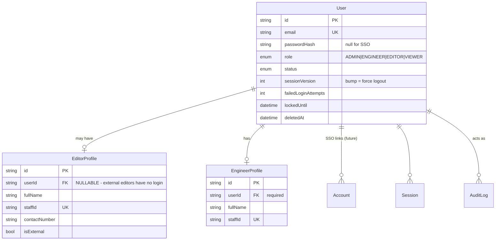
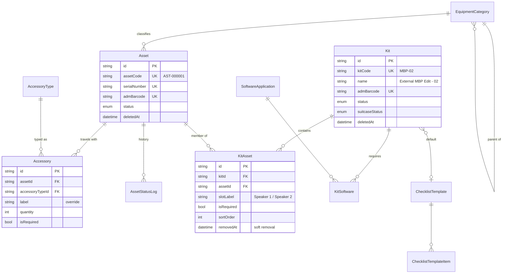
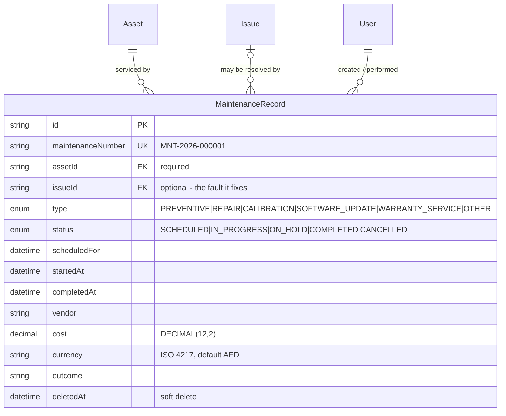

# Edit Kit Management System — Architecture

**Status:** Phase 3 (dashboard and login redesign) — complete. Phases 1 and 2
— complete.
**Last updated:** 2026-09-03

---

## 1. What this system replaces

A paper "External Editing Kit — Handover and Return" form. The paper form is a
*snapshot* of one kit at one moment: a fixed list of equipment rows, a fixed list
of software, a fixed checklist, and two signatures.

The core architectural requirement is that **the form is data, not code**. An
administrator must be able to create a new kit, a new equipment category, a new
accessory type, a new software requirement, or a new checklist template, and the
handover wizard must pick all of it up with no deployment.

That single requirement drives almost every decision below.

---

## 2. System architecture

### 2.1 Runtime shape

A single Next.js application (App Router, Node.js runtime) talking to one
PostgreSQL database, deployed as a container behind the corporate reverse proxy.
There is no separate API service in the MVP.

```
                    ┌──────────────────────────────────────┐
   Browser /        │  Reverse proxy (TLS termination)     │
   Tablet   ───────▶│  corporate network only              │
                    └──────────────────┬───────────────────┘
                                       │
                    ┌──────────────────▼───────────────────┐
                    │  Next.js 16 (Node runtime)           │
                    │                                      │
                    │  proxy.ts ....... optimistic auth    │
                    │  app/ ........... RSC pages          │
                    │  server/actions/  authz + validation │
                    │  server/services/ business logic     │
                    │  server/db/ ..... Prisma             │
                    └────────┬───────────────────┬─────────┘
                             │                   │
                  ┌──────────▼──────┐   ┌────────▼─────────┐
                  │  PostgreSQL 16  │   │  File storage    │
                  │                 │   │  LOCAL (volume)  │
                  │  + pg_trgm      │   │  → AZURE_BLOB    │
                  │  + btree_gist   │   │    later         │
                  └─────────────────┘   └──────────────────┘
```

### 2.2 Layering (Clean-Architecture-flavoured, not dogmatic)

Four layers, enforced by folder boundaries and an ESLint import rule:

| Layer | Location | Responsibility | May import |
|---|---|---|---|
| **UI** | `src/app`, `src/components`, `src/features/*/components` | Rendering only. No business rules, no Prisma. | features, components, lib |
| **Interface adapters** | `src/server/actions`, `src/app/api` | Authenticate → authorise → Zod-validate → call service → map result. Nothing else. | services, validation, auth |
| **Application / domain** | `src/server/services` | All business rules. Pure functions of `(tx, actor, input)`. Transaction-aware. | db, domain, lib |
| **Infrastructure** | `src/server/db`, `src/server/storage`, `src/server/auth` | Prisma client, file storage, auth provider. | — |

**The rule that matters:** a React component never imports Prisma, and a service
never imports `next/headers`. Services receive an explicit `actor` object, which
makes them unit-testable without a request context and makes it impossible to
accidentally ship an unauthenticated write path.

### 2.3 Read path vs write path

- **Reads** go through a *Data Access Layer* (`src/server/dal`). Every DAL
  function calls `requireSession()` itself, so authorisation happens next to the
  data rather than in a layout. This follows the Next.js guidance that layout
  checks are not a security boundary (layouts do not re-render on navigation and
  do not gate nested segments).
- **Writes** go through Server Actions in `src/server/actions`, which are treated
  as public HTTP endpoints: every one re-checks the session and the permission,
  regardless of what the UI showed.

`proxy.ts` (Next.js 16's replacement for `middleware.ts`) does an *optimistic*
cookie-only check to bounce anonymous users to `/login`. It is a UX
optimisation, never the security boundary.

As built in Phase 2, the pieces are: `server/auth/session.ts`
(`getCurrentUser`, `requireAuth`, `requirePermission`), `server/auth/page-guards.ts`
(the page-flavoured variants that redirect or `forbidden()`), `server/auth/api.ts`
(`withApiAuth` for route handlers) and `server/auth/action.ts` (the `action()`
wrapper for Server Actions). Section 11 describes them.

---

## 3. Data model

### 3.1 Design invariants

1. **Nothing from the paper form is a column.** Equipment lists, accessory
   lists, software lists and checklists are all rows.
2. **A signed inspection is immutable.** Corrections happen by voiding and
   re-inspecting, never by `UPDATE`. Every mutation path checks `lockedAt`.
3. **Inspection lines carry snapshots.** `AssetInspection` stores
   `serialNumberSnapshot`, `admBarcodeSnapshot`, `modelSnapshot`, … as written
   at inspection time. Renaming an asset in 2027 cannot rewrite what an editor
   signed for in 2026.
4. **Handover and Return are two rows, never one.** `Inspection.type`
   distinguishes them, so the side-by-side diff is a plain join.
5. **Reference data is soft-deleted.** Bookings point at kits, assets and
   categories forever; hard deletion would orphan history.

### 3.2 ER model — identity



> **The important nullable in this system.** `EditorProfile.userId` is optional.
> Freelance/external editors appear on bookings and sign handovers but have no
> account. Modelling the editor as "a User with role EDITOR" would have made
> external handovers impossible without creating fake accounts.

### 3.3 ER model — equipment catalogue and kits



`AccessoryType` is an addition to the entity list in the brief. Without it,
"Power Adapter" would be free text on every asset and the admin could not
maintain a consistent vocabulary — which contradicts the "no hard-coded
accessories" requirement.

### 3.4 ER model — bookings, inspections, signatures


### 3.5 Two refinements to the requested entity list

The brief listed `BookingChecklistItem` and `SoftwareCheck`. Building them
exactly as named creates a conflict: the checklist is snapshotted **per
booking**, but it is *answered* twice — once at handover and once at return.
One row cannot hold both answers without the return overwriting the handover,
which requirement §"RETURN WORKFLOW" explicitly forbids.

Resolution:

| Entity | Role |
|---|---|
| `BookingChecklistItem` | The snapshot. One row per checklist line per **booking**. Holds label, description, phase, required, order. Frozen at booking creation. |
| `ChecklistResult` *(added)* | The answer. One row per line per **inspection**. Holds PASS/FAIL/NOT_APPLICABLE + notes. |

`SoftwareCheck` needed no split — it already hangs off `Inspection` — but it
gained `nameSnapshot` / `versionSnapshot` / `vendorSnapshot` for the same
immutability reason.

`AssetHistory` was deliberately **not** created. The asset timeline is a service
that merges `AssetStatusLog`, `AssetInspection` (joined to `Booking`), `Issue`,
and `AuditLog` at read time. A separate denormalised history table would be a
second source of truth that can silently drift from the first.

### 3.6 Maintenance records (R-7 resolved)

`AssetStatus.MAINTENANCE` records *that* an asset is out of service.
`MaintenanceRecord` records what was done, by whom, when, and what it cost —
the data the annual calibration report and the cost-per-asset report need.



Design points:

- **Linked to `Asset`, never to `Kit`.** Maintenance happens to a serialised
  item; a kit-level record would hide which monitor was recalibrated. The
  relation is `onDelete: Restrict` — an asset with service history cannot be
  hard-deleted (assets are soft-deleted anyway).
- **`issueId` is optional and `SetNull`.** A repair usually starts from an
  `Issue` raised at return; a calibration does not. Removing the issue keeps
  the maintenance history intact.
- **Only `IN_PROGRESS` takes the asset out of service.** A `SCHEDULED` record
  is a plan, so the asset stays bookable. The coupling to `AssetStatus` is a
  service-layer rule governed by the `maintenance.setAssetStatusOnStart`
  setting — not a trigger, because whether to restore `AVAILABLE` on
  completion depends on whether an issue is still open.
- **`MNT-YYYY-NNNNNN` numbering** uses the same locked counter as bookings and
  issues (AD-1), so seeded and UI-created records form one sequence.
- **Attachments** (vendor reports, invoices) are deliberately not wired yet;
  adding `maintenanceRecordId` to `Attachment` is a one-column migration when
  Phase 4 builds the UI.

---

## 4. Guarantees enforced in the database, not in application code

Application-level checks lose races. These are constraints, so they hold even
under concurrent requests, and even if someone writes to the database by hand.

### 4.1 No overlapping bookings for the same kit

```sql
ALTER TABLE bookings ADD CONSTRAINT bookings_no_overlap
  EXCLUDE USING gist (
    "kitId" WITH =,
    tstzrange("bookingStart", "bookingEnd", '[]') WITH &&
  ) WHERE (status IN ('RESERVED','READY_FOR_HANDOVER','CHECKED_OUT','OVERDUE','RETURN_INSPECTION')
           AND "deletedAt" IS NULL);
```

Requires the `btree_gist` extension. Two engineers reserving MBP-02 for
overlapping weeks now fails at commit rather than producing a double-booked kit
that nobody notices until collection day.

### 4.2 One live inspection of each type per booking

A partial unique index on `("bookingId", type) WHERE "voidedAt" IS NULL`. An
admin can void a return inspection and redo it; they cannot end up with two
live ones.

### 4.3 One live signature of each type per inspection

Same pattern on `("inspectionId", type) WHERE "voidedAt" IS NULL`.

### 4.4 An asset cannot sit in two kits at once

Partial unique index on `("assetId") WHERE "removedAt" IS NULL` in `kit_assets`.

### 4.5 Fast barcode / free-text search

`pg_trgm` + GIN indexes on the name and code columns that global search hits,
plus plain B-tree indexes on `admBarcode` across `assets`, `kits` and
`accessories`. Barcode lookup is a single indexed equality — ready for a
hardware scanner posting into a search box.

The GIN indexes are declared in `schema.prisma`
(`@@index([name(ops: raw("gin_trgm_ops"))], type: Gin, map: …)`) *and* created
in the migration under the same names. Prisma ignores partial indexes,
exclusion constraints and triggers when checking for drift, but it does see
ordinary indexes — left undeclared, it would generate a migration to drop them.

### 4.6 Verified, not assumed

All of §4, including the maintenance rules in §4.7, is exercised by
`scripts/db/verify-constraints.sql` — 30 tests that insert violating rows
inside a transaction, assert the specific SQLSTATE, and roll back. It passed
30/30 against PostgreSQL 16.15 on 2026-09-03.

### 4.7 Maintenance lifecycle rules

Added by migration `20260903000200_maintenance_records`, alongside the table.

| Rule | Mechanism |
|---|---|
| Work cannot finish before it starts | `CHECK (completedAt IS NULL OR startedAt IS NULL OR completedAt >= startedAt)` |
| Status and timestamps agree: `COMPLETED` ⇔ `completedAt` set, `CANCELLED` ⇔ `cancelledAt` set, `IN_PROGRESS` ⇒ `startedAt` set | `CHECK` `maintenance_records_status_matches_timestamps` |
| Cost is never negative | `CHECK (cost IS NULL OR cost >= 0)` |
| Currency is a three-letter upper-case ISO 4217 code | `CHECK (currency ~ '^[A-Z]{3}$')` |
| An asset is in at most one workshop at a time | Partial unique index on `(assetId) WHERE deletedAt IS NULL AND status IN ('IN_PROGRESS','ON_HOLD')` |
| An asset with service history cannot be hard-deleted | FK `ON DELETE RESTRICT` |
| Removing an issue keeps its repair history | FK `ON DELETE SET NULL` |

Several `SCHEDULED` records per asset are legitimate — annual calibration plus
a planned repair — so exclusivity applies only to work actually underway. A
partial index on `scheduledFor` over open records backs the "maintenance due"
dashboard tile.

---

## 5. Key architecture decisions

### AD-1 — Numbering via a locked counter row, not a Postgres sequence

`BK-2026-000001` must have no gaps (it is quoted in emails and disputes).
Postgres sequences deliberately leak numbers on rollback. Instead
`NumberSequence` holds `(scope, period, current)` and is incremented with
`UPDATE … RETURNING` **inside the same transaction** as the row it numbers. If
the booking insert fails, the number is released.

Scopes: `BK-YYYY-` bookings, `ISS-YYYY-` issues, `INS-YYYY-` inspections and
`MNT-YYYY-` maintenance reset each January; `AST-` assets and `KIT-` kits run
continuously.

Cost: writes to the same scope serialise. At a few hundred bookings a year this
is irrelevant.

### AD-2 — JWT sessions with a `sessionVersion` kill switch

Auth.js v5 forces the JWT strategy when using a Credentials provider, so
database sessions are not available. To keep server-side revocation (required
by "session timeout design" and "no client-side-only security"), `User` carries
`sessionVersion`. The `jwt` callback compares the token's copy against the
database; a mismatch invalidates the token immediately. Bump it on password
change, role change, suspension, or "sign out everywhere".

Short `maxAge` (8 h) + `updateAge` (15 min) gives an idle timeout.

*As implemented:* the check runs in the `jwt` callback of the full Auth.js
instance (`server/auth/auth.ts`), which is what `auth()` uses in Server
Components, Server Actions and Route Handlers. The proxy uses a lighter
instance without it - a database round-trip on every prefetch would be wasteful
and the proxy is optimistic by design (§11.5). Suspending a user or resetting
their password bumps `sessionVersion`, and their next request ends with a
cleared cookie.

### AD-3 — All auth behind a facade

Everything auth-related is confined to `src/server/auth/*`, and the rest of the
app only ever imports `requireSession()`, `requirePermission()` and the `Actor`
type. Adding Entra ID later means adding a provider inside that folder. The
`Account` / `Session` tables already exist for it.

This also contains the risk that `next-auth@5` is still a beta release (see §7).

### AD-4 — Storage provider is a column, not a config

Every `Attachment` and `Signature` row stores `storageProvider` (`LOCAL` /
`AZURE_BLOB`) alongside its path. Migrating to Azure Blob does not require
rewriting old rows or a big-bang cutover — old files keep resolving through the
local driver while new ones go to Blob.

### AD-5 — Reporting reads from a query layer, not from pages

Each report is a function in `src/server/reports/` returning
`{ columns: ColumnDef[], rows: Record<string, unknown>[] }`. The HTML table, the
future CSV writer and the future Excel writer are three renderers over that one
shape. Adding "export to Excel" becomes one renderer, not ten report rewrites.

### AD-6 — PDF generated from `documentSnapshot`, not from live joins

When an inspection completes, the fully-resolved document is serialised into
`Inspection.documentSnapshot`. The PDF renderer reads only that. A handover PDF
regenerated in three years is byte-identical to the one signed, even if the kit
has since been dismantled.

### AD-7 — Server Actions are treated as public endpoints

Every action runs `requirePermission(actor, PERMISSION)` before touching data.
The UI hiding a button is cosmetic. This is wrapped in a single `action()`
helper so it cannot be forgotten by omission — the helper *requires* a
permission argument.

*As implemented:* `action({ permission, schema, handler })` in
`server/auth/action.ts`. `permission` is a `Permission`, a list (any-of) or the
literal `'authenticated'` - it cannot be omitted. Input is parsed with the Zod
schema before the handler runs; authorization and validation failures return a
typed `ActionResult`, never a stack trace. `setUserStatus` is the first action
built on it.

### AD-8 — Handover and return run in one transaction

Completing a handover writes: inspection status, `lockedAt`, both signatures,
booking status, kit status, N asset statuses, N `AssetStatusLog` rows, and an
audit entry. Any partial application leaves equipment in a wrong state. All of
it runs inside `prisma.$transaction` with `Serializable` isolation.

### AD-9 — Every timestamp is `timestamptz`, not Prisma's default

Prisma maps `DateTime` to PostgreSQL `TIMESTAMP(3)` **without time zone** unless
told otherwise. That type stores a naive wall-clock value and forgets which zone
it was in — a booking created from a laptop set to London time and read by a
server in UTC would drift by an hour, silently. All 86 `DateTime` columns carry
`@db.Timestamptz(3)`, which stores an unambiguous instant. This is also what
makes the `tstzrange` overlap constraint (§4.1) well-defined.

### AD-10 — Immutability is enforced by triggers, not only by code

`lockedAt` checks in the service layer are the first line. Behind them,
`BEFORE UPDATE` triggers on `inspections` and `signatures` reject any change to
a signed record's content, and `audit_logs` rejects `UPDATE` and `DELETE`
outright. A future code path — or a hand-run `psql` session — cannot quietly
edit what an editor signed for. This is what "immutable/audited signed records"
in the security requirements actually means at the storage layer.

### AD-11 — Permissions, not roles, are the authorization API

Application code never asks "is this an ADMIN?". It asks
`can(actor, 'kit.manage')`. Roles are rows in one table
(`server/auth/permissions.ts`) that maps each role to a set of named
permissions. Adding a capability means adding a permission and granting it;
no `if (role === ...)` is scattered through pages or actions. The matrix is
plain data, so it is unit-tested exhaustively and can be rendered on an admin
page. A role the matrix does not know grants nothing (fail closed).

### AD-12 — Wrong password and unknown account are indistinguishable

The credentials check hashes against a decoy when there is no account (or no
local password), so timing does not reveal existence, and both cases return the
same `invalid_credentials`. Only a *correct* password unlocks the more helpful
answers - "account disabled", "temporarily locked" - because a correct password
already proves the caller controls the account. Failed attempts are audited and
counted; the account locks after `MAX_LOGIN_ATTEMPTS` for
`LOGIN_LOCKOUT_MINUTES`, and a per-address / per-account sliding-window rate
limiter sits in front of the whole thing.

### AD-13 — One business time zone, one conversion module

Timestamps are instants (`TIMESTAMPTZ`). Every question about a *day* -
"today's bookings", "due tomorrow", the date printed on a row - is asked of the
business wall clock, `APP_TIMEZONE` (default `Asia/Dubai`, +04:00, no DST),
never of the server's or the browser's clock. `src/lib/datetime.ts` is the only
module that performs that conversion; it is built on `Intl` alone so output is
identical on every host and needs no extra dependency. Components receive a
`timeZone` string in their data and call the helper. A dashboard rendered at
21:00 UTC on 3 September shows 4 September, because that is the date in Dubai.

### AD-14 — The dashboard derives, it never stores

Kit and asset headline counts read the *stored* status columns, which the
workflows maintain (AD-8) - the dashboard does not second-guess them from
bookings. "Overdue", by contrast, is derived at read time exactly as R-3
planned: a booking is overdue when it is flagged `OVERDUE` or is
`CHECKED_OUT` past `expectedReturnDate`. No dashboard-specific column, view or
cache exists; every number is one `count` / `GROUP BY` or one bounded
`findMany` against an existing index (§12.4).

### AD-15 — Theme is a class on <html>; colours are tokens

Light and dark are two sets of CSS custom properties (`src/app/globals.css`)
selected by a `light` / `dark` class on `<html>`. Tailwind utilities read the
tokens through the `@theme` block (`bg-panel`, `text-muted`, `border-line`,
…), so components never name a palette colour and the whole interface changes
with one class. `next-themes` owns the state: it persists the choice in
`localStorage` (`ekms-theme`), follows the operating system until the user
chooses, and injects a one-line anti-flash script that receives the request's
CSP nonce - no `unsafe-inline`, no hydration mismatch (`<html
suppressHydrationWarning>`). Nothing is stored server-side, so the choice
survives sign-out and applies to the login page as well.

---

## 6. Folder structure

```
edit-kit-management/
├─ docker/
│  ├─ Dockerfile                    # multi-stage, standalone output, non-root
│  └─ postgres-init/                # extensions on first boot
├─ docs/
│  ├─ ARCHITECTURE.md               # this file
│  └─ ROADMAP.md
├─ prisma/
│  ├─ schema.prisma
│  ├─ migrations/
│  │  ├─ 20260903000000_init/
│  │  ├─ 20260903000100_integrity_constraints_and_search_indexes/
│  │  └─ 20260903000200_maintenance_records/
│  └─ seed/
│     ├─ index.ts                   # orchestrator
│     ├─ 01-users.ts
│     ├─ 02-catalogue.ts            # categories, accessory types, software, settings
│     ├─ 03-assets.ts
│     ├─ 04-checklists.ts
│     ├─ 05-kits.ts                 # depends on 03 and 04
│     └─ 06-maintenance.ts          # depends on 01 and 03
├─ src/
│  ├─ app/
│  │  ├─ (auth)/login/page.tsx
│  │  ├─ (app)/                     # authenticated shell: sidebar + header
│  │  │  ├─ layout.tsx
│  │  │  ├─ dashboard/
│  │  │  ├─ bookings/
│  │  │  │  ├─ page.tsx  new/  [id]/  [id]/handover/  [id]/return/
│  │  │  ├─ kits/                   page.tsx  new/  [id]/  [id]/edit/
│  │  │  ├─ assets/                 page.tsx  new/  [id]/  [id]/edit/
│  │  │  ├─ editors/                page.tsx  [id]/
│  │  │  ├─ issues/                 page.tsx  [id]/
│  │  │  ├─ reports/
│  │  │  └─ admin/
│  │  │     ├─ users/ categories/ software/ checklists/
│  │  │     └─ audit-logs/ settings/
│  │  └─ api/
│  │     ├─ auth/[...nextauth]/route.ts
│  │     ├─ files/[id]/route.ts     # authorised file serving
│  │     └─ search/route.ts         # global + barcode lookup
│  │
│  ├─ components/
│  │  ├─ ui/                        # shadcn primitives, unmodified
│  │  ├─ layout/                    # AppSidebar, AppHeader, Breadcrumbs
│  │  └─ common/                    # StatusBadge, DataTable, EmptyState,
│  │                                # ConfirmDialog, PageHeader, Stepper
│  ├─ features/                     # one folder per bounded context
│  │  ├─ auth/components/login-form.tsx   # Phase 2
│  │  ├─ dashboard/components/            # Phase 3: dashboard-view, kpi-card, section-card,
│  │  │                                   #   bookings-table, issues-table, activity-feed,
│  │  │                                   #   quick-actions, editor-dashboard
│  │  ├─ bookings/  kits/  assets/  editors/  issues/
│  │  ├─ inspections/               # the wizard lives here
│  │  ├─ signatures/                # SignaturePad
│  │  └─ dashboard/  reports/  admin/
│  │
│  ├─ proxy.ts                      # optimistic auth gate + CSP nonce (Phase 2)
│  ├─ server/                       # never reachable from the client bundle
│  │  ├─ db/prisma.ts               # singleton
│  │  ├─ auth/                      # Phase 2 - the whole auth facade (AD-3)
│  │  │  ├─ auth.config.ts          #   proxy-safe Auth.js config, jwt/session callbacks
│  │  │  ├─ auth.ts                 #   NextAuth instance: Credentials provider, revocation
│  │  │  ├─ credentials.ts          #   verifyCredentials: lockout, audit, anti-enumeration
│  │  │  ├─ password.ts             #   bcrypt cost 12 (the only place bcrypt is called)
│  │  │  ├─ permissions.ts          #   the permission matrix + can()
│  │  │  ├─ session.ts              #   getCurrentUser, requireAuth, requirePermission
│  │  │  ├─ page-guards.ts          #   redirect / forbidden() variants for pages
│  │  │  ├─ api.ts                  #   withApiAuth for route handlers
│  │  │  ├─ action.ts               #   action() wrapper for Server Actions (AD-7)
│  │  │  ├─ route-policy.ts         #   public / authenticated / permission per path
│  │  │  ├─ rate-limit.ts           #   LoginRateLimiter seam + in-memory default
│  │  │  └─ errors.ts               #   UnauthorizedError / ForbiddenError
│  │  ├─ dal/                       # authorised reads (bookings.dal.ts scopes EDITOR; dashboard.dal.ts)
│  │  ├─ actions/                   # server actions (auth.actions.ts, admin-users.actions.ts)
│  │  ├─ services/                  # business logic, transaction-aware
│  │  │  ├─ dashboard.service.ts    # Phase 3: buildDashboard (permission-gated assembly)
│  │  │  ├─ booking.service.ts
│  │  │  ├─ handover.service.ts
│  │  │  ├─ return.service.ts
│  │  │  ├─ issue.service.ts
│  │  │  ├─ maintenance.service.ts
│  │  │  ├─ audit.service.ts
│  │  │  └─ numbering.service.ts
│  │  ├─ reports/                   # report definitions + renderers
│  │  ├─ pdf/                       # document renderer
│  │  └─ storage/                   # LocalDriver, (AzureBlobDriver later)
│  │
│  ├─ lib/
│  │  ├─ env.ts                     # zod-validated environment
│  │  ├─ datetime.ts                # Phase 3: business time zone helpers (AD-13)
│  │  ├─ validation/                # zod schemas shared client + server
│  │  ├─ constants/                 # status labels, colours, nav definition
│  │  └─ utils/
│  └─ types/
├─ tests/                           # Vitest (Phase 2)
│  ├─ unit/                         #   permissions, route policy, validation, rate limit, token callbacks
│  ├─ integration/                  #   credentials, session, revocation, actions, booking scope, proxy
│  └─ helpers/                      #   test users, rollback transactions, real session cookies
├─ scripts/auth/reset-password.ts   # break-glass password reset (revokes sessions)
├─ .env.example
├─ docker-compose.yml
├─ prisma.config.ts
├─ vitest.config.mts
└─ DEVELOPMENT.md
```

**Why `features/` and `server/` are separate.** `features/` is UI grouped by
domain; `server/` is logic grouped by domain. Keeping them apart makes the
client/server boundary visible in the file tree — if a component needs something
from `server/`, that is a code smell unless it is a Server Component.

---

## 7. Risks and gaps found in the requirements

Listed worst-first. Items marked **[decision needed]** change what gets built.

### R-1 — How does an external editor sign? — **RESOLVED**

**External editors sign in person on the authenticated engineer's tablet or
device.** No external `User` account is required. The engineer is signed in;
the editor signs the handover and return on that device, exactly as they signed
the paper form. `EditorProfile.userId` stays nullable for this reason, and
internal editors who do have logins keep `booking.readOwn` / `booking.signOwn`
for their own bookings. Remote counter-signing (a freelancer logging in to
sign later) is out of scope; the schema would allow it later without
migration, but nothing is built for it.

### R-2 — Signature legal weight

A canvas PNG is not a qualified electronic signature. What we provide is
*evidence*: SHA-256 of the image, signer identity snapshot, timestamp, IP, user
agent, immutable rows, and full audit trail. If these handovers are ever meant
to support a financial claim against an editor for lost equipment, get that
confirmed by legal before go-live. Mitigation available later: hash-chain the
audit log, or add an RFC 3161 timestamp.

### R-3 — Overdue detection needs a scheduler that the brief does not mention

`OVERDUE` is a stored status but nothing sets it. Options: a container cron
hitting an authenticated route, a `pg_cron` job, or computing overdue at read
time and only persisting it during a nightly sweep. **Assumed:** nightly sweep +
read-time derivation for the dashboard, so the dashboard is never stale.

### R-4 — "Do not allow the handover to be completed until required checks are completed" is ambiguous **[decision needed]**

Two readings: (a) every required line must have *an answer*; (b) every required
line must be `INCLUDED`. **Assumed (a)**, plus: a `MISSING`/`DAMAGED` line
requires a note, and offers to raise an Issue. Reading (b) would block handover
whenever a single cable is missing, which is likely not what the department
wants.

### R-5 — Timezone handling — *resolved (AD-13)*

`ADM` suggests Asia/Dubai. "Booking Start Date" on paper is a *date*; in the
database it is an instant. Storing UTC and rendering in a configured
`APP_TIMEZONE` is correct, but a booking created at 00:30 Dubai time will render
as the previous day if anything reads it in UTC. Resolved in Phase 3:
`src/lib/datetime.ts` is the single place instants become wall-clock values
(`businessDayRange`, `formatDate`, `formatTime`, `describeDue`), the business
zone defaults to `Asia/Dubai` (`APP_TIMEZONE`), and the dashboard's "today" is
computed on that calendar - unit-tested at the 21:00 UTC / 01:00 Dubai boundary
and on DST transition days for zones that have them.

### R-6 — Concurrent edits to one inspection

Two engineers with the same booking open on two tablets will silently overwrite
each other. Needs optimistic concurrency (compare `updatedAt` on save, reject
with a conflict dialog). Scheduled for Phase 8 — flagging it now because it is
easy to forget until it corrupts a real handover.

### R-7 — No Maintenance entity, but maintenance is in scope — *resolved*

`AssetStatus.MAINTENANCE` existed and the asset history was supposed to show
"Maintenance", but no maintenance entity was requested, and `AssetStatusLog`
records only *that* an asset went into maintenance. Resolved in Phase 1 by
adding `MaintenanceRecord` (§3.6) with its own numbering scope, lifecycle
constraints (§4.7), seed data and constraint tests — before Phase 4, so no
asset history ever needs migrating. The UI lands with asset management in
Phase 4.

### R-8 — Signature and photo retention

Signature images are personal data. No retention period is specified. Local disk
storage in a container also loses files on redeploy unless a volume is mounted —
the compose file mounts one, but the production deployment must too. Azure Blob
should land before any real volume of handovers accumulates.

### R-9 — `next-auth@5` is still beta — *accepted, contained*

`5.0.0-beta.32` is now in use (Phase 2). It declares support for Next 16 and
behaved as documented in every test, but it is a beta in a production system.
Contained by AD-3: the rest of the application imports only
`getCurrentUser` / `require*` / `action()` from `server/auth`, so swapping the
library would touch one folder. Watch the Auth.js release notes before go-live.

### R-10 — Prisma's `latest` npm tag is currently an RC (8.0.0-rc.12) — *mitigated*

Pinned to **7.10.0**, the stable release matching `@prisma/client@7.10.0`. Do
not run `npm update prisma` without checking the tag. Prisma 7 also requires a
driver adapter (`@prisma/adapter-pg`) — the client no longer accepts a URL.

### R-11 — Local Node.js was v23 (non-LTS, end-of-life) — *resolved*

Prisma 7 refused to install on Node 23 outright (it supports 20.19+, 22.12+,
24.0+). Node **24.19.0 LTS** is now installed; `package.json` declares
`engines.node >= 22.12` and the Dockerfile uses `node:24-alpine`, so local and
container runtimes match.

### R-12 — Smaller open questions

- Does `BK-YYYY-NNNNNN` reset each January? **Assumed yes.**
- Can the returning engineer differ from the handover engineer? **Assumed yes.**
- Can a kit's contents change while it is checked out? **Assumed no** — kit
  edits are blocked while `status = CHECKED_OUT`.
- Who may void a signed inspection? **Assumed ADMIN only**, always audited.
- Uploaded photos are not virus-scanned. Acceptable on an internal network with
  strict MIME/extension/size validation and non-executable serving; call it out
  if the app is ever exposed more widely.

---

## 8. Future integrations — how each one lands

None are implemented. Each has a defined seam so it does not require rework:

| Integration | Seam already in place |
|---|---|
| Entra ID SSO | `Account` table + auth facade (AD-3); add provider, map role claim |
| Teams / Email notifications | Services emit domain events; add a dispatcher subscriber |
| Barcode scanner | `admBarcode` indexed on assets, kits, accessories; `/api/search` exact-match fast path |
| QR codes | Kit/asset codes already unique and stable |
| Azure Blob | `storageProvider` column (AD-4) + driver interface |
| Excel export | Report query layer (AD-5) — add a renderer |
| Power BI | Read-only DB role over the normalised schema |
| Approval workflows | `BookingStatus.DRAFT` already exists as the pre-approval state |

---

## 9. Security posture

| Control | Implementation | Status |
|---|---|---|
| Authentication | Auth.js v5 (`5.0.0-beta.32`) Credentials provider over `verifyCredentials`; bcrypt cost 12 via `bcryptjs`; lockout after `MAX_LOGIN_ATTEMPTS` (5) for `LOGIN_LOCKOUT_MINUTES` (15) | Built (Phase 2) |
| Brute force / enumeration | Per-address and per-account sliding-window rate limiter in `authorize`; decoy hash comparison; identical answer for unknown account and wrong password (AD-12) | Built (Phase 2) |
| Session | Stateless JWT, encrypted (JWE) with `AUTH_SECRET`, `httpOnly`, `SameSite=Lax`, `Secure` over HTTPS; sliding cookie (`updateAge` 15 min) under an absolute 8 h cap stamped at sign-in | Built (Phase 2) |
| Session revocation | `User.sessionVersion` + status re-checked against the database on every `auth()` call (AD-2); bumped on suspend and password reset | Built (Phase 2) |
| Authorization | Permission matrix in `server/auth/permissions.ts` (AD-11); `requirePermission` in pages, route handlers and the `action()` wrapper; role always read from the database, never from the client | Built (Phase 2) |
| Data scoping | EDITOR sees only own bookings — a `where` clause derived from the actor in `server/dal/bookings.dal.ts`, not a UI filter | Built (Phase 2) |
| Route protection | `proxy.ts` optimistic cookie check (redirect / 401 JSON / 403) + authoritative per-page and per-handler checks | Built (Phase 2) |
| Input validation | Zod at every trust boundary; the login schema is shared client + server | Built (Phase 2) |
| CSRF | Auth.js double-submit token on its routes; Server Actions are origin-checked by Next.js; sign-out is a POST action, never a link | Built (Phase 2) |
| Content Security Policy | Per-request nonce issued by `proxy.ts`: `script-src 'self' 'nonce-…' 'strict-dynamic'`, `frame-ancestors 'none'`, `form-action 'self'`, `object-src 'none'`; styles allow inline (React style attributes) | Built (Phase 2) |
| Other headers | `X-Frame-Options: DENY`, `nosniff`, `Referrer-Policy`, `Permissions-Policy`, HSTS in production (`next.config.ts`) | Built (Phase 1) |
| SQL injection | Prisma parameterised queries only; the raw statements are DDL in migrations and the numbering upsert | Built (Phase 1) |
| Auditability | `AuditLog` rows for LOGIN_SUCCESS / LOGIN_FAILED / LOGOUT / PASSWORD_CHANGED and every status change, with IP and user agent | Built (Phase 2) |
| Least disclosure | `getCurrentUser` returns an `Actor` DTO; `passwordHash` never leaves `server/auth`; the session carries id, name, email, role only | Built (Phase 2) |
| File uploads | Extension + MIME sniff + size cap + random stored filename + served through an authorised route, never statically | Planned (Phase 8/9) |
| Immutability | `lockedAt` checks + void-don't-delete on signatures and inspections; database triggers (AD-10) | Triggers built (Phase 1); service checks Phase 8 |

---

## 10. Testing strategy (Phase 13, designed now)

- **Unit** — services with an in-memory actor and a transaction mock. The
  highest-value targets are `numbering`, `handover.complete`, `return.complete`
  and the permission matrix.
- **Integration** — Testcontainers Postgres, real migrations, real constraints.
  This is where the exclusion constraint and the partial unique indexes get
  proven.
- **E2E** — Playwright over the full handover → return happy path, plus the
  "engineer tries to edit a locked inspection" path.

The layering exists largely to make the first bullet possible: business rules
that live inside React components cannot be tested this way.

Phase 2 started this early: the auth suite (86 tests in 11 files) runs
under Vitest against the local PostgreSQL database - real bcrypt, real rows,
real encrypted session cookies through the real proxy. See §11.8.

---

## 11. Authentication and authorization (Phase 2)

### 11.1 Shape

```
 Browser ──POST form──▶ signInAction ──▶ Auth.js signIn('credentials')
                                            │
                                            ▼
                               Credentials.authorize()
                                 rate limiter ─▶ verifyCredentials() ─▶ audit
                                            │  (bcrypt compare, lockout, status)
                                            ▼
                               jwt callback (sign-in): sub, role, sessionVersion,
                                                       authenticatedAt
                                            ▼
                               encrypted cookie  authjs.session-token  (httpOnly)

 Every later request:
   proxy.ts      decode cookie ─▶ route policy ─▶ redirect / 401 / 403 / pass
   page/action   auth() ─▶ jwt callback re-checks DB (status, sessionVersion)
                 getCurrentUser() ─▶ Actor from DB ─▶ requirePermission()
```

Everything auth-related lives in `src/server/auth/` (AD-3). The application
imports only `getCurrentUser`, `requireAuth`, `requirePermission`,
`requireRole`, `requireAdmin`, the page/API/action wrappers, `can()` and the
`Permission` type.

### 11.2 Session strategy

- **Stateless JWT**, forced by Auth.js when a Credentials provider is used.
  The cookie is a JWE encrypted with `AUTH_SECRET`; rotating the secret signs
  everyone out.
- **Contents:** `sub` (user id), `name`, `email`, `role`, `sessionVersion`,
  `authenticatedAt`. The session object handed to the application is exactly
  `{ id, name, email, role }`.
- **Lifetime:** cookie slides with activity (`SESSION_UPDATE_AGE_SECONDS`, 15
  min) but the `jwt` callback returns `null` - ending the session - once
  `authenticatedAt` is older than `SESSION_MAX_AGE_SECONDS` (8 h). Sliding
  alone would let a session live forever.
- **Revocation (AD-2):** on every session read the full instance re-loads the
  user row; not ACTIVE, deleted, or `sessionVersion` mismatch ⇒ `null` ⇒
  cookie cleared. Suspension and password reset both bump the version.
- **Cookie flags:** `httpOnly`, `SameSite=Lax`, `Secure` (and the
  `__Secure-` prefix) whenever the request is HTTPS. Auth.js derives this from
  `x-forwarded-proto`, which the corporate reverse proxy must forward.

### 11.3 Passwords

bcrypt, cost 12, through `bcryptjs` (pure JS - no native build on Alpine or on
developer laptops). `server/auth/password.ts` is the only module that calls
bcrypt; the seed, the reset script and the credentials check all use it. The
cost lives inside each hash, so it can be raised later without a migration.
Argon2id remains the alternative if a native dependency ever becomes
acceptable.

### 11.4 RBAC design and permission matrix

Roles: `ADMIN`, `ENGINEER`, `EDITOR`, `VIEWER` (the `UserRole` enum). External
editors have an `EditorProfile` and no `User`; they never authenticate, they
sign in person on the authenticated engineer's tablet (R-1, resolved).

| Permission | ADMIN | ENGINEER | EDITOR | VIEWER |
|---|:-:|:-:|:-:|:-:|
| dashboard.view | ✓ | ✓ | ✓ | ✓ |
| booking.create | ✓ | ✓ | | |
| booking.read | ✓ | ✓ | | ✓ |
| booking.readOwn | ✓ | | ✓ | |
| booking.update | ✓ | ✓ | | |
| booking.cancel | ✓ | ✓ | | |
| booking.signOwn | ✓ | | ✓ | |
| handover.perform / handover.complete | ✓ | ✓ | | |
| return.perform / return.complete | ✓ | ✓ | | |
| kit.read | ✓ | ✓ | | ✓ |
| kit.manage | ✓ | | | |
| asset.read | ✓ | ✓ | | ✓ |
| asset.manage | ✓ | | | |
| editor.read | ✓ | ✓ | | |
| editor.manage | ✓ | | | |
| issue.read / issue.create / issue.manage | ✓ | ✓ | | |
| report.read | ✓ | ✓ | | ✓ |
| maintenance.read | ✓ | ✓ | | |
| maintenance.manage | ✓ | | | |
| admin.users.manage · admin.categories.manage · admin.software.manage · admin.checklists.manage · admin.audit.read · admin.settings.manage | ✓ | | | |

Notes on the edges of the brief:

- ENGINEER holds `booking.cancel` (cancelling a reservation before handover
  is routine store work) but not `editor.manage`, `kit.manage`,
  `asset.manage` or `maintenance.manage`. Any of these is a one-line change.
- EDITOR's `booking.readOwn` is a *permission to see some bookings*; which
  ones is decided in the DAL from `actor.editorProfileId`. An EDITOR without a
  profile sees none. Object-level misses return "not found", never "forbidden",
  so a guessed id reveals nothing.
- VIEWER has no mutating permission at all; the unit suite asserts that
  structurally (every VIEWER permission is a read).

### 11.5 Route protection

Three layers, each independent:

1. **`src/proxy.ts`** (optimistic). Decodes the cookie with a database-free
   Auth.js instance and applies `route-policy.ts`: `/login`, `/api/health` and
   `/api/auth/*` are public; everything else needs a session; `/admin/*` needs
   the section's `admin.*` permission. Anonymous → `307 /login?callbackUrl=…`
   (pages) or `401` JSON (`/api/*`); signed-in but not permitted → rewrite to
   the 403 page with status 403 (pages) or `403` JSON; signed-in on `/login`
   → `/dashboard`. It also mints the CSP nonce.
2. **Pages** call `requirePermissionForPage(…)` (or `requireAuthForPage`)
   first thing. These read the actor from the database, redirect to `/login`
   without a session and call Next's `forbidden()` without permission, which
   renders `forbidden.tsx` with a real 403.
3. **Route handlers** use `withApiAuth(permission, handler)` → 401/403 JSON.
   **Server Actions** use `action({ permission, schema, handler })` → typed
   result. Both derive the actor from the session + database and ignore
   anything the client claims about its role.

Unauthenticated and forbidden are always distinguished: 401/redirect for the
former, 403 for the latter; 404 for routes that do not exist.

### 11.6 Login flow and error handling

`signInAction` validates with Zod, calls Auth.js `signIn`, and maps the
`CredentialsSignin` code to copy: `invalid_credentials` → "Incorrect email or
password."; `account_disabled` → "This account is not active…";
`account_locked` → "…temporarily locked…"; `rate_limited` → "Too many sign-in
attempts…". The disabled and locked messages are only ever produced after a
correct password (AD-12). On success Auth.js redirects to the validated
`callbackUrl` (same-origin path, never `/login`) or `/dashboard`.

### 11.7 Future Entra ID integration point

Add a Microsoft Entra ID provider to the `providers` array in
`server/auth/auth.ts` and map the directory's group/app-role claim to
`UserRole` in the `jwt` callback (or, better, look the user up by email and
take the role from the `users` row so administrators keep control). The
`Account` table already exists for the adapter, `User.passwordHash` is nullable
for SSO-only accounts, and `revalidateToken` applies unchanged. No page, action
or DAL function changes.

### 11.8 What is tested

Unit: the permission matrix (per role, and "VIEWER never mutates"), route
classification and decisions, redirect-path safety, the login schema, the rate
limiter, the `jwt`/`session` callbacks. Integration (real database):
`verifyCredentials` for valid, wrong-password, unknown, disabled, locked and
SSO-only accounts inside rolled-back transactions; password storage is bcrypt
for every account in the database; `getCurrentUser` / `require*` with a stubbed
Auth.js session; `revalidateToken` for suspend and version bump; the
`setUserStatus` Server Action as anonymous, ENGINEER, forged-role ENGINEER and
ADMIN; EDITOR booking scoping; and the proxy driven with genuine encrypted
cookies for every route class.

### 11.9 Known limits and decisions carried forward

- The rate limiter is in-process. Behind more than one container, provide a
  shared `LoginRateLimiter` (Redis or a Postgres table) - the interface exists.
- No MFA, no password-change or "sign out everywhere" UI yet
  (`mustChangePassword` and `sessionVersion` are ready for both).
- `forbidden()` returns a true 403 because the guards run before streaming;
  if a page later moves its check inside `<Suspense>`, the status becomes 200
  with the 403 body (the proxy still answers 403 for `/admin/*`).
- `unauthorized()` / `forbidden()` are behind Next's experimental
  `authInterrupts` flag.

---

## 12. Dashboard (Phase 3)

### 12.1 Shape

```
 app/(app)/dashboard/page.tsx        requirePermissionForPage('dashboard.view')
          │                          buildDashboard(prisma, actor, { timeZone })
          ▼
 server/services/dashboard.service.ts   decides WHAT the actor may see (can / canAny)
          │                             runs the permitted queries concurrently
          ▼
 server/dal/dashboard.dal.ts            one indexed query per fact, explicit select,
          │                             booking reads scoped by visibilityFor(actor)
          ▼
 features/dashboard/components/*        render whatever sections are non-null;
                                        never check a role or permission
```

The service returns a `DashboardData` object whose sections are `null` when
the actor lacks the permission and empty when there is simply nothing to show.
The page and components therefore contain no authorization logic at all; the
matrix in `permissions.ts` (AD-11) is the only place it lives.

### 12.2 What each role sees

| Section | Permission | ADMIN | ENGINEER | VIEWER | EDITOR |
|---|---|:-:|:-:|:-:|:-:|
| Available / Reserved / Checked-out kits | `kit.read` | ✓ | ✓ | ✓ | |
| Overdue count and table | `booking.read` | ✓ | ✓ | ✓ | |
| Assets in maintenance | `asset.read` | ✓ | ✓ | ✓ | |
| … active maintenance records hint | `maintenance.read` | ✓ | ✓ | | |
| Open issues count and table | `issue.read` | ✓ | ✓ | | |
| Today's bookings, upcoming returns | `booking.read` | ✓ | ✓ | ✓ | |
| Recent activity (operational events) | not own-only | ✓ | ✓ | ✓ | |
| … including sign-in / sign-out events | `admin.audit.read` | ✓ | | | |
| Current booking, upcoming return, history | `booking.readOwn` without `booking.read` | | | | ✓ |
| Quick actions | any of `booking.create`, `issue.create` | ✓ | ✓ | | |

An EDITOR's booking reads go through the same `visibilityFor(actor)` fragment
as the bookings list, so another editor's booking cannot be returned by the
query, let alone rendered. Object-level misses stay "not found".

### 12.3 Derivations

| Figure | Source | Rule |
|---|---|---|
| Available / Reserved / Checked out / Maintenance kits | `kits.status` (stored) | `GROUP BY status` over `deletedAt IS NULL AND isActive`; total excludes RETIRED |
| Overdue bookings | derived (R-3, AD-14) | `status = OVERDUE` OR (`status = CHECKED_OUT` AND `expectedReturnDate < now`) |
| Assets in maintenance | `assets.status = MAINTENANCE` (stored; set when a record goes IN_PROGRESS per `maintenance.setAssetStatusOnStart`) | count |
| Active maintenance records | `maintenance_records.status IN (IN_PROGRESS, ON_HOLD)` | count, shown as the tile hint |
| Open issues | `issues.status IN (OPEN, UNDER_INVESTIGATION)` | count + newest six |
| Today's bookings | business-day range in `APP_TIMEZONE` | `bookingStart` in today OR `expectedReturnDate` in today; CANCELLED excluded |
| Upcoming returns | out bookings not yet overdue | `status IN (CHECKED_OUT, OVERDUE) AND expectedReturnDate >= now`, nearest first |
| Editor's current booking | earliest live booking | `status IN (RESERVED, READY_FOR_HANDOVER, CHECKED_OUT, OVERDUE, RETURN_INSPECTION)` ordered by `bookingStart` |
| Recent activity | `audit_logs` | newest ten; sign-in/out/password events only for `admin.audit.read`; only action, entity, actor, summary, time are selected |

`booking.overdueGraceHours` (24) is **not** applied to the dashboard: the
dashboard is meant to be timely, so a kit one hour late shows as overdue. The
grace period governs when the nightly sweep (Phase 7) flips the stored status
to `OVERDUE` and when notifications fire. Within the grace window a booking
therefore appears in *Overdue* here while its status still reads
"Checked out" - the badge makes that visible rather than hiding it.

### 12.4 Queries and indexes

Ten queries for an administrator, three for an editor, all issued concurrently
and each bounded by a `take`. No query loads a table to count in JavaScript
and no query runs per row.

| Query | Index used |
|---|---|
| kits `GROUP BY status` | `kits(status)` |
| assets in maintenance | `assets(status)` |
| active maintenance records | `maintenance_records(status, scheduledFor)` |
| open issues count + list | `issues_open_by_reported_at` (partial, `reportedAt DESC`) |
| overdue count + list | `bookings_active_by_expected_return` (partial: live statuses, `expectedReturnDate`) |
| upcoming returns | same partial index, range scan from `now` |
| today's bookings | `bookings(bookingStart, bookingEnd)` and `bookings(status, expectedReturnDate)` (bitmap OR) |
| editor current / history | `bookings(editorId)` |
| recent activity | `audit_logs(createdAt)`, `audit_logs(action, createdAt)` |

No new index was added. Every predicate matches an index created in Phase 1,
and at this system's volume (hundreds of bookings a year) the planner will
choose sequential scans anyway; adding indexes without a measured need would
only slow writes.

### 12.5 Login redesign

The sign-in screen shares the shell's identity: a slate-950 canvas, the EK
mark, the application name and the tagline "Equipment Handover & Return
Management" in a branded panel beside a white card (split layout from `lg`,
stacked with a compact brand header below it). The card carries only what the
form needs - heading, email, password with show/hide, validation and the
generic failure message, the submit button with its pending state - and a
one-line "Internal use only · Access is logged" footer. Nothing about the
environment, database, seeded accounts or permissions is rendered. The form
component and every server-side behaviour (validation, anti-enumeration,
lockout, rate limiting, callbackUrl, session) are unchanged from Phase 2.

### 12.6 Tests

`tests/integration/dashboard.test.ts` seeds kits in every status, assets and
maintenance records, open/investigating/resolved issues, bookings for two
editors (overdue by time, flagged OVERDUE, two upcoming returns created out of
order, a collection at 00:30 Dubai, one at 23:30 Dubai the previous day, one
cancelled, one tomorrow) and fourteen audit rows - inside a rolled-back
transaction - and asserts the deltas for ADMIN, ENGINEER, VIEWER and two
EDITORs, the Dubai-vs-UTC "today" boundary, ordering, limits, empty states and
that no sensitive field leaves the DAL. `tests/unit/datetime.test.ts` covers
the helper including DST transition days. `tests/component/pull-cord-theme-toggle.test.tsx`
renders the theme switch inside the real provider under jsdom: initial theme
from the system preference, a stored choice winning over it, click, Enter and
Space toggling with the label and `localStorage` following, a pull past the
threshold toggling exactly once, a short pull doing nothing, and the cord
clamped at its maximum. 114 tests in 14 files pass.

### 12.7 Theme switch

`src/components/theme/theme-provider.tsx` wraps `next-themes` (AD-15).
`src/components/theme/pull-cord-theme-toggle.tsx` is the control: one
`<button>` drawing a bulb, a cord and a handle in SVG. Pointer Events give the
same gesture to mouse, touch and stylus - `pointerdown` captures the pointer,
`pointermove` stretches the cord (clamped at 40 px), `pointerup` past 24 px
toggles and the cord springs back (220 ms). A tap, Enter or Space toggles
through the button's native click; a drag that fell short does nothing and
suppresses the trailing click so nothing toggles twice. Gesture state lives in
refs so fast pointer sequences cannot outrun a render. `aria-label` reads
"Switch to light mode" / "Switch to dark mode"; `touch-action: none` is set on
the control only, never on the page. With `prefers-reduced-motion` the cord
still follows the finger (direct manipulation) but the spring-back and the
bulb nudge are disabled; the theme itself always switches. The control sits in
the command bar beside the account menu, and the same compact version sits in
the corner of the sign-in brand panel (and the mobile brand band).

### 12.8 Design language

The interface is meant to read as its own product, not a generic admin
template:

- **Identity:** deep navy command bar in both modes; a single teal accent (`--accent`)
  for the active marker, links, counts, the EK mark and focus rings; Manrope for
  headings, brand and headline numbers, Inter for dense content.
- **Surfaces:** cool off-white page (`#f3f5f9`) with white panels in light mode;
  deep navy-black page (`#0b1120`) with slate-blue panels in dark mode. Panels
  use a 14 px radius, a hairline border and a tinted header - no drop shadows.
- **Command bar (no sidebar):** one 60 px navy header across the full width -
  the teal EK mark with the application name and tagline, horizontal primary
  navigation (Dashboard, Bookings, Kits, Equipment, Editors, Issues, Reports)
  with a teal underline on the active section, an *Administration* dropdown
  that appears only when the server included that group, then today's date,
  the role chip, the compact pull-cord and an account menu (name, email, role,
  sign-out). Below `lg` the tabs fold into a panel behind a menu button.
- **Workspace header:** a breadcrumb eyebrow ("Operations / Bookings", last
  segment in teal), a 30 px display heading with actions on the right, one line
  of context, and - where a workspace has sections - a horizontal tab bar on
  the closing hairline (Kits and Equipment by status, Administration by
  section). Nothing else sits between the command bar and the page.
- **Dashboard rhythm:** an "Operations status" board - a framed panel with two
  rows of three connected figures - then a row of "Go to" shortcut chips,
  overdue first when it exists, and two paired panels across the full width:
  today's movements beside upcoming returns, open issues beside an activity
  timeline with a teal marker on the newest.
- **Bookings workspace:** search field and quick-filter chips (All, Today,
  Reserved, Checked out, Due soon, Overdue) above a wide list with a slim count
  line - no table nested in a card.
- **Status:** square-cornered chips with a leading dot; red only for overdue
  and critical.
- **Empty states:** dashed frame, teal-tinted icon, one plain sentence.
