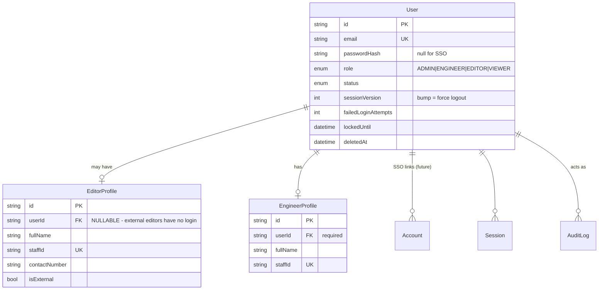
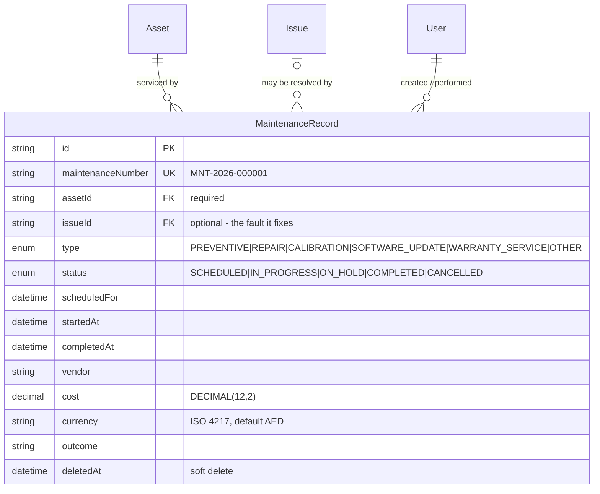

# Edit Kit Management System — Architecture

**Status:** Phase 11 (issue management) — complete. Phases 1–10 — complete.
**Last updated:** 2026-09-05

---

## 1. What this system replaces

A paper "External Editing Kit — Handover and Return" form. The paper form is a
*snapshot* of one kit at one moment: a fixed list of equipment rows, a fixed list
of software, a fixed checklist, and two signatures.

The core architectural requirement is that **the form is data, not code**. An
administrator must be able to create a new kit, a new equipment category, a new
accessory type, a new software requirement, or a new checklist template, and the
handover wizard must pick all of it up with no deployment.

That single requirement drives almost every decision below.

---

## 2. System architecture

### 2.1 Runtime shape

A single Next.js application (App Router, Node.js runtime) talking to one
PostgreSQL database, deployed as a container behind the corporate reverse proxy.
There is no separate API service in the MVP.

```
                    ┌──────────────────────────────────────┐
   Browser /        │  Reverse proxy (TLS termination)     │
   Tablet   ───────▶│  corporate network only              │
                    └──────────────────┬───────────────────┘
                                       │
                    ┌──────────────────▼───────────────────┐
                    │  Next.js 16 (Node runtime)           │
                    │                                      │
                    │  proxy.ts ....... optimistic auth    │
                    │  app/ ........... RSC pages          │
                    │  server/actions/  authz + validation │
                    │  server/services/ business logic     │
                    │  server/db/ ..... Prisma             │
                    └────────┬───────────────────┬─────────┘
                             │                   │
                  ┌──────────▼──────┐   ┌────────▼─────────┐
                  │  PostgreSQL 16  │   │  File storage    │
                  │                 │   │  LOCAL (volume)  │
                  │  + pg_trgm      │   │  → AZURE_BLOB    │
                  │  + btree_gist   │   │    later         │
                  └─────────────────┘   └──────────────────┘
```

### 2.2 Layering (Clean-Architecture-flavoured, not dogmatic)

Four layers, enforced by folder boundaries and an ESLint import rule:

| Layer | Location | Responsibility | May import |
|---|---|---|---|
| **UI** | `src/app`, `src/components`, `src/features/*/components` | Rendering only. No business rules, no Prisma. | features, components, lib |
| **Interface adapters** | `src/server/actions`, `src/app/api` | Authenticate → authorise → Zod-validate → call service → map result. Nothing else. | services, validation, auth |
| **Application / domain** | `src/server/services` | All business rules. Pure functions of `(tx, actor, input)`. Transaction-aware. | db, domain, lib |
| **Infrastructure** | `src/server/db`, `src/server/storage`, `src/server/auth` | Prisma client, file storage, auth provider. | — |

**The rule that matters:** a React component never imports Prisma, and a service
never imports `next/headers`. Services receive an explicit `actor` object, which
makes them unit-testable without a request context and makes it impossible to
accidentally ship an unauthenticated write path.

### 2.3 Read path vs write path

- **Reads** go through a *Data Access Layer* (`src/server/dal`). Every DAL
  function calls `requireSession()` itself, so authorisation happens next to the
  data rather than in a layout. This follows the Next.js guidance that layout
  checks are not a security boundary (layouts do not re-render on navigation and
  do not gate nested segments).
- **Writes** go through Server Actions in `src/server/actions`, which are treated
  as public HTTP endpoints: every one re-checks the session and the permission,
  regardless of what the UI showed.

`proxy.ts` (Next.js 16's replacement for `middleware.ts`) does an *optimistic*
cookie-only check to bounce anonymous users to `/login`. It is a UX
optimisation, never the security boundary.

As built in Phase 2, the pieces are: `server/auth/session.ts`
(`getCurrentUser`, `requireAuth`, `requirePermission`), `server/auth/page-guards.ts`
(the page-flavoured variants that redirect or `forbidden()`), `server/auth/api.ts`
(`withApiAuth` for route handlers) and `server/auth/action.ts` (the `action()`
wrapper for Server Actions). Section 11 describes them.

---

## 3. Data model

### 3.1 Design invariants

1. **Nothing from the paper form is a column.** Equipment lists, accessory
   lists, software lists and checklists are all rows.
2. **A signed inspection is immutable.** Corrections happen by voiding and
   re-inspecting, never by `UPDATE`. Every mutation path checks `lockedAt`.
3. **Inspection lines carry snapshots.** `AssetInspection` stores
   `serialNumberSnapshot`, `admBarcodeSnapshot`, `modelSnapshot`, … as written
   at inspection time. Renaming an asset in 2027 cannot rewrite what an editor
   signed for in 2026.
4. **Handover and Return are two rows, never one.** `Inspection.type`
   distinguishes them, so the side-by-side diff is a plain join.
5. **Reference data is soft-deleted.** Bookings point at kits, assets and
   categories forever; hard deletion would orphan history.

### 3.2 ER model — identity



> **The important nullable in this system.** `EditorProfile.userId` is optional.
> Freelance/external editors appear on bookings and sign handovers but have no
> account. Modelling the editor as "a User with role EDITOR" would have made
> external handovers impossible without creating fake accounts.

### 3.3 ER model — equipment catalogue and kits


`AccessoryType` is an addition to the entity list in the brief. Without it,
"Power Adapter" would be free text on every asset and the admin could not
maintain a consistent vocabulary — which contradicts the "no hard-coded
accessories" requirement.

### 3.4 ER model — bookings, inspections, signatures


### 3.5 Two refinements to the requested entity list

The brief listed `BookingChecklistItem` and `SoftwareCheck`. Building them
exactly as named creates a conflict: the checklist is snapshotted **per
booking**, but it is *answered* twice — once at handover and once at return.
One row cannot hold both answers without the return overwriting the handover,
which requirement §"RETURN WORKFLOW" explicitly forbids.

Resolution:

| Entity | Role |
|---|---|
| `BookingChecklistItem` | The snapshot. One row per checklist line per **booking**. Holds label, description, phase, required, order. Frozen at booking creation. |
| `ChecklistResult` *(added)* | The answer. One row per line per **inspection**. Holds PASS/FAIL/NOT_APPLICABLE + notes. |

`SoftwareCheck` needed no split — it already hangs off `Inspection` — but it
gained `nameSnapshot` / `versionSnapshot` / `vendorSnapshot` for the same
immutability reason.

`AssetHistory` was deliberately **not** created. The asset timeline is a service
that merges `AssetStatusLog`, `AssetInspection` (joined to `Booking`), `Issue`,
and `AuditLog` at read time. A separate denormalised history table would be a
second source of truth that can silently drift from the first.

### 3.6 Maintenance records (R-7 resolved)

`AssetStatus.MAINTENANCE` records *that* an asset is out of service.
`MaintenanceRecord` records what was done, by whom, when, and what it cost —
the data the annual calibration report and the cost-per-asset report need.



Design points:

- **Linked to `Asset`, never to `Kit`.** Maintenance happens to a serialised
  item; a kit-level record would hide which monitor was recalibrated. The
  relation is `onDelete: Restrict` — an asset with service history cannot be
  hard-deleted (assets are soft-deleted anyway).
- **`issueId` is optional and `SetNull`.** A repair usually starts from an
  `Issue` raised at return; a calibration does not. Removing the issue keeps
  the maintenance history intact.
- **Only `IN_PROGRESS` takes the asset out of service.** A `SCHEDULED` record
  is a plan, so the asset stays bookable. The coupling to `AssetStatus` is a
  service-layer rule governed by the `maintenance.setAssetStatusOnStart`
  setting — not a trigger, because whether to restore `AVAILABLE` on
  completion depends on whether an issue is still open.
- **`MNT-YYYY-NNNNNN` numbering** uses the same locked counter as bookings and
  issues (AD-1), so seeded and UI-created records form one sequence.
- **Attachments** (vendor reports, invoices) are deliberately not wired yet;
  adding `maintenanceRecordId` to `Attachment` is a one-column migration when
  Phase 4 builds the UI.

---

## 4. Guarantees enforced in the database, not in application code

Application-level checks lose races. These are constraints, so they hold even
under concurrent requests, and even if someone writes to the database by hand.

### 4.1 No overlapping bookings for the same kit

```sql
ALTER TABLE bookings ADD CONSTRAINT bookings_no_overlap
  EXCLUDE USING gist (
    "kitId" WITH =,
    tstzrange("bookingStart", "bookingEnd", '[)') WITH &&
  ) WHERE (status IN ('RESERVED','READY_FOR_HANDOVER','CHECKED_OUT','OVERDUE','RETURN_INSPECTION')
           AND "deletedAt" IS NULL);
```

The window is half-open, `[start, end)`: the kit is held from the start
instant up to, but not including, the end instant, so a booking 10:00–12:00 and
the next one 12:00–14:00 on the same kit are adjacent, not overlapping, while
any shared moment is refused. Phase 1 shipped a closed range (`'[]'`); Phase 7
replaced it by migration `20260905230000_booking_half_open_window`, which also
tightened `bookings_period_is_ordered` to `bookingEnd > bookingStart` so an
empty range can never slip past the constraint. Requires the `btree_gist`
extension. Two engineers reserving MBP-02 for
overlapping weeks now fails at commit rather than producing a double-booked kit
that nobody notices until collection day.

### 4.2 One live inspection of each type per booking

A partial unique index on `("bookingId", type) WHERE "voidedAt" IS NULL`. An
admin can void a return inspection and redo it; they cannot end up with two
live ones.

### 4.3 One live signature of each type per inspection

Same pattern on `("inspectionId", type) WHERE "voidedAt" IS NULL`.

### 4.4 An asset cannot sit in two kits at once

Partial unique index on `("assetId") WHERE "removedAt" IS NULL` in `kit_assets`.

### 4.5 Fast barcode / free-text search

`pg_trgm` + GIN indexes on the name and code columns that global search hits,
plus plain B-tree indexes on `admBarcode` across `assets`, `kits` and
`accessories`. Barcode lookup is a single indexed equality — ready for a
hardware scanner posting into a search box.

The GIN indexes are declared in `schema.prisma`
(`@@index([name(ops: raw("gin_trgm_ops"))], type: Gin, map: …)`) *and* created
in the migration under the same names. Prisma ignores partial indexes,
exclusion constraints and triggers when checking for drift, but it does see
ordinary indexes — left undeclared, it would generate a migration to drop them.

### 4.6 Verified, not assumed

All of §4, including the maintenance rules in §4.7, is exercised by
`scripts/db/verify-constraints.sql` — 30 tests that insert violating rows
inside a transaction, assert the specific SQLSTATE, and roll back. It passed
30/30 against PostgreSQL 16.15 on 2026-09-03.

### 4.7 Maintenance lifecycle rules

Added by migration `20260903000200_maintenance_records`, alongside the table.

| Rule | Mechanism |
|---|---|
| Work cannot finish before it starts | `CHECK (completedAt IS NULL OR startedAt IS NULL OR completedAt >= startedAt)` |
| Status and timestamps agree: `COMPLETED` ⇔ `completedAt` set, `CANCELLED` ⇔ `cancelledAt` set, `IN_PROGRESS` ⇒ `startedAt` set | `CHECK` `maintenance_records_status_matches_timestamps` |
| Cost is never negative | `CHECK (cost IS NULL OR cost >= 0)` |
| Currency is a three-letter upper-case ISO 4217 code | `CHECK (currency ~ '^[A-Z]{3}$')` |
| An asset is in at most one workshop at a time | Partial unique index on `(assetId) WHERE deletedAt IS NULL AND status IN ('IN_PROGRESS','ON_HOLD')` |
| An asset with service history cannot be hard-deleted | FK `ON DELETE RESTRICT` |
| Removing an issue keeps its repair history | FK `ON DELETE SET NULL` |

Several `SCHEDULED` records per asset are legitimate — annual calibration plus
a planned repair — so exclusivity applies only to work actually underway. A
partial index on `scheduledFor` over open records backs the "maintenance due"
dashboard tile.

---

## 5. Key architecture decisions

### AD-1 — Numbering via a locked counter row, not a Postgres sequence

`BK-2026-000001` must have no gaps (it is quoted in emails and disputes).
Postgres sequences deliberately leak numbers on rollback. Instead
`NumberSequence` holds `(scope, period, current)` and is incremented with
`UPDATE … RETURNING` **inside the same transaction** as the row it numbers. If
the booking insert fails, the number is released.

Scopes: `BK-YYYY-` bookings, `ISS-YYYY-` issues, `INS-YYYY-` inspections and
`MNT-YYYY-` maintenance reset each January; `AST-` assets and `KIT-` kits run
continuously.

Cost: writes to the same scope serialise. At a few hundred bookings a year this
is irrelevant.

### AD-2 — JWT sessions with a `sessionVersion` kill switch

Auth.js v5 forces the JWT strategy when using a Credentials provider, so
database sessions are not available. To keep server-side revocation (required
by "session timeout design" and "no client-side-only security"), `User` carries
`sessionVersion`. The `jwt` callback compares the token's copy against the
database; a mismatch invalidates the token immediately. Bump it on password
change, role change, suspension, or "sign out everywhere".

Short `maxAge` (8 h) + `updateAge` (15 min) gives an idle timeout.

*As implemented:* the check runs in the `jwt` callback of the full Auth.js
instance (`server/auth/auth.ts`), which is what `auth()` uses in Server
Components, Server Actions and Route Handlers. The proxy uses a lighter
instance without it - a database round-trip on every prefetch would be wasteful
and the proxy is optimistic by design (§11.5). Suspending a user or resetting
their password bumps `sessionVersion`, and their next request ends with a
cleared cookie.

A cleared cookie is reserved for that proof. When the database cannot be
reached the callback keeps the token and the session survives the outage; see
AD-21, which also explains why the proxy never redirects a cookie holder away
from `/login`.

### AD-3 — All auth behind a facade

Everything auth-related is confined to `src/server/auth/*`, and the rest of the
app only ever imports `requireSession()`, `requirePermission()` and the `Actor`
type. Adding Entra ID later means adding a provider inside that folder. The
`Account` / `Session` tables already exist for it.

This also contains the risk that `next-auth@5` is still a beta release (see §7).

### AD-4 — Storage provider is a column, not a config

Every `Attachment` and `Signature` row stores `storageProvider` (`LOCAL` /
`AZURE_BLOB`) alongside its path. Migrating to Azure Blob does not require
rewriting old rows or a big-bang cutover — old files keep resolving through the
local driver while new ones go to Blob.

### AD-5 — Reporting reads from a query layer, not from pages

Each report is a function in `src/server/reports/` returning
`{ columns: ColumnDef[], rows: Record<string, unknown>[] }`. The HTML table and the
CSV writer are two renderers over that one shape, and a future Excel writer
would be a third. Adding a format becomes one renderer, not eleven report
rewrites. Delivered in Phase 12 (§21).

### AD-6 — PDF generated from `documentSnapshot`, not from live joins

When an inspection completes, the fully-resolved document is serialised into
`Inspection.documentSnapshot`. The PDF renderer reads only that. A handover PDF
regenerated in three years says exactly what was signed, even if the kit has
since been renamed or dismantled. Delivered in Phase 12 (§21.5).

### AD-7 — Server Actions are treated as public endpoints

Every action runs `requirePermission(actor, PERMISSION)` before touching data.
The UI hiding a button is cosmetic. This is wrapped in a single `action()`
helper so it cannot be forgotten by omission — the helper *requires* a
permission argument.

*As implemented:* `action({ permission, schema, handler })` in
`server/auth/action.ts`. `permission` is a `Permission`, a list (any-of) or the
literal `'authenticated'` - it cannot be omitted. Input is parsed with the Zod
schema before the handler runs; authorization and validation failures return a
typed `ActionResult`, never a stack trace. `setUserStatus` is the first action
built on it.

### AD-8 — Handover and return run in one transaction

Completing a handover writes: inspection status, `lockedAt`, both signatures,
booking status, kit status, N asset statuses, N `AssetStatusLog` rows, and an
audit entry. Any partial application leaves equipment in a wrong state. All of
it runs inside `prisma.$transaction` with `Serializable` isolation.

### AD-9 — Every timestamp is `timestamptz`, not Prisma's default

Prisma maps `DateTime` to PostgreSQL `TIMESTAMP(3)` **without time zone** unless
told otherwise. That type stores a naive wall-clock value and forgets which zone
it was in — a booking created from a laptop set to London time and read by a
server in UTC would drift by an hour, silently. All 86 `DateTime` columns carry
`@db.Timestamptz(3)`, which stores an unambiguous instant. This is also what
makes the `tstzrange` overlap constraint (§4.1) well-defined.

### AD-10 — Immutability is enforced by triggers, not only by code

`lockedAt` checks in the service layer are the first line. Behind them,
`BEFORE UPDATE` triggers on `inspections` and `signatures` reject any change to
a signed record's content, and `audit_logs` rejects `UPDATE` and `DELETE`
outright. A future code path — or a hand-run `psql` session — cannot quietly
edit what an editor signed for. This is what "immutable/audited signed records"
in the security requirements actually means at the storage layer.

### AD-11 — Permissions, not roles, are the authorization API

Application code never asks "is this an ADMIN?". It asks
`can(actor, 'kit.manage')`. Roles are rows in one table
(`server/auth/permissions.ts`) that maps each role to a set of named
permissions. Adding a capability means adding a permission and granting it;
no `if (role === ...)` is scattered through pages or actions. The matrix is
plain data, so it is unit-tested exhaustively and can be rendered on an admin
page. A role the matrix does not know grants nothing (fail closed).

### AD-12 — Wrong password and unknown account are indistinguishable

The credentials check hashes against a decoy when there is no account (or no
local password), so timing does not reveal existence, and both cases return the
same `invalid_credentials`. Only a *correct* password unlocks the more helpful
answers - "account disabled", "temporarily locked" - because a correct password
already proves the caller controls the account. Failed attempts are audited and
counted; the account locks after `MAX_LOGIN_ATTEMPTS` for
`LOGIN_LOCKOUT_MINUTES`, and a per-address / per-account sliding-window rate
limiter sits in front of the whole thing.

### AD-13 — One business time zone, one conversion module

Timestamps are instants (`TIMESTAMPTZ`). Every question about a *day* -
"today's bookings", "due tomorrow", the date printed on a row - is asked of the
business wall clock, `APP_TIMEZONE` (default `Asia/Dubai`, +04:00, no DST),
never of the server's or the browser's clock. `src/lib/datetime.ts` is the only
module that performs that conversion; it is built on `Intl` alone so output is
identical on every host and needs no extra dependency. Components receive a
`timeZone` string in their data and call the helper. A dashboard rendered at
21:00 UTC on 3 September shows 4 September, because that is the date in Dubai.

### AD-14 — The dashboard derives, it never stores

Kit and asset headline counts read the *stored* status columns, which the
workflows maintain (AD-8) - the dashboard does not second-guess them from
bookings. "Overdue", by contrast, is derived at read time exactly as R-3
planned: a booking is overdue when it is flagged `OVERDUE` or is
`CHECKED_OUT` past `expectedReturnDate`. No dashboard-specific column, view or
cache exists; every number is one `count` / `GROUP BY` or one bounded
`findMany` against an existing index (§12.4).

### AD-16 — Equipment status is owned by whoever changes it

`Asset.status` has two kinds of value. RESERVED, CHECKED_OUT and MAINTENANCE
are *workflow* statuses: bookings, handover / return and maintenance records
set and clear them, and the edit form cannot touch them
(`allowedStatusTransitions` in `server/services/assets.service.ts`). AVAILABLE,
DAMAGED, MISSING and RETIRED are *manual* statuses a person may set, with two
guards: nothing becomes AVAILABLE while a maintenance record is IN_PROGRESS or
ON_HOLD, and nothing is RETIRED (or removed) while it is a member of a kit.
Every change writes an `AssetStatusLog` row and an audit entry in the same
transaction as the update, and the AST number is allocated inside that
transaction, so a failed insert never burns a number (AD-1). Equipment is never
hard-deleted: `deletedAt` hides it from lists, pickers and kits while
inspections, issues and history keep resolving.

### AD-15 — Theme is a class on <html>; colours are tokens

Light and dark are two sets of CSS custom properties (`src/app/globals.css`)
selected by a `light` / `dark` class on `<html>`. Tailwind utilities read the
tokens through the `@theme` block (`bg-panel`, `text-muted`, `border-line`,
…), so components never name a palette colour and the whole interface changes
with one class. `next-themes` owns the state: it persists the choice in
`localStorage` (`ekms-theme`), follows the operating system until the user
chooses, and injects a one-line anti-flash script that receives the request's
CSP nonce - no `unsafe-inline`, no hydration mismatch (`<html
suppressHydrationWarning>`). Nothing is stored server-side, so the choice
survives sign-out and applies to the login page as well.

---

### AD-17 — Kit readiness is computed, never stored

**Decision.** `Kit.status` records what an operator or a booking decided
(AVAILABLE, MAINTENANCE, RESERVED …). Whether the kit can actually go out is a
separate, derived answer - `evaluateKitAvailability` in `kits.service.ts` -
computed from the live facts about its members (status, maintenance in
progress or on hold, removal), its live booking and its own status, with
required members blocking and optional members warning.

**Why.** A stored "ready" flag would have to be rewritten every time any of a
dozen assets changed state, from every code path that can change one; the
first path that forgets leaves a kit that says Ready with a damaged monitor
inside. Deriving it from indexed facts costs one extra select per page and can
never be stale. The same function will gate booking creation and handover, so
the rule exists exactly once.

**Consequence.** The list and the workspace show both: the status badge (what
was decided) and the availability badge (what the equipment allows), and the
notice lists the equipment standing in the way.

### AD-18 — The editor profile is the identity; an account is optional

**Decision.** `EditorProfile` is what a booking, a handover and a signature
refer to. It exists for every editor, internal or external. `User` is an
authentication concern and is attached to a profile only when an internal
editor needs to sign in (`EditorProfile.userId`, nullable, unique). Type is a
stored fact (`isExternal`), never inferred from the presence of an account.

**Why.** Most editors who receive kits are external and will never have a
login (R-1: they sign in person on the engineer's device). Forcing a User per
editor would mean inventing accounts nobody uses, and inferring "internal"
from an account would misclassify every internal editor created before their
account is linked. Keeping the identity on the profile also means an account
can be disabled, deleted or re-linked without a single booking losing its
editor.

**Consequence.** Linking is an explicit, audited operation with its own rules
(15.3); deactivation is the way an editor leaves (15.4); the booking picker
reads profiles, not users; and Phase 8 signatures point at
`signerEditorProfileId` with a name snapshot, exactly as the schema already
provides.

### AD-19 — A reservation is a window, checked twice

**Decision.** Whether a kit can be reserved is two separate questions asked in
one transaction: *is the kit structurally ready* (the Phase 5 rule with the
current hold set aside - `evaluateKitReadinessForBooking`) and *is the window
free* (`findOverlappingBookings`, the same half-open predicate as the
database exclusion constraint). The service answers both with sentences; the
constraint `bookings_no_overlapping_period_per_kit` decides when two
transactions race, and its refusal is translated into the same kind of
sentence.

**Why.** Availability "right now" and availability "for next week" are
different facts. Folding the live booking into readiness would make a kit that
is out today unbookable for a window after it returns; dropping the pre-check
would leave the operator with a bare constraint error. Two checks with one
authority give explainable refusals without ever trusting the pre-check for
correctness.

**Consequence.** A DRAFT is outside the constraint's status set and holds
nothing; reserving is the moment the window is claimed. The window is
half-open, [start, end): a booking that ends at 12:00 and one that starts at
12:00 on the same kit are adjacent and both allowed; the return inspection of
the first is what physically frees the kit for the second.

### AD-20 — A signature is an image plus a server-decided signer

**Decision.** The signature pad sends one thing: a PNG. The server attributes
it - the editor signature to the booking's `EditorProfile`, the engineer
signature to the authenticated actor - snapshots the signer's name and staff
id, stores the image as a file under the configured store with its SHA-256 on
the row, and never updates a signature row: a new signature voids the old one.

**Why.** An external editor has no account and signs on someone else's device,
so nothing the client sends can prove who they are; the booking already says.
Trusting a posted editor or user id would let one form field re-attribute a
signature. Files rather than database payloads keep the rows small and let the
storage provider change (AD-4); the hash lets a regenerated document prove the
image is the one that was signed (AD-6).

**Consequence.** Signature paths and hashes stay inside the DAL; pages see
who and when. Re-signing is an audited void plus insert, so the one-live-
signature index and the immutability trigger both hold, and the frozen
`documentSnapshot` carries the hashes of exactly the two signatures that
completed the handover.

### AD-21 — Only proof ends a session, and the gate never asserts one

**Decision.** Two rules, together. The request gate decides with the cookie
alone, so it may refuse a request or serve it, but it must never redirect
*towards* an authenticated route on the strength of a cookie: `/login` is
always served, and the login page decides who is signed in through the same
database-backed path the protected pages use. And a session read has three
answers, not two - signed in, definitively anonymous, or unresolved - so an
unreachable database is never mistaken for a sign-out.

**Why.** The two layers disagreeing produced a redirect loop. The gate saw a
decodable cookie and sent the visitor from `/login` to `/dashboard`; the page
resolved the same cookie against the database, found the session revoked (or
the database unreachable) and sent them back to `/login`. The browser gave up
with ERR_TOO_MANY_REDIRECTS, and clearing site data was the only way in.

**Consequence.** `revalidateToken` returns `null` - which is what makes Auth.js
clear the cookie - only for a definitive answer: unknown, deleted, not ACTIVE,
or a revoked `sessionVersion`. A failed read returns the token untouched, so an
outage signs nobody out; nothing is authorised on that token alone, because
`resolveSession()` still reads the account and answers "unavailable", which
pages turn into a retryable error page, route handlers into JSON 503 and
actions into a plain failure. A stale cookie now costs one redirect to a
rendered login form. Regression cover lives in
`tests/integration/auth-redirect-loop.test.ts`, which walks both layers the way
a browser does, and `tests/integration/auth-outage.test.ts`, which pins the
cookie-clearing condition.

### AD-22 — The return is measured against the handover, not the kit

**Decision.** A return inspection copies its lines from the booking's
*completed handover* - the `AssetInspection` and `AccessoryInspection` rows
with their snapshots and the condition each item left in - and never from the
kit's current composition. Every line that the handover recorded as handed over
must be given an explicit returned / damaged / not-returned answer before the
booking can close; a line that never went out stays not-applicable. Problems
are recorded and raise Issues rather than blocking the close, and the kit's
status afterwards comes from re-running the Phase 5 readiness rule, not from
the booking having completed.

**Why.** What is owed is what left. A kit's contents change - an asset is
retired, moved to another kit, or added - and none of that can alter what an
editor took away last week. Reading live composition would quietly stop asking
for a removed asset (so it is never chased) and start demanding one that never
left (so the return cannot close). Blocking the close on problems would push
engineers to record a clean return to get the booking off their list, which is
exactly the information the system exists to keep.

**Consequence.** `getHandoverForReturn` is the historical source and the return
document carries both conditions per line, so the frozen record shows what
changed while the kit was out. Lateness is derived from
`expectedReturnDate` and `actualReturnDate` rather than stored, so a completed
booking stops being operationally overdue without losing the fact that it came
back late. The engineer receiving the kit signs (a new `RETURN_ENGINEER` row);
the editor's signature is optional because a kit is often dropped off without
them and an external editor has no account (AD-20). The handover's own
signatures and document are never touched.

### AD-23 — A case label is public; a file is a booking record

**Decision.** A kit's QR code encodes one opaque URL, `/k/<kit id>`, and nothing
else; following it requires a session and `kit.read`. Signature images and
photos are never static files: they are served by `/api/files/<kind>/<id>`,
which resolves the row, authorises the caller against the booking the file
belongs to (`booking.read`, or `booking.readOwn` for the booking's own
editor), and only then reads the bytes through a single read path that refuses
to resolve outside the store. Uploaded files are typed by their bytes, bounded
in size, and stored under names the server generates.

**Why.** A label on a flight case can be read by anyone who can see the case,
so it must carry nothing worth reading. A signature or a photo of someone's
equipment is part of a booking's record, so the booking's permissions are the
right ones to decide who sees it - and an external editor, who has no account,
has no file access at all, which is consistent with signing in person (AD-20).
Everything the client says about an upload - its name, its type, its size - is
a claim; the store trusts only the bytes it counted and sniffed itself.

**Consequence.** The QR payload is stable across renaming and renumbering, and
a lost case tells a stranger nothing. Paths, providers and hashes never leave
the DAL to a page or a response; an unknown id and a forbidden one look the
same from outside; a row whose file has gone answers 410 rather than failing.
Photos are optional evidence on an open inspection, capped at twelve, and
frozen with the document they belong to - a return never touches a handover's.

### AD-24 — An issue records a fact; it never moves equipment

**Decision.** Issues are the written record of something wrong with equipment.
Raising one changes no asset or kit status, and resolving or closing one does
not put anything back into service. A missing asset stays MISSING and a damaged
one stays DAMAGED until somebody deliberately moves it. Closing an issue that
was never resolved requires a written reason; reopening keeps whatever was
recorded last time.

**Why.** The two things fail at different times. A return decides what state
equipment is in, with the equipment in its hands (AD-22); an issue is the
follow-up conversation about it, which may take days and may end in "nothing
wrong after all". If resolving an issue quietly made the asset available, one
optimistic click would put a broken machine back on the shelf, and the next
hand-out would find out. Keeping them separate also means an issue can be about
something with no status of its own - a case, an accessory, a delivery.

**Consequence.** The issue lifecycle is small and self-contained: open, being
investigated, resolved, closed, and reopened when the fault comes back. It
carries evidence (photos, through the Phase 10 route with `issue.read` or the
booking rule as the gate) and a full audit trail, and it links out to the
equipment, kit, booking and inspection it came from. Returning equipment to
service stays a deliberate act - the maintenance workflow's job - and a
resolved issue on a missing asset is a state the system is happy to hold, which
is exactly what the tests assert.

### AD-25 — A report is authorised twice; a document belongs to its booking

**Decision.** Reading a report needs two permissions, not one: `report.read`
opens the reports area, and a report that reads issues, maintenance or editor
records additionally needs the permission for that data. A booking-shaped
report is also scoped in the query - a caller who may see only their own
bookings gets their own rows, and a caller with no booking visibility gets an
impossible scope rather than a full table. A document (`/bookings/[id]/document/[kind]`
and its PDF) is authorised as the booking's own record instead, so an internal
editor can open what they signed without holding `report.read` at all.

**Why.** A report is a new way to read data that already has an owner, and the
report layer must not become a side door around the permission that guards it:
a viewer who cannot open `/issues` should not read the same rows by typing an
issues report's URL. Scoping rather than refusing is the safer default at the
query layer - a page can forget to check, a `where` clause cannot - and it is
what lets a report be offered to a narrower audience later without rewriting
it. Documents pull the other way. The signed handover is the editor's own
receipt, and gating it behind a reporting permission would either lock them out
of their own record or hand them everyone else's.

**Consequence.** `mayRunReport` requires `report.read` plus every `alsoNeeds`
entry; an unknown report id is refused exactly like a forbidden one, so ids
cannot be enumerated. `scopeFor` derives the scope from the actor's booking
permission and every booking-shaped definition applies it. Documents check the
booking: `booking.read`, or `booking.readOwn` matched against the actor's own
editor profile. External editors, who have no login (AD-20), get the paper copy
in person. Today no role reaches a report through the narrowing path, but the
narrowing lives in the query rather than in the page that calls it.

## 6. Folder structure

```
edit-kit-management/
├─ docker/
│  ├─ Dockerfile                    # multi-stage, standalone output, non-root
│  └─ postgres-init/                # extensions on first boot
├─ docs/
│  ├─ ARCHITECTURE.md               # this file
│  └─ ROADMAP.md
├─ prisma/
│  ├─ schema.prisma
│  ├─ migrations/
│  │  ├─ 20260903000000_init/
│  │  ├─ 20260903000100_integrity_constraints_and_search_indexes/
│  │  ├─ 20260903000200_maintenance_records/
│  │  ├─ 20260905134441_kit_audit_actions/   # five AuditAction values (Phase 5)
│  │  ├─ 20260905143330_editor_audit_actions/ # three AuditAction values (Phase 6)
│  │  └─ 20260905230000_booking_half_open_window/ # exclusion constraint [start, end), strict period check (Phase 7)
│  └─ seed/
│     ├─ index.ts                   # orchestrator
│     ├─ 01-users.ts
│     ├─ 02-catalogue.ts            # categories, accessory types, software, settings
│     ├─ 03-assets.ts
│     ├─ 04-checklists.ts
│     ├─ 05-kits.ts                 # depends on 03 and 04
│     └─ 06-maintenance.ts          # depends on 01 and 03
├─ src/
│  ├─ app/
│  │  ├─ (auth)/login/page.tsx
│  │  ├─ (app)/                     # authenticated shell: sidebar + header
│  │  │  ├─ layout.tsx
│  │  │  ├─ dashboard/
│  │  │  ├─ bookings/
│  │  │  │  ├─ page.tsx  new/  [id]/  [id]/handover/  [id]/return/
│  │  │  ├─ kits/                   page.tsx  new/  [id]/  [id]/edit/
│  │  │  ├─ assets/                 page.tsx  new/  [id]/  [id]/edit/
│  │  │  ├─ editors/                page.tsx  [id]/
│  │  │  ├─ issues/                 page.tsx  [id]/
│  │  │  ├─ reports/
│  │  │  └─ admin/
│  │  │     ├─ users/ categories/ software/ checklists/
│  │  │     └─ audit-logs/ settings/
│  │  └─ api/
│  │     ├─ auth/[...nextauth]/route.ts
│  │     ├─ files/[id]/route.ts     # authorised file serving
│  │     └─ search/route.ts         # global + barcode lookup
│  │
│  ├─ components/
│  │  ├─ ui/                        # shadcn primitives, unmodified
│  │  ├─ layout/                    # AppSidebar, AppHeader, Breadcrumbs
│  │  └─ common/                    # StatusBadge, Timeline, Pagination, EmptyState,
│  │                                # ConfirmDialog, PageHeader, Stepper
│  ├─ features/                     # one folder per bounded context
│  │  ├─ auth/components/login-form.tsx   # Phase 2
│  │  ├─ dashboard/components/            # Phase 3: dashboard-view, kpi-card, section-card,
│  │  │                                   #   bookings-table, issues-table, activity-feed,
│  │  │                                   #   quick-actions, editor-dashboard
│  │  ├─ assets/                          # Phase 4: hrefs.ts + components (toolbar, table, form,
│  │  │                                   #   summary, accessories, maintenance, issues, history)
│  │  ├─ kits/                            # Phase 5: hrefs.ts + components (toolbar, table, form, overview,
│  │  │                                   #   availability badge / notice, equipment panel, asset picker,
│  │  │                                   #   member / software / checklist forms, history)
│  │  ├─ editors/                         # Phase 6: hrefs.ts + components (badges, toolbar, table, form,
│  │  │                                   #   overview, account forms, action forms, bookings, issues, activity)
│  │  ├─ bookings/                        # Phase 7: hrefs.ts + components (toolbar, table, time badge, schedule
│  │  │                                   #   block, editor picker, kit picker, form, action forms, overview,
│  │  │                                   #   equipment, activity)
│  │  ├─ handover/                        # Phase 8: step card, identity panels, equipment form, checklist form,
│  │  │                                   #   signature pad (canvas), start / complete forms, summary
│  │  ├─ return/                          # Phase 9: handover recap, equipment return form, return checklist,
│  │  │                                   #   start / complete forms, return summary
│  │  ├─ photos/                          # Phase 10: photo evidence (upload + thumbnails), read-only photo strip
│  │  ├─ issues/                          # Phase 11: hrefs.ts + table, summary, lifecycle forms, photos, history, report form
│  │  ├─ admin/components/                # admin-tabs, category-form, category-active-toggle
│  │  ├─ bookings/  kits/  assets/  editors/  issues/
│  │  ├─ inspections/               # the wizard lives here
│  │  ├─ signatures/                # SignaturePad
│  │  └─ dashboard/  reports/  admin/
│  │
│  ├─ proxy.ts                      # optimistic auth gate + CSP nonce (Phase 2)
│  ├─ server/                       # never reachable from the client bundle
│  │  ├─ db/prisma.ts               # singleton
│  │  ├─ auth/                      # Phase 2 - the whole auth facade (AD-3)
│  │  │  ├─ auth.config.ts          #   proxy-safe Auth.js config, jwt/session callbacks
│  │  │  ├─ auth.ts                 #   NextAuth instance: Credentials provider, revocation
│  │  │  ├─ credentials.ts          #   verifyCredentials: lockout, audit, anti-enumeration
│  │  │  ├─ password.ts             #   bcrypt cost 12 (the only place bcrypt is called)
│  │  │  ├─ permissions.ts          #   the permission matrix + can()
│  │  │  ├─ session.ts              #   getCurrentUser, requireAuth, requirePermission
│  │  │  ├─ page-guards.ts          #   redirect / forbidden() variants for pages
│  │  │  ├─ api.ts                  #   withApiAuth for route handlers
│  │  │  ├─ action.ts               #   action() wrapper for Server Actions (AD-7)
│  │  │  ├─ route-policy.ts         #   public / authenticated / permission per path
│  │  │  ├─ rate-limit.ts           #   LoginRateLimiter seam + in-memory default
│  │  │  └─ errors.ts               #   UnauthorizedError / ForbiddenError
│  │  ├─ dal/                       # authorised reads (bookings, dashboard, assets, catalogue, kits, editors, handover, return, attachments, issues)
│  │  ├─ actions/                   # server actions (auth, admin-users, assets, accessories, categories,
│  │  │                             #   kits, kit-composition, editors, bookings, handover, return, photos, issues)
│  │  ├─ services/                  # business logic, transaction-aware
│  │  │  ├─ dashboard.service.ts    # Phase 3: buildDashboard (permission-gated assembly)
│  │  │  ├─ assets.service.ts       # Phase 4: lifecycle rules, create/update/remove, accessories
│  │  │  ├─ categories.service.ts   # Phase 4: create/update/activate categories
│  │  │  ├─ kits.service.ts         # Phase 5: kit lifecycle, assignment rules, availability, composition
│  │  │  ├─ editors.service.ts      # Phase 6: editor lifecycle, account linking, deactivation, picker
│  │  │  ├─ bookings.service.ts     # Phase 7: reservation gate, explicit transitions, edit, cancellation
│  │  │  ├─ handover.service.ts     # Phase 8: eligibility, snapshot, verification, signatures, atomic completion
│  │  │  ├─ return.service.ts       # Phase 9: handover-snapshot authority, conditions, issues, kit re-evaluation
│  │  │  ├─ photos.service.ts       # Phase 10: optional evidence on an open inspection
│  │  │  ├─ files.service.ts        # Phase 10: booking-scoped authorisation for signature / photo bytes
│  │  │  ├─ qr.service.ts           # Phase 10: the kit scan path and inline SVG
│  │  │  ├─ issues.service.ts       # Phase 11: the issue lifecycle, reporting, assignment
│  │  │  ├─ reports.service.ts      # Phase 12: the catalogue, the scope, running a report, CSV
│  │  │  ├─ documents.service.ts    # Phase 12: reading a frozen document and rendering its PDF
│  │  │  ├─ errors.ts               # DomainError + unique-violation mapping
│  │  │  ├─ booking.service.ts
│  │  │  ├─ handover.service.ts
│  │  │  ├─ return.service.ts
│  │  │  ├─ issue.service.ts
│  │  │  ├─ maintenance.service.ts
│  │  │  ├─ audit.service.ts
│  │  │  └─ numbering.service.ts
│  │  ├─ reports/                   # Phase 12: the query layer (AD-5)
│  │  │  ├─ types.ts                #   ColumnDef, ReportParams, ReportDefinition
│  │  │  ├─ filters.ts              #   URL → typed params, once, for every report
│  │  │  ├─ definitions.ts          #   the eleven reports
│  │  │  ├─ registry.ts             #   the catalogue and who may run what
│  │  │  └─ renderers/csv.ts        #   the first extra renderer (BOM, CRLF, formula guard)
│  │  ├─ documents/                 # Phase 12: the frozen document (AD-6)
│  │  │  ├─ snapshot.ts             #   defensive read of Inspection.documentSnapshot
│  │  │  └─ pdf.ts                  #   pdf-lib renderer, signatures embedded
│  │  └─ storage/                   # Phase 8: signature-store; Phase 10: photo-store + the one contained read path; Azure later
│  │
│  ├─ lib/
│  │  ├─ env.ts                     # zod-validated environment
│  │  ├─ datetime.ts                # Phase 3: business time zone helpers (AD-13); Phase 7 wall-clock ↔ instant
│  │  ├─ booking-rules.ts           # Phase 7: pure lifecycle table, overdue / due-soon, half-open overlap, schedule rules
│  │  ├─ validation/                # zod schemas shared client + server
│  │  ├─ constants/                 # status labels, colours, nav definition
│  │  └─ utils/
│  └─ types/
├─ tests/                           # Vitest (Phase 2)
│  ├─ unit/                         #   permissions, route policy, validation, rate limit, token callbacks
│  ├─ integration/                  #   credentials, session, revocation, actions, booking scope, proxy
│  └─ helpers/                      #   test users, rollback transactions, real session cookies
├─ scripts/auth/reset-password.ts   # break-glass password reset (revokes sessions)
├─ .env.example
├─ docker-compose.yml
├─ prisma.config.ts
├─ vitest.config.mts
└─ DEVELOPMENT.md
```

**Why `features/` and `server/` are separate.** `features/` is UI grouped by
domain; `server/` is logic grouped by domain. Keeping them apart makes the
client/server boundary visible in the file tree — if a component needs something
from `server/`, that is a code smell unless it is a Server Component.

---

## 7. Risks and gaps found in the requirements

Listed worst-first. Items marked **[decision needed]** change what gets built.

### R-1 — How does an external editor sign? — **RESOLVED**

**External editors sign in person on the authenticated engineer's tablet or
device.** No external `User` account is required. The engineer is signed in;
the editor signs the handover and return on that device, exactly as they signed
the paper form. `EditorProfile.userId` stays nullable for this reason, and
internal editors who do have logins keep `booking.readOwn` / `booking.signOwn`
for their own bookings. Remote counter-signing (a freelancer logging in to
sign later) is out of scope; the schema would allow it later without
migration, but nothing is built for it.

### R-2 — Signature legal weight

A canvas PNG is not a qualified electronic signature. What we provide is
*evidence*: SHA-256 of the image, signer identity snapshot, timestamp, IP, user
agent, immutable rows, and full audit trail. If these handovers are ever meant
to support a financial claim against an editor for lost equipment, get that
confirmed by legal before go-live. Mitigation available later: hash-chain the
audit log, or add an RFC 3161 timestamp.

### R-3 — Overdue detection needs a scheduler that the brief does not mention

`OVERDUE` is a stored status but nothing sets it. Options: a container cron
hitting an authenticated route, a `pg_cron` job, or computing overdue at read
time and only persisting it during a nightly sweep. **Assumed:** nightly sweep +
read-time derivation for the dashboard, so the dashboard is never stale.

### R-4 — "Do not allow the handover to be completed until required checks are completed" is ambiguous **[decision needed]**

Two readings: (a) every required line must have *an answer*; (b) every required
line must be `INCLUDED`. **Assumed (a)**, plus: a `MISSING`/`DAMAGED` line
requires a note, and offers to raise an Issue. Reading (b) would block handover
whenever a single cable is missing, which is likely not what the department
wants.

### R-5 — Timezone handling — *resolved (AD-13)*

`ADM` suggests Asia/Dubai. "Booking Start Date" on paper is a *date*; in the
database it is an instant. Storing UTC and rendering in a configured
`APP_TIMEZONE` is correct, but a booking created at 00:30 Dubai time will render
as the previous day if anything reads it in UTC. Resolved in Phase 3:
`src/lib/datetime.ts` is the single place instants become wall-clock values
(`businessDayRange`, `formatDate`, `formatTime`, `describeDue`), the business
zone defaults to `Asia/Dubai` (`APP_TIMEZONE`), and the dashboard's "today" is
computed on that calendar - unit-tested at the 21:00 UTC / 01:00 Dubai boundary
and on DST transition days for zones that have them.

### R-6 — Concurrent edits to one inspection

Two engineers with the same booking open on two tablets will silently overwrite
each other. Needs optimistic concurrency (compare `updatedAt` on save, reject
with a conflict dialog). Scheduled for Phase 8 — flagging it now because it is
easy to forget until it corrupts a real handover.

### R-7 — No Maintenance entity, but maintenance is in scope — *resolved*

`AssetStatus.MAINTENANCE` existed and the asset history was supposed to show
"Maintenance", but no maintenance entity was requested, and `AssetStatusLog`
records only *that* an asset went into maintenance. Resolved in Phase 1 by
adding `MaintenanceRecord` (§3.6) with its own numbering scope, lifecycle
constraints (§4.7), seed data and constraint tests — before Phase 4, so no
asset history ever needs migrating. The UI lands with asset management in
Phase 4.

### R-8 — Signature and photo retention

Signature images are personal data. No retention period is specified. Local disk
storage in a container also loses files on redeploy unless a volume is mounted —
the compose file mounts one, but the production deployment must too. Azure Blob
should land before any real volume of handovers accumulates.

### R-9 — `next-auth@5` is still beta — *accepted, contained*

`5.0.0-beta.32` is now in use (Phase 2). It declares support for Next 16 and
behaved as documented in every test, but it is a beta in a production system.
Contained by AD-3: the rest of the application imports only
`getCurrentUser` / `require*` / `action()` from `server/auth`, so swapping the
library would touch one folder. Watch the Auth.js release notes before go-live.

### R-10 — Prisma's `latest` npm tag is currently an RC (8.0.0-rc.12) — *mitigated*

Pinned to **7.10.0**, the stable release matching `@prisma/client@7.10.0`. Do
not run `npm update prisma` without checking the tag. Prisma 7 also requires a
driver adapter (`@prisma/adapter-pg`) — the client no longer accepts a URL.

### R-11 — Local Node.js was v23 (non-LTS, end-of-life) — *resolved*

Prisma 7 refused to install on Node 23 outright (it supports 20.19+, 22.12+,
24.0+). Node **24.19.0 LTS** is now installed; `package.json` declares
`engines.node >= 22.12` and the Dockerfile uses `node:24-alpine`, so local and
container runtimes match.

### R-12 — Smaller open questions

- Does `BK-YYYY-NNNNNN` reset each January? **Assumed yes.**
- Can the returning engineer differ from the handover engineer? **Assumed yes.**
- Can a kit's contents change while it is checked out? **Assumed no** — kit
  edits are blocked while `status = CHECKED_OUT`.
- Who may void a signed inspection? **Assumed ADMIN only**, always audited.
- Uploaded photos are not virus-scanned. Acceptable on an internal network with
  strict MIME/extension/size validation and non-executable serving; call it out
  if the app is ever exposed more widely.

---

## 8. Future integrations — how each one lands

None are implemented. Each has a defined seam so it does not require rework:

| Integration | Seam already in place |
|---|---|
| Entra ID SSO | `Account` table + auth facade (AD-3); add provider, map role claim |
| Teams / Email notifications | Services emit domain events; add a dispatcher subscriber |
| Barcode scanner | `admBarcode` indexed on assets, kits, accessories; `/api/search` exact-match fast path |
| QR codes | Kit/asset codes already unique and stable |
| Azure Blob | `storageProvider` column (AD-4) + driver interface |
| Excel export | Report query layer (AD-5) — add a renderer |
| Power BI | Read-only DB role over the normalised schema |
| Approval workflows | `BookingStatus.DRAFT` already exists as the pre-approval state |

---

## 9. Security posture

| Control | Implementation | Status |
|---|---|---|
| Authentication | Auth.js v5 (`5.0.0-beta.32`) Credentials provider over `verifyCredentials`; bcrypt cost 12 via `bcryptjs`; lockout after `MAX_LOGIN_ATTEMPTS` (5) for `LOGIN_LOCKOUT_MINUTES` (15) | Built (Phase 2) |
| Brute force / enumeration | Per-address and per-account sliding-window rate limiter in `authorize`; decoy hash comparison; identical answer for unknown account and wrong password (AD-12) | Built (Phase 2) |
| Session | Stateless JWT, encrypted (JWE) with `AUTH_SECRET`, `httpOnly`, `SameSite=Lax`, `Secure` over HTTPS; sliding cookie (`updateAge` 15 min) under an absolute 8 h cap stamped at sign-in | Built (Phase 2) |
| Session revocation | `User.sessionVersion` + status re-checked against the database on every `auth()` call (AD-2); bumped on suspend and password reset | Built (Phase 2) |
| Authorization | Permission matrix in `server/auth/permissions.ts` (AD-11); `requirePermission` in pages, route handlers and the `action()` wrapper; role always read from the database, never from the client | Built (Phase 2) |
| Data scoping | EDITOR sees only own bookings — a `where` clause derived from the actor in `server/dal/bookings.dal.ts`, not a UI filter | Built (Phase 2) |
| Route protection | `proxy.ts` optimistic cookie check (redirect / 401 JSON / 403) + authoritative per-page and per-handler checks | Built (Phase 2) |
| Input validation | Zod at every trust boundary; the login schema is shared client + server | Built (Phase 2) |
| CSRF | Auth.js double-submit token on its routes; Server Actions are origin-checked by Next.js; sign-out is a POST action, never a link | Built (Phase 2) |
| Content Security Policy | Per-request nonce issued by `proxy.ts`: `script-src 'self' 'nonce-…' 'strict-dynamic'`, `frame-ancestors 'none'`, `form-action 'self'`, `object-src 'none'`; styles allow inline (React style attributes) | Built (Phase 2) |
| Other headers | `X-Frame-Options: DENY`, `nosniff`, `Referrer-Policy`, `Permissions-Policy`, HSTS in production (`next.config.ts`) | Built (Phase 1) |
| SQL injection | Prisma parameterised queries only; the raw statements are DDL in migrations and the numbering upsert | Built (Phase 1) |
| Auditability | `AuditLog` rows for LOGIN_SUCCESS / LOGIN_FAILED / LOGOUT / PASSWORD_CHANGED and every status change, with IP and user agent | Built (Phase 2) |
| Least disclosure | `getCurrentUser` returns an `Actor` DTO; `passwordHash` never leaves `server/auth`; the session carries id, name, email, role only | Built (Phase 2) |
| File uploads | Extension + MIME sniff + size cap + random stored filename + served through an authorised route, never statically | Planned (Phase 8/9) |
| Immutability | `lockedAt` checks + void-don't-delete on signatures and inspections; database triggers (AD-10) | Triggers built (Phase 1); service checks Phase 8 |

---

## 10. Testing strategy (Phase 13, designed now)

- **Unit** — services with an in-memory actor and a transaction mock. The
  highest-value targets are `numbering`, `handover.complete`, `return.complete`
  and the permission matrix.
- **Integration** — Testcontainers Postgres, real migrations, real constraints.
  This is where the exclusion constraint and the partial unique indexes get
  proven.
- **E2E** — Playwright over the full handover → return happy path, plus the
  "engineer tries to edit a locked inspection" path.

The layering exists largely to make the first bullet possible: business rules
that live inside React components cannot be tested this way.

Phase 2 started this early: the auth suite (86 tests in 11 files) runs
under Vitest against the local PostgreSQL database - real bcrypt, real rows,
real encrypted session cookies through the real proxy. See §11.8.

---

## 11. Authentication and authorization (Phase 2)

### 11.1 Shape

```
 Browser ──POST form──▶ signInAction ──▶ Auth.js signIn('credentials')
                                            │
                                            ▼
                               Credentials.authorize()
                                 rate limiter ─▶ verifyCredentials() ─▶ audit
                                            │  (bcrypt compare, lockout, status)
                                            ▼
                               jwt callback (sign-in): sub, role, sessionVersion,
                                                       authenticatedAt
                                            ▼
                               encrypted cookie  authjs.session-token  (httpOnly)

 Every later request:
   proxy.ts      decode cookie ─▶ route policy ─▶ redirect / 401 / 403 / pass
   page/action   auth() ─▶ jwt callback re-checks DB (status, sessionVersion)
                 getCurrentUser() ─▶ Actor from DB ─▶ requirePermission()
```

Everything auth-related lives in `src/server/auth/` (AD-3). The application
imports only `getCurrentUser`, `requireAuth`, `requirePermission`,
`requireRole`, `requireAdmin`, the page/API/action wrappers, `can()` and the
`Permission` type.

### 11.2 Session strategy

- **Stateless JWT**, forced by Auth.js when a Credentials provider is used.
  The cookie is a JWE encrypted with `AUTH_SECRET`; rotating the secret signs
  everyone out.
- **Contents:** `sub` (user id), `name`, `email`, `role`, `sessionVersion`,
  `authenticatedAt`. The session object handed to the application is exactly
  `{ id, name, email, role }`.
- **Lifetime:** cookie slides with activity (`SESSION_UPDATE_AGE_SECONDS`, 15
  min) but the `jwt` callback returns `null` - ending the session - once
  `authenticatedAt` is older than `SESSION_MAX_AGE_SECONDS` (8 h). Sliding
  alone would let a session live forever.
- **Revocation (AD-2):** on every session read the full instance re-loads the
  user row; not ACTIVE, deleted, or `sessionVersion` mismatch ⇒ `null` ⇒
  cookie cleared. Suspension and password reset both bump the version.
- **Cookie flags:** `httpOnly`, `SameSite=Lax`, `Secure` (and the
  `__Secure-` prefix) whenever the request is HTTPS. Auth.js derives this from
  `x-forwarded-proto`, which the corporate reverse proxy must forward.

### 11.3 Passwords

bcrypt, cost 12, through `bcryptjs` (pure JS - no native build on Alpine or on
developer laptops). `server/auth/password.ts` is the only module that calls
bcrypt; the seed, the reset script and the credentials check all use it. The
cost lives inside each hash, so it can be raised later without a migration.
Argon2id remains the alternative if a native dependency ever becomes
acceptable.

### 11.4 RBAC design and permission matrix

Roles: `ADMIN`, `ENGINEER`, `EDITOR`, `VIEWER` (the `UserRole` enum). External
editors have an `EditorProfile` and no `User`; they never authenticate, they
sign in person on the authenticated engineer's tablet (R-1, resolved).

| Permission | ADMIN | ENGINEER | EDITOR | VIEWER |
|---|:-:|:-:|:-:|:-:|
| dashboard.view | ✓ | ✓ | ✓ | ✓ |
| booking.create | ✓ | ✓ | | |
| booking.read | ✓ | ✓ | | ✓ |
| booking.readOwn | ✓ | | ✓ | |
| booking.update | ✓ | ✓ | | |
| booking.cancel | ✓ | ✓ | | |
| booking.signOwn | ✓ | | ✓ | |
| handover.perform / handover.complete | ✓ | ✓ | | |
| return.perform / return.complete | ✓ | ✓ | | |
| kit.read | ✓ | ✓ | | ✓ |
| kit.manage | ✓ | | | |
| asset.read | ✓ | ✓ | | ✓ |
| asset.manage | ✓ | | | |
| editor.read | ✓ | ✓ | | |
| editor.manage | ✓ | | | |
| issue.read / issue.create / issue.manage | ✓ | ✓ | | |
| report.read | ✓ | ✓ | | ✓ |
| maintenance.read | ✓ | ✓ | | |
| maintenance.manage | ✓ | | | |
| admin.users.manage · admin.categories.manage · admin.software.manage · admin.checklists.manage · admin.audit.read · admin.settings.manage | ✓ | | | |

Notes on the edges of the brief:

- ENGINEER holds `booking.cancel` (cancelling a reservation before handover
  is routine store work) but not `editor.manage`, `kit.manage`,
  `asset.manage` or `maintenance.manage`. Any of these is a one-line change.
- EDITOR's `booking.readOwn` is a *permission to see some bookings*; which
  ones is decided in the DAL from `actor.editorProfileId`. An EDITOR without a
  profile sees none. Object-level misses return "not found", never "forbidden",
  so a guessed id reveals nothing.
- VIEWER has no mutating permission at all; the unit suite asserts that
  structurally (every VIEWER permission is a read).

### 11.5 Route protection

Three layers, each independent:

1. **`src/proxy.ts`** (optimistic). Decodes the cookie with a database-free
   Auth.js instance and applies `route-policy.ts`: `/login`, `/api/health` and
   `/api/auth/*` are public; everything else needs a session; `/admin/*` needs
   the section's `admin.*` permission. Anonymous → `307 /login?callbackUrl=…`
   (pages) or `401` JSON (`/api/*`); signed-in but not permitted → rewrite to
   the 403 page with status 403 (pages) or `403` JSON; signed-in on `/login`
   → `/dashboard`. It also mints the CSP nonce.
2. **Pages** call `requirePermissionForPage(…)` (or `requireAuthForPage`)
   first thing. These read the actor from the database, redirect to `/login`
   without a session and call Next's `forbidden()` without permission, which
   renders `forbidden.tsx` with a real 403.
3. **Route handlers** use `withApiAuth(permission, handler)` → 401/403 JSON.
   **Server Actions** use `action({ permission, schema, handler })` → typed
   result. Both derive the actor from the session + database and ignore
   anything the client claims about its role.

Unauthenticated and forbidden are always distinguished: 401/redirect for the
former, 403 for the latter; 404 for routes that do not exist.

### 11.6 Login flow and error handling

`signInAction` validates with Zod, calls Auth.js `signIn`, and maps the
`CredentialsSignin` code to copy: `invalid_credentials` → "Incorrect email or
password."; `account_disabled` → "This account is not active…";
`account_locked` → "…temporarily locked…"; `rate_limited` → "Too many sign-in
attempts…". The disabled and locked messages are only ever produced after a
correct password (AD-12). On success Auth.js redirects to the validated
`callbackUrl` (same-origin path, never `/login`) or `/dashboard`.

### 11.7 Future Entra ID integration point

Add a Microsoft Entra ID provider to the `providers` array in
`server/auth/auth.ts` and map the directory's group/app-role claim to
`UserRole` in the `jwt` callback (or, better, look the user up by email and
take the role from the `users` row so administrators keep control). The
`Account` table already exists for the adapter, `User.passwordHash` is nullable
for SSO-only accounts, and `revalidateToken` applies unchanged. No page, action
or DAL function changes.

### 11.8 What is tested

Unit: the permission matrix (per role, and "VIEWER never mutates"), route
classification and decisions, redirect-path safety, the login schema, the rate
limiter, the `jwt`/`session` callbacks. Integration (real database):
`verifyCredentials` for valid, wrong-password, unknown, disabled, locked and
SSO-only accounts inside rolled-back transactions; password storage is bcrypt
for every account in the database; `getCurrentUser` / `require*` with a stubbed
Auth.js session; `revalidateToken` for suspend and version bump; the
`setUserStatus` Server Action as anonymous, ENGINEER, forged-role ENGINEER and
ADMIN; EDITOR booking scoping; and the proxy driven with genuine encrypted
cookies for every route class.

### 11.9 Known limits and decisions carried forward

- The rate limiter is in-process. Behind more than one container, provide a
  shared `LoginRateLimiter` (Redis or a Postgres table) - the interface exists.
- No MFA, no password-change or "sign out everywhere" UI yet
  (`mustChangePassword` and `sessionVersion` are ready for both).
- `forbidden()` returns a true 403 because the guards run before streaming;
  if a page later moves its check inside `<Suspense>`, the status becomes 200
  with the 403 body (the proxy still answers 403 for `/admin/*`).
- `unauthorized()` / `forbidden()` are behind Next's experimental
  `authInterrupts` flag.

---

## 12. Dashboard (Phase 3)

### 12.1 Shape

```
 app/(app)/dashboard/page.tsx        requirePermissionForPage('dashboard.view')
          │                          buildDashboard(prisma, actor, { timeZone })
          ▼
 server/services/dashboard.service.ts   decides WHAT the actor may see (can / canAny)
          │                             runs the permitted queries concurrently
          ▼
 server/dal/dashboard.dal.ts            one indexed query per fact, explicit select,
          │                             booking reads scoped by visibilityFor(actor)
          ▼
 features/dashboard/components/*        render whatever sections are non-null;
                                        never check a role or permission
```

The service returns a `DashboardData` object whose sections are `null` when
the actor lacks the permission and empty when there is simply nothing to show.
The page and components therefore contain no authorization logic at all; the
matrix in `permissions.ts` (AD-11) is the only place it lives.

### 12.2 What each role sees

| Section | Permission | ADMIN | ENGINEER | VIEWER | EDITOR |
|---|---|:-:|:-:|:-:|:-:|
| Available / Reserved / Checked-out kits | `kit.read` | ✓ | ✓ | ✓ | |
| Overdue count and table | `booking.read` | ✓ | ✓ | ✓ | |
| Assets in maintenance | `asset.read` | ✓ | ✓ | ✓ | |
| … active maintenance records hint | `maintenance.read` | ✓ | ✓ | | |
| Open issues count and table | `issue.read` | ✓ | ✓ | | |
| Today's bookings, upcoming returns | `booking.read` | ✓ | ✓ | ✓ | |
| Recent activity (operational events) | not own-only | ✓ | ✓ | ✓ | |
| … including sign-in / sign-out events | `admin.audit.read` | ✓ | | | |
| Current booking, upcoming return, history | `booking.readOwn` without `booking.read` | | | | ✓ |
| Quick actions | any of `booking.create`, `issue.create` | ✓ | ✓ | | |

An EDITOR's booking reads go through the same `visibilityFor(actor)` fragment
as the bookings list, so another editor's booking cannot be returned by the
query, let alone rendered. Object-level misses stay "not found".

### 12.3 Derivations

| Figure | Source | Rule |
|---|---|---|
| Available / Reserved / Checked out / Maintenance kits | `kits.status` (stored) | `GROUP BY status` over `deletedAt IS NULL AND isActive`; total excludes RETIRED |
| Overdue bookings | derived (R-3, AD-14) | `status = OVERDUE` OR (`status = CHECKED_OUT` AND `expectedReturnDate < now`) |
| Assets in maintenance | `assets.status = MAINTENANCE` (stored; set when a record goes IN_PROGRESS per `maintenance.setAssetStatusOnStart`) | count |
| Active maintenance records | `maintenance_records.status IN (IN_PROGRESS, ON_HOLD)` | count, shown as the tile hint |
| Open issues | `issues.status IN (OPEN, UNDER_INVESTIGATION)` | count + newest six |
| Today's bookings | business-day range in `APP_TIMEZONE` | `bookingStart` in today OR `expectedReturnDate` in today; CANCELLED excluded |
| Upcoming returns | out bookings not yet overdue | `status IN (CHECKED_OUT, OVERDUE) AND expectedReturnDate >= now`, nearest first |
| Editor's current booking | earliest live booking | `status IN (RESERVED, READY_FOR_HANDOVER, CHECKED_OUT, OVERDUE, RETURN_INSPECTION)` ordered by `bookingStart` |
| Recent activity | `audit_logs` | newest ten; sign-in/out/password events only for `admin.audit.read`; only action, entity, actor, summary, time are selected |

`booking.overdueGraceHours` (24) is **not** applied to the dashboard: the
dashboard is meant to be timely, so a kit one hour late shows as overdue. The
grace period governs when the nightly sweep (Phase 7) flips the stored status
to `OVERDUE` and when notifications fire. Within the grace window a booking
therefore appears in *Overdue* here while its status still reads
"Checked out" - the badge makes that visible rather than hiding it.

### 12.4 Queries and indexes

Ten queries for an administrator, three for an editor, all issued concurrently
and each bounded by a `take`. No query loads a table to count in JavaScript
and no query runs per row.

| Query | Index used |
|---|---|
| kits `GROUP BY status` | `kits(status)` |
| assets in maintenance | `assets(status)` |
| active maintenance records | `maintenance_records(status, scheduledFor)` |
| open issues count + list | `issues_open_by_reported_at` (partial, `reportedAt DESC`) |
| overdue count + list | `bookings_active_by_expected_return` (partial: live statuses, `expectedReturnDate`) |
| upcoming returns | same partial index, range scan from `now` |
| today's bookings | `bookings(bookingStart, bookingEnd)` and `bookings(status, expectedReturnDate)` (bitmap OR) |
| editor current / history | `bookings(editorId)` |
| recent activity | `audit_logs(createdAt)`, `audit_logs(action, createdAt)` |

No new index was added. Every predicate matches an index created in Phase 1,
and at this system's volume (hundreds of bookings a year) the planner will
choose sequential scans anyway; adding indexes without a measured need would
only slow writes.

### 12.5 Login redesign

The sign-in screen shares the shell's identity: a slate-950 canvas, the EK
mark, the application name and the tagline "Equipment Handover & Return
Management" in a branded panel beside a white card (split layout from `lg`,
stacked with a compact brand header below it). The card carries only what the
form needs - heading, email, password with show/hide, validation and the
generic failure message, the submit button with its pending state - and a
one-line "Internal use only · Access is logged" footer. Nothing about the
environment, database, seeded accounts or permissions is rendered. The form
component and every server-side behaviour (validation, anti-enumeration,
lockout, rate limiting, callbackUrl, session) are unchanged from Phase 2.

### 12.6 Tests

`tests/integration/dashboard.test.ts` seeds kits in every status, assets and
maintenance records, open/investigating/resolved issues, bookings for two
editors (overdue by time, flagged OVERDUE, two upcoming returns created out of
order, a collection at 00:30 Dubai, one at 23:30 Dubai the previous day, one
cancelled, one tomorrow) and fourteen audit rows - inside a rolled-back
transaction - and asserts the deltas for ADMIN, ENGINEER, VIEWER and two
EDITORs, the Dubai-vs-UTC "today" boundary, ordering, limits, empty states and
that no sensitive field leaves the DAL. `tests/unit/datetime.test.ts` covers
the helper including DST transition days. `tests/component/pull-cord-theme-toggle.test.tsx`
renders the theme switch inside the real provider under jsdom: initial theme
from the system preference, a stored choice winning over it, click, Enter and
Space toggling with the label and `localStorage` following, a pull past the
threshold toggling exactly once, a short pull doing nothing, and the cord
clamped at its maximum. 114 tests in 14 files pass.

### 12.7 Theme switch

`src/components/theme/theme-provider.tsx` wraps `next-themes` (AD-15).
`src/components/theme/pull-cord-theme-toggle.tsx` is the control: one
`<button>` drawing a bulb, a cord and a handle in SVG. Pointer Events give the
same gesture to mouse, touch and stylus - `pointerdown` captures the pointer,
`pointermove` stretches the cord (clamped at 40 px), `pointerup` past 24 px
toggles and the cord springs back (220 ms). A tap, Enter or Space toggles
through the button's native click; a drag that fell short does nothing and
suppresses the trailing click so nothing toggles twice. Gesture state lives in
refs so fast pointer sequences cannot outrun a render. `aria-label` reads
"Switch to light mode" / "Switch to dark mode"; `touch-action: none` is set on
the control only, never on the page. With `prefers-reduced-motion` the cord
still follows the finger (direct manipulation) but the spring-back and the
bulb nudge are disabled; the theme itself always switches. The control sits in
the command bar beside the account menu, and the same compact version sits in
the corner of the sign-in brand panel (and the mobile brand band).

### 12.8 Design language

The interface is meant to read as its own product, not a generic admin
template:

- **Identity:** deep navy command bar in both modes; a single teal accent (`--accent`)
  for the active marker, links, counts, the EK mark and focus rings; Manrope for
  headings, brand and headline numbers, Inter for dense content.
- **Surfaces:** cool off-white page (`#f3f5f9`) with white panels in light mode;
  deep navy-black page (`#0b1120`) with slate-blue panels in dark mode. Panels
  use a 14 px radius, a hairline border and a tinted header - no drop shadows.
- **Command bar (no sidebar):** one 60 px navy header across the full width -
  the teal EK mark with the application name and tagline, horizontal primary
  navigation (Dashboard, Bookings, Kits, Equipment, Editors, Issues, Reports)
  with a teal underline on the active section, an *Administration* dropdown
  that appears only when the server included that group, then today's date,
  the role chip, the compact pull-cord and an account menu (name, email, role,
  sign-out). Below `lg` the tabs fold into a panel behind a menu button.
- **Workspace header:** a breadcrumb eyebrow ("Operations / Bookings", last
  segment in teal), a 30 px display heading with actions on the right, one line
  of context, and - where a workspace has sections - a horizontal tab bar on
  the closing hairline (Kits and Equipment by status, Administration by
  section). Nothing else sits between the command bar and the page.
- **Dashboard rhythm:** an "Operations status" board - a framed panel with two
  rows of three connected figures - then a row of "Go to" shortcut chips,
  overdue first when it exists, and two paired panels across the full width:
  today's movements beside upcoming returns, open issues beside an activity
  timeline with a teal marker on the newest.
- **Bookings workspace:** search field and quick-filter chips (All, Today,
  Reserved, Checked out, Due soon, Overdue) above a wide list with a slim count
  line - no table nested in a card.
- **Status:** square-cornered chips with a leading dot; red only for overdue
  and critical.
- **Empty states:** dashed frame, teal-tinted icon, one plain sentence.

---

## 13. Equipment (Phase 4)

### 13.1 Shape

```
 /assets                     loadEquipmentList(query)      requirePermission('asset.read')
 /assets/new                 AssetForm  -> createAssetFormAction   action({ permission: 'asset.manage', schema })
 /assets/[id]                loadAssetWorkspace(actor, id) detail + history + lifecycle, gated per section
 /assets/[id]/edit           AssetForm  -> updateAssetFormAction
 /admin/categories           listCategories / create / update / setCategoryActive  (admin.categories.manage)

 pages ──▶ services (assets.service.ts, categories.service.ts) ──▶ DAL (assets.dal.ts, catalogue.dal.ts) ──▶ Prisma
 forms ──▶ Server Actions (action() wrapper) ──▶ services
```

Pages guard with `requirePermissionForPage`, then call the service. Services
receive an `Actor` and never touch the session. The DAL has explicit selects
everywhere and returns flat rows; nothing about users leaves it except the
display name on a status-log entry.

### 13.2 List, search and pagination

`listAssets` builds one `where` from the URL - status tab (a set of stored
statuses per tab), category, kit assignment (`kitAssets some / none removedAt
null`) and a search term matched with the trigram indexes on asset code, ADM
barcode, serial number, name and model plus manufacturer - then runs `count`
and a `findMany` with `skip` / `take` (default 25) and a stable secondary
order. The current kit is loaded through the relation with `take: 1` (one
batched query, not one per row). Tab counts come from one `GROUP BY status`.
Every list state is a URL (`features/assets/hrefs.ts`), so pages can be
bookmarked and pagination is a link.

**Barcode scanner:** the search box is the scan target. Before rendering, the
list page asks `findAssetIdByBarcode` for an *exact* match on an asset's or an
accessory's ADM barcode (both unique B-tree indexes) and redirects to the
equipment when it finds one; anything else falls through to the normal search.

### 13.3 Lifecycle

See AD-16. The edit form only offers the transitions the server allows for that
asset, asks for a reason when the status changes, and the service re-checks the
transition against the database facts (`getAssetLifecycleContext`: in a kit,
active maintenance, live booking on the kit). New equipment may be recorded as
AVAILABLE, DAMAGED or MISSING. `isAvailableForUse` (AVAILABLE, not removed, no
active maintenance) is the rule later phases use before booking or handing over
an asset.

### 13.4 Accessories, maintenance, issues, history

Accessories are rows against `AccessoryType` - the catalogue seeded in Phase 1
- with an optional label, quantity, serial, barcode and "required at handover"
flag; they are soft-deleted so `AccessoryInspection` lines from past handovers
keep their reference. Maintenance and issues are shown read-only on the
equipment workspace (tabs appear only with `maintenance.read` /
`issue.read`). The history trail merges six sources in memory from six
concurrent indexed queries: status log, kit membership (added / removed),
inspection lines (checked out / returned under BK-…), issues (reported /
resolved), maintenance (scheduled / started / completed / cancelled) and the
asset's own audit entries (added, details updated, accessories, removed) -
newest first, capped at 100, raw audit payloads never included.

### 13.5 Categories

Administration › Categories lists every category with its live equipment
count, creates and edits (code derived from the name when omitted, uniqueness
enforced by the database and mapped to field errors) and activates or
deactivates. There is no delete: deactivation removes a category from the
pickers, existing equipment keeps it, and the edit form keeps a deactivated
category selectable for the asset that already has it.

### 13.6 Permissions

| Capability | Permission | ADMIN | ENGINEER | VIEWER | EDITOR |
|---|---|:-:|:-:|:-:|:-:|
| List, search, open equipment | `asset.read` | ✓ | ✓ | ✓ | |
| Create, edit, remove equipment; manage accessories | `asset.manage` | ✓ | | | |
| Maintenance tab | `maintenance.read` | ✓ | ✓ | | |
| Issues tab | `issue.read` | ✓ | ✓ | | |
| Categories administration | `admin.categories.manage` | ✓ | | | |

Every mutation goes through `action()` with the permission named; the UI hides
what the actor cannot do, and the server refuses it regardless.

### 13.7 Tests

`tests/integration/assets.service.test.ts` (rolled-back transactions):
consecutive AST codes with status log and audit; duplicate barcode and serial
mapped to field errors by the database constraint; unknown / inactive category
refused without consuming a number; search by barcode, serial and manufacturer;
exact barcode resolution including accessory barcodes; category, status-view
and assignment filters; pagination and sort stability; detail assembly with and
without the maintenance / issue permissions; history ordering and content; no
sensitive fields; active maintenance blocks availability and removal; checked-
out equipment locked; manual transitions recorded; soft removal and kit-member
refusal; unknown accessory type refused. `tests/integration/assets.actions.test.ts`
(real Server Actions with a stubbed session, run inside a single transaction
that is rolled back after the file — the `prisma` export is a proxy onto the
transaction client, so numbering, audit and the `NEXT_REDIRECT` path are all
real and nothing persists): anonymous list rejected, VIEWER can list, VIEWER
and ENGINEER cannot create or edit, validation errors, ADMIN creates, is
audited and redirected, accessory authorization; the rollback is verified
against the database (counter, rows, users unchanged). 138 tests in 16 files
pass.

---

## 14. Kits (Phase 5)

### 14.1 Shape

Kits live at `/kits` (list), `/kits/new`, `/kits/[id]` (workspace with
Overview, Equipment, Software, Checklist and History tabs driven by `?tab=`)
and `/kits/[id]/edit`, all on the top-navigation shell. A kit is a code, a
name and a barcode; everything about *what is in it* is a row somewhere else:

| Concern | Rows | Managed on |
|---|---|---|
| Contents | `KitAsset` (`slotLabel`, `isRequired`, `sortOrder`, `removedAt`) | Equipment tab |
| Software expected on the workstation | `KitSoftware` → `SoftwareApplication` | Software tab |
| Handover checklist new bookings start from | `Kit.defaultChecklistTemplateId` → `ChecklistTemplate` | Checklist tab |

Layers follow Phase 4: `server/dal/kits.dal.ts` (reads with explicit selects),
`server/services/kits.service.ts` (lifecycle, assignment rules, availability,
every mutation in one transaction with its audit entry),
`server/actions/kits.actions.ts` and `kit-composition.actions.ts` (built with
`action()`, all `kit.manage`), `features/kits/` (UI). Form state - which member
is being edited, whether the equipment picker is open and what it searched for
- lives in the URL (`?member=`, `?add=1`, `?pick=`), so it survives a refresh
and Server Components render the forms in place. No Prisma reaches a client
component; no rule lives in React.

### 14.2 List, search and pagination

One `count` plus one page query (`skip` / `take`), sorted by code, name, status
or last update with a stable secondary key. Search is a single `OR` over the
kit's code, name and barcode **and** over the active members' asset code, ADM
barcode and serial number (`kitAssets: { some: { removedAt: null, asset: { OR:
… } } }`), so scanning a monitor's barcode finds the kit it travels in. The
trigram indexes on `kits` (code, name, barcode) and `assets` (barcode, serial)
serve the partial matches. An exact kit barcode redirects to the kit.

Status tabs map to the stored `KitStatus`: All · Available · Reserved ·
Checked out · Maintenance / Unavailable (MAINTENANCE + DAMAGED) · Retired, with
counts from one `GROUP BY status`. Each row also carries the *computed*
availability (14.5): the page query selects the members' status, deletion flag
and active-maintenance count and the live booking in the same statement, so
25 rows cost two queries, not fifty.

### 14.3 Lifecycle

AD-16 applied to kits. `RESERVED` and `CHECKED_OUT` belong to bookings and
cannot be entered or left by editing; a kit in either state is "controlled by
its booking". `AVAILABLE`, `MAINTENANCE`, `DAMAGED` and `RETIRED` are manual,
with two guards: a kit with equipment still in it or with a live booking
cannot be `RETIRED`, and a kit is created only as `AVAILABLE`, `MAINTENANCE`
or `DAMAGED`. Status changes are audited as `KIT_STATUS_CHANGED` with the
reason typed by the operator.

Removal is a soft delete (`deletedAt`, `isActive = false`) and is refused
while the kit has members, a live booking, or a workflow status - the assets
must first return to the pool. A removed kit's workspace still opens with a
banner; its history is kept.

**Contents lock.** While any booking of the kit is `READY_FOR_HANDOVER`,
`CHECKED_OUT`, `OVERDUE` or `RETURN_INSPECTION`, the contents are frozen: the
handover document is being or has been signed against them. A plain
`RESERVED` booking does not freeze the contents - the snapshot is taken at
handover.

### 14.4 Composition and assignment rules

`addKitAsset` and `removeKitAsset` check, in the transaction:

| Rule (from the brief) | Check | Database backstop |
|---|---|---|
| 1. One active kit per asset | `currentKit` must be null; message names the other kit | partial unique index `kit_assets_one_active_kit_per_asset` |
| 2. Soft-deleted / retired asset cannot join | `deletedAt`, `RETIRED` | - |
| 3. CHECKED_OUT (or RESERVED) asset cannot move | asset status | - |
| 4 / 5. Active maintenance = unavailable | `MaintenanceRecord` IN_PROGRESS or ON_HOLD counted per asset; status MAINTENANCE | - |
| 6. No duplicate membership | active row for (kit, asset) | composite key `kit_assets_kitId_assetId_key` |
| 7. No removal that breaks a workflow | contents lock (14.3); asset CHECKED_OUT / RESERVED | - |
| 8. History is never destroyed | removal sets `removedAt`; re-adding the same asset to the same kit reactivates the composite row; the `KIT_ASSET_ADDED` / `KIT_ASSET_REMOVED` audit entries (carrying `kitAssetId`, `assetId`, `assetCode`) are the durable record of every join and leave | append-only `audit_logs` |

Only `AVAILABLE` equipment with no active maintenance and no current kit can
be added - DAMAGED and MISSING items are refused as well, since a kit is issued
as a working whole. A retired kit and a kit under contents lock accept nothing.

**Concurrency.** Two administrators adding the same asset to different kits
both pass the pre-check; the second `INSERT` then trips the partial unique
index. `translateKitAssetError` turns that P2002 into a `DomainError('conflict')`
("This equipment was just added to another kit…"), which the action wrapper
returns as a `rejected` result. The database, not the check, is the authority.

The equipment picker (`?add=1&pick=`) is a GET form so a keyboard barcode
scanner's Enter submits it; results come back with a verdict per row - an
"Add" control or the sentence explaining why not - and an exact barcode or
asset-code match is flagged as a scan and placed first.

### 14.5 Availability

`evaluateKitAvailability(facts)` in `kits.service.ts` is the one calculation
of "can this kit go out right now". Facts (`KitAvailabilityFacts`) are the
kit's status, deletion and active flags, the live booking, and per active
member: status, deletion flag, active-maintenance count, `isRequired`. The
DAL gathers them in one shape for the list (per row), the detail page (from
the already-loaded detail) and `getKitAvailability(db, kitId)` (one query, for
the booking phases). The verdict:

```ts
{
  available: boolean,
  state: 'ready' | 'reserved' | 'out' | 'unavailable',
  reasons: [{ code, severity: 'blocking' | 'warning', assetId, assetCode, slotLabel, reason }],
  blockingCount, warningCount, memberCount, requiredCount
}
```

Blocking: kit removed / inactive / RETIRED / MAINTENANCE / DAMAGED, a live
booking (state `reserved`, or `out` when the booking is CHECKED_OUT / OVERDUE /
RETURN_INSPECTION), and any **required** member that is removed, not
AVAILABLE, or has maintenance in progress or on hold. The same problems on an
**optional** member are warnings and do not block. The UI renders the verdict
through `KitAvailabilityBadge` (Ready · Reserved · Out · Not ready · N) and
`AvailabilityNotice` (the sentences, each linking to the equipment) - no
component recomputes it.

### 14.6 Required versus optional membership

`KitAsset.isRequired` already existed (Phase 1; default `true`; the seed marks
the laptop stand optional). No migration was needed. It is exposed as a
Required / Optional choice when adding a member and on the member edit form,
and it is exactly what separates blocking reasons from warnings in 14.5.

### 14.7 Software and checklist configuration

Software expectations are `KitSoftware` rows (Required / Optional) chosen from
the active `SoftwareApplication` catalogue; duplicates are refused by the
composite key and reported as a conflict. Removal is a hard delete: handover
software checks reference the application, never this row, and the
`KIT_SOFTWARE_ADDED` / `KIT_SOFTWARE_REMOVED` audit entries keep the history.
Whether an application is actually installed is a handover question, not
answered here.

The checklist tab shows the template the kit's bookings will start from - the
kit's own or, when none is set, the system default (`isDefault`) - with its
checks previewed read-only, and lets `kit.manage` pick another active template
or clear back to the default (`KIT_CHECKLIST_CHANGED`). Templates are copied
into bookings at creation, so this never alters an existing booking.

### 14.8 History

`getKitHistory` merges four sources into one trail, newest first: the kit's
audit entries (creation, edits, status, members, software, checklist,
removal), `KitAsset` rows (added / removed - skipped when an audit entry with
the same `kitAssetId` already reports it, so seeded rows appear once and
audited rows are not doubled), bookings (reserved · checked out · returned ·
cancelled) and, with `issue.read`, issues against the kit. Every event is a
sentence with an actor when known and a reference link; raw audit JSON is
never rendered.

### 14.9 Permissions

`kit.read`: ADMIN, ENGINEER, VIEWER - list and workspace. `kit.manage`: ADMIN -
create, edit, remove, every composition change. EDITOR has neither and
receives 403 on `/kits`; the booking-scoped kit view an editor needs arrives
with bookings. Pages check with `requirePermissionForPage`, actions with
`action({ permission: 'kit.manage' })`, and the DAL exposes only display
names for editors and engineers - never emails, ids or credentials.

### 14.10 Audit

Kit lifecycle reuses `CREATE`, `UPDATE`, `DELETE` and the existing
`KIT_STATUS_CHANGED`. Composition needed its own vocabulary so the history and
the audit page can tell "a member left" from "the notes changed":
`KIT_ASSET_ADDED`, `KIT_ASSET_REMOVED`, `KIT_SOFTWARE_ADDED`,
`KIT_SOFTWARE_REMOVED`, `KIT_CHECKLIST_CHANGED`, added to `AuditAction` by
migration `20260905134441_kit_audit_actions` (five `ALTER TYPE … ADD VALUE`
statements; no existing migration touched). Every entry names the kit as
`entityType 'Kit'` and carries the member's `kitAssetId` / `assetId` /
`assetCode` in `metadata` for the deduplication in 14.8.

### 14.11 Tests

`tests/integration/kits.service.test.ts` (26, each in `withRollback`): create
with audit and detail shape; kit-code normalisation and rejection; duplicate
code as a field error (database-enforced); edit, status reason, workflow
statuses refused, retire only when empty; soft delete only when empty and
unbooked; search by code / name / barcode and exact-barcode resolution;
search through contained equipment (code, barcode, serial) including the
seeded kit; status tabs and counts; pagination and sort; no sensitive fields in
list, detail or history; add member with audit and cross-link on the asset;
duplicate, other-kit, checked-out / reserved, maintenance (active record and
status), retired / missing / damaged / removed / unknown equipment refused;
retired kit and contents lock refuse additions; safe removal, reactivation of
the composite row, slot edit; removal blocked by checkout and by
reserved / checked-out equipment; the database race translated to a friendly
conflict; availability ready / unavailable / warning / reserved / out /
maintenance with the blocking asset identified; software add / duplicate /
remove with audit; checklist assign / no-op / clear / validate; history order
and deduplication (seeded kit shows 12 additions exactly once).
`tests/integration/kits.actions.test.ts` (10, one rolled-back transaction):
anonymous rejected; VIEWER and ENGINEER can list with availability per row;
EDITOR forbidden; VIEWER / ENGINEER cannot create; validation before the
database; ADMIN creates, audited, redirected; ENGINEER cannot edit; member
add authorisation plus duplicate and other-kit refusals through the action
layer; software and checklist authorisation. 174 tests in 18 files pass; the
ASSET counter, kit and user tables are unchanged after two consecutive runs.

### 14.12 Development-database note

The local `number_sequences` row for `ASSET` reads 14 while the highest asset
code is `AST-000012`: two numbers were consumed by pre-Phase-4 test runs
before the suites were made side-effect free. This is a development-only
artefact. Production code is untouched by it (the counter is authoritative and
gap-free from here on), and the sequence is deliberately not reset here; if
the local database is ever rebuilt (`npm run db:reset`) the discrepancy
disappears.

---

## 15. Editors (Phase 6)

### 15.1 Shape

Editors live at `/editors` (directory), `/editors/new`, `/editors/[id]`
(workspace with Overview, Active bookings, Booking history, Issues and Activity
tabs driven by `?tab=`, the booking tabs paginated by `?page=`) and
`/editors/[id]/edit`, all on the top-navigation shell. Layers follow Phases 4
and 5: `server/dal/editors.dal.ts` (reads with explicit selects),
`server/services/editors.service.ts` (rules and mutations, each in one
transaction with its audit entry), `server/actions/editors.actions.ts` (built
with `action()`, all `editor.manage`), `features/editors/` (UI). No Prisma in
client components; no rule in React.

### 15.2 Internal and external editors

`EditorProfile.isExternal` already carried the distinction (Phase 1), so the
type is stored, not inferred: an internal editor exists before - and without -
an account, and the UI presents the boolean as Internal / External. External
editors have no account by design (R-1: they sign in person on the engineer's
device); internal editors *may* be linked to one. The profile is the identity
that bookings, inspections and signatures point at (`Booking.editorId`,
`Signature.signerEditorProfileId`, with the name and staff id snapshotted at
signing time), which is why it is never destroyed once it has history.

### 15.3 Account link (AD-18)

`EditorProfile.userId` is nullable and unique: one account per profile, one
profile per account, optional. Linking is an explicit, audited operation
(`linkEditorUser` / `unlinkEditorUser`, `EDITOR_USER_LINKED` /
`EDITOR_USER_UNLINKED`), also offered inline when creating an internal editor.
Rules, checked in the transaction and backed by the unique index:

- only internal editors take an account (make the editor internal first);
- the account must exist, not be deleted and not be `DISABLED`;
- the account must not already belong to another editor (the message names
  that editor; the database refuses the race);
- an editor already holding an account must unlink before taking another;
- an editor cannot be made external while linked.

No account is ever created here. The link is what gives a signed-in EDITOR
`booking.readOwn` over these bookings; it is not a route to the directory.

### 15.4 Lifecycle and history

- **Deactivation**, not deletion: `isActive = false` (`EDITOR_STATUS_CHANGED`
  with the operator's reason). An inactive editor disappears from the booking
  picker and is refused for new bookings, while every past booking, handover
  and signature keeps its editor and the workspace still opens. Deactivation
  is refused while the editor holds a live booking - a kit out with someone
  must be returned or the booking cancelled first.
- **Removal** is a soft delete (`deletedAt`, `isActive = false`, account
  unlinked) and is refused for any profile with booking or signature history.
  `Booking.editorId` is `ON DELETE RESTRICT`, so even a direct delete could
  not orphan a booking.
- Edits are diffed and audited as `UPDATE`; staff id uniqueness is
  database-enforced and surfaced as a field error.

### 15.5 Directory, search and the booking picker

One `count` plus one page query, sorted by name, staff id or last update; a
third grouped query adds total bookings per editor on the page (no N+1). Each
row carries the linked account (name and status only), the live booking count
(`_count` with the live-status filter) and the latest booking. Search is one
`OR` over name, staff id, contact number and email through the trigram indexes;
an exact staff id (case-insensitive, unique index) redirects to the editor.
Tabs: All · Internal · External · Active · Inactive, counted from one
`GROUP BY isExternal, isActive`.

For Phase 7, `searchActiveEditors` / `searchEditorsForPicker` return active,
live editors by name, staff id or contact number with an exact staff id first,
and never an inactive or removed profile. `findEditorIdByStaffId` is the
scanner path.

### 15.6 Bookings, issues and activity

`listEditorBookings` serves both booking tabs from the database: `active` =
RESERVED · READY_FOR_HANDOVER · CHECKED_OUT · OVERDUE · RETURN_INSPECTION,
soonest first; `history` = every booking, newest first; both paginated. Rows
carry booking number, kit, start, collection, expected and actual return,
status and the engineer's display name - nothing else about anyone. Issues
raised on the editor's bookings appear with `issue.read`. Activity merges the
profile's audit entries with booking milestones (created, collected, returned,
cancelled) into the shared `Timeline`.

### 15.7 Permissions

`editor.read`: ADMIN, ENGINEER. `editor.manage`: ADMIN. VIEWER keeps its
existing matrix (no editor directory). EDITOR has neither: `/editors` is 403
and their own bookings come through `booking.readOwn`, scoped in the bookings
DAL. Pages check with `requirePermissionForPage`, actions with
`action({ permission: 'editor.manage' })`. `kit.manage` stays ADMIN-only
(Phase 6 decision).

### 15.8 Audit

`CREATE`, `UPDATE`, `DELETE` are reused for the profile itself. Activation and
account linkage are security-relevant events with their own vocabulary -
`EDITOR_STATUS_CHANGED`, `EDITOR_USER_LINKED`, `EDITOR_USER_UNLINKED` - added
by migration `20260905143330_editor_audit_actions` (three `ALTER TYPE … ADD
VALUE`; no existing migration touched). Every entry uses
`entityType 'EditorProfile'`.

### 15.9 Tests

`tests/integration/editors.service.test.ts` (14, each in `withRollback`):
external editor created without an account and audited; internal editor
without an account, then linked and unlinked with both audit entries;
one-step optional link and the external-with-account refusal; duplicate
staff id as a database-enforced field error; schema normalisation and
rejections; search by name / staff id / contact / email and exact staff-id
resolution; type and status filters with tab counts; pagination, sort and
per-row booking figures; no credentials or lockout state in any read; active
bookings scoped to live statuses and history newest first with pagination;
inactive editors out of the picker while history stays readable, deactivation
blocked by a live booking, reactivation; removal refused with history and
soft removal without; edits, linked-to-external refusal and audit diff; link
rules (disabled, deleted, external, unknown, second editor for one account,
second account for one editor, seeded account not offered) and the unique
index as the final authority. `tests/integration/editors.actions.test.ts`
(10, one rolled-back transaction): anonymous rejected; ENGINEER lists the
seeded editors; VIEWER refused; EDITOR refused the directory and any workspace
while `booking.readOwn` still resolves their own profile; VIEWER / ENGINEER
cannot create; validation before the database; ADMIN creates, audited,
redirected; ENGINEER cannot edit or deactivate; link authorisation and rules
through the action layer; deactivate / reactivate audited. 198 tests in 20
files pass; the database and counters are unchanged after two consecutive runs.

---

## 16. Bookings (Phase 7)

### 16.1 Shape

Bookings live at `/bookings` (workspace), `/bookings/new`, `/bookings/[id]`
(Overview, Equipment, Activity tabs) and `/bookings/[id]/edit`, on the
top-navigation shell. Phase 7 owns the reservation - everything before the kit
physically leaves; the handover inspection and signatures are Phase 8 and
`/bookings/[id]/handover` does not exist yet.

Layers: `server/dal/bookings.dal.ts` (the Phase 2 module, extended - every
read still passes through `visibilityFor(actor)`), `lib/booking-rules.ts`
(pure lifecycle and time rules shared by DAL, service, dashboard and tests),
`server/services/bookings.service.ts` (reservation gate, explicit transitions,
edit and cancellation, each in one transaction with its audit entry),
`server/actions/bookings.actions.ts` (built with `action()`),
`features/bookings/` (UI). Pickers are GET searches whose selection lands in
the URL; the schedule and review section is the only POST.

### 16.2 Booking number

`nextNumber(tx, NumberScope.BOOKING)` inside the insert's transaction gives
`BK-YYYY-NNNNNN` (yearly, AD-1). A failed reservation - conflict, refused
readiness, schedule error - rolls the increment back with it, so numbers stay
gap-free, and tests never leave a `BOOKING` counter row behind.

### 16.3 Draft and reservation

A booking is created either as a **DRAFT** or directly **RESERVED**. A draft
holds nothing: it is not in the exclusion constraint's status set and blocks
no one. Reserving - on creation or later through `reserveBooking` - runs the
gate: the editor is bookable (16.5), the kit is structurally ready (16.6), and
the window is free of other holding bookings (16.4). Drafts exist so a planner
can pencil a job in before the kit's readiness or the exact window is settled.

### 16.4 Overlap: pre-check and the constraint

`findOverlappingBookings` mirrors the database predicate exactly - live
statuses (RESERVED, READY_FOR_HANDOVER, CHECKED_OUT, OVERDUE,
RETURN_INSPECTION) and a **half-open** window `[bookingStart, bookingEnd)`,
the same `tstzrange(…, '[)')` the constraint uses (`bookingStart < end AND
bookingEnd > start`). Booking A 10:00–12:00 and booking B 12:00–14:00 on one
kit are adjacent and both allowed; a single shared minute is a conflict. The
Phase 1 constraint was closed on both ends and refused this exact case;
migration `20260905230000_booking_half_open_window` re-created it half-open
and made the period check strict. The pre-check exists to explain the conflict
("already booked under BK-… for …"); `bookings_no_overlapping_period_per_kit`
is the authority when two operators race for the same kit and window, and
`translateBookingDbError` turns its refusal into a `conflict` domain error the
form renders. The two schedule check constraints are translated the same way.

### 16.5 Editor selection

The Phase 6 picker search (`searchActiveEditors`: active, live editors by
name, staff ID or contact number, exact staff ID first) plus
`editorBookingBlocker`: external editors may have no staff ID (Phase 7
decision); internal editors must have one before they can be booked, because
the handover document and the account link key on it. Inactive and removed
editors are refused at creation, reservation, readiness and edit. No company
field is required of external editors (Phase 7 decision).

### 16.6 Kit readiness

`evaluateKitReadinessForBooking` (kits.service) is the Phase 5 availability
rule with the *current* hold set aside: the kit's own RESERVED / CHECKED_OUT
status and its live booking describe today, and the requested window is
checked by 16.4 instead. Everything else still blocks - retired, maintenance
or damaged kit, removed kit, required members unavailable, in maintenance or
removed - and optional members warn. The kit picker, the reservation gate,
readiness re-checks on `markReadyForHandover` and the booking's Equipment tab
all call this one function. `evaluateKitAvailability` itself learned to ignore
a reservation that has not started yet, so a booking next month no longer
shows the kit as "Reserved" today.

### 16.7 Lifecycle

`lib/booking-rules.ts` holds the transition table and the service exposes one
operation per edge:

| From | To | Operation | What it checks / does |
|---|---|---|---|
| DRAFT | RESERVED | `reserveBooking` | editor, readiness, window |
| RESERVED | DRAFT | `returnToDraft` | releases the window |
| RESERVED | READY_FOR_HANDOVER | `markReadyForHandover` | editor, readiness, window; sets `Kit.status` RESERVED (the kit is set aside) |
| READY_FOR_HANDOVER | RESERVED | `revertReadyForHandover` | kit back to AVAILABLE |
| DRAFT / RESERVED / READY_FOR_HANDOVER | CANCELLED | `cancelBooking` | reason required; kit released |

CHECKED_OUT and beyond belong to Phases 8 and 9; COMPLETED and CANCELLED are
terminal. No form posts a status. Edit scope follows the status: DRAFT and
RESERVED are fully editable (a reservation whose kit or window changes is
re-validated, excluding itself from the overlap check); READY_FOR_HANDOVER
allows engineer, purpose and notes only; later states are read-only.

### 16.8 Overdue and due soon

Derived, never scheduled (Phase 7 decision): `isBookingOverdue` = status
OVERDUE, or CHECKED_OUT with `expectedReturnDate < now`; the dashboard's
`overdueWhere` is the SQL form of the same rule, so both surfaces agree. `now`
is an instant; Asia/Dubai only decides how it is displayed. "Due soon" is
`[now, now + BOOKING_DUE_SOON_HOURS)` for kits that are out - one setting
(`env.BOOKING_DUE_SOON_HOURS`, default 48) read by the list filter, the tab
count and the dashboard. The service computes both flags per row
(`bookingTimeState`); components render them and never recompute.

### 16.9 Engineer

`Booking.engineerId` already pointed at `EngineerProfile` (required), so the
form assigns an engineer from the active profiles whose account is live and not
disabled, defaulting to the signed-in engineer. Reassignment is an ordinary
edit audited as `BOOKING_UPDATED` with "engineer assigned: …" in the summary.
No new relation was needed.

### 16.10 Cancellation

`cancelBooking` requires `booking.cancel`, an eligible status and a reason;
it sets CANCELLED, `cancelledAt` and `cancelReason`, restores the kit status
if the booking had set it aside, and writes `BOOKING_CANCELLED` with the
reason. Rows are never deleted; the exclusion constraint ignores CANCELLED, so
the window is free the moment the transaction commits.

### 16.11 Detail and timeline

`getBookingDetailForActor` returns the booking with the editor (name, type,
staff ID, contact, company or department), the kit (code, name, status,
barcode), the engineer's name and staff ID and the checklist template name -
no user ids, emails or credentials. The Overview shows the schedule strip,
the three identity panels, the operational status with the derived time state,
the readiness verdict and the explicit actions; the Equipment tab shows the
kit's composition read-only; the Activity tab renders the booking's audit
entries as sentences. Links to the editor, kit and assets appear only when the
actor holds the matching read permission.

### 16.12 Permissions

`booking.create`, `booking.update`, `booking.cancel`: ADMIN and ENGINEER.
`booking.read`: ADMIN, ENGINEER, VIEWER. `booking.readOwn`: EDITOR, resolved
through `User → EditorProfile.userId → Booking.editorId` in the DAL scope; an
editor's search never leaves that scope and another editor's booking is a 404.
Client-supplied editor ids are inputs to be validated, never proof of ownership.

### 16.13 Audit

`BOOKING_CREATED` (with the initial status), `BOOKING_STATUS_CHANGED` for
every transition (with a detail such as "Kit set aside for handover"),
`BOOKING_UPDATED` with the changed fields before and after,
`BOOKING_CANCELLED` with the reason, and `KIT_STATUS_CHANGED` on the kit when
it is set aside or released. All values existed; no migration was needed.

### 16.14 Tests

`tests/integration/bookings.service.test.ts` (16, rolled back): Dubai
wall-clock conversion; overdue / due-soon derivation; half-open overlap;
schedule errors field by field; BK numbering in sequence and drafts holding
nothing; reservation for an external editor without staff ID, audited, kit
status untouched; internal-without-staff-ID, inactive, removed, unknown editor
and unknown engineer refused; damaged, maintenance-blocked and retired kits
refused (draft allowed, reserve refused); impossible schedules refused without
consuming a number; overlapping reservations refused, back-to-back and
post-cancellation ones accepted, drafts never block; the exclusion
constraint settling a race and its translation; search by number, editor
name, staff ID, kit code and kit barcode, status filters, sort, pagination and
tab counts; due-soon and overdue filters and flags; EDITOR scope and no
sensitive fields; edit re-validation of window and kit, restricted edits when
ready, read-only when completed; the full transition walk with kit set aside
and released, cancellation preserving the row, terminal states, and the
ordered timeline. `tests/integration/bookings.actions.test.ts` (9, one
rolled-back transaction): anonymous rejected; VIEWER reads but cannot create;
EDITOR cannot create; validation before the database; ENGINEER creates a
draft; ADMIN reserves and an overlapping reservation is refused with a
sentence; ENGINEER edits notes; EDITOR sees only their own booking through
the loaders; cancellation authorisation, reason required, terminal states.
`tests/integration/bookings.boundary.test.ts` (2, rolled back) is the exact
adjacent-booking proof: A 10:00–12:00 and B 12:00–14:00 on one kit both
reserve, a direct insert of 08:00–10:00 passes the constraint itself, and
11:00–13:00 is refused by the service and, bypassing it, by the database.
The Phase 2 scope suite still passes unchanged. 237 tests in 25 files pass;
the database and every numbering counter are unchanged after two runs.

---

## 17. Handover (Phase 8)

### 17.1 Shape

The handover lives at `/bookings/[id]/handover` on the top-navigation shell,
reached from the booking workspace's "Start handover" / "Continue handover"
action, which appears only for a READY_FOR_HANDOVER booking and an actor with
`handover.perform`. The page is a sequence: identities (booking, editor, kit),
then four numbered stages - equipment, checklist and software, signatures,
review and complete. Layers follow the earlier phases:
`server/dal/handover.dal.ts` (reads with explicit selects; signature rows
leave without path or hash), `server/services/handover.service.ts` (rules,
snapshot, verification, signatures, completion), `server/actions/handover.actions.ts`
(`action()`-wrapped; `handover.perform` for start, verify and sign,
`handover.complete` for the final step), `server/storage/signature-store.ts`
(signature files), `features/handover/` (UI). The forms post ids and answers;
every fact is re-read on the server.

### 17.2 Eligibility

`bookingHandoverBlockers` (pure) answers "can this booking be handed over at
all": the booking must be READY_FOR_HANDOVER; the editor must exist, be
active and not removed; the kit must exist and be set aside for this booking
(`Kit.status = RESERVED`, which `markReadyForHandover` set in Phase 7); and
the kit must be structurally ready by the Phase 5 rule
(`evaluateKitReadinessForBooking` - required members available, no
maintenance in progress or on hold, nothing removed or retired). Optional
members only warn.

A kit carrying no equipment is refused as well. It passes the readiness rule
trivially - no required member can be missing when there are none - but a
handover exists to verify equipment, and a signed document listing none proves
nothing. `verificationVerdict` repeats the check on the inspection's own lines,
so an empty document cannot be completed either. The same function runs when the handover starts, when the
page renders and again inside the completing transaction, so readiness that
drifted after the reservation blocks completion with the exact reasons.

### 17.3 The handover document: one inspection, snapshot lines

Starting the handover creates one `Inspection` of type HANDOVER and copies
what the kit contains *at that moment* into rows that belong to the inspection:

| Snapshot | Rows | Source |
|---|---|---|
| Equipment | `AssetInspection` (code, name, category, make, model, serial, barcode, slot; `kitAssetId`) | active `KitAsset` members |
| Accessories | `AccessoryInspection` (label, type, serial, barcode, expected quantity) | the asset's live accessories |
| Software | `SoftwareCheck` (name, version, vendor) | `KitSoftware` |
| Checklist | `BookingChecklistItem` (label, description, phase, required, order; `sourceTemplateItemId`) | the kit's template, else the system default |

The checklist copy is the one Phase 7 deferred: it is written once per booking
(guarded by an existence check inside the same transaction that creates the
inspection) and `ChecklistResult` rows are created only when answers are
saved, one per item per inspection (`@@unique([inspectionId,
bookingChecklistItemId])`). Reloading or pressing Start again never copies
again: the partial unique index `inspections_one_live_per_booking_and_type`
keeps one live handover per booking, and a racing second Start reuses the row
the index kept. A later template edit changes nothing here - the tests edit the
template after the snapshot and read the booking's item unchanged.

### 17.4 Software decision

Software verification is snapshotted at handover start in the same spirit as
the checklist: one `SoftwareCheck` row per `KitSoftware` entry with the name,
version and vendor frozen. The engineer records INSTALLED, NOT_INSTALLED,
LICENSE_ISSUE, NEEDS_UPDATE or NOT_APPLICABLE plus the installed version;
required applications must be INSTALLED or NOT_APPLICABLE to complete,
optional ones only warn. Whether an application is required is read from the
kit's current `KitSoftware` row at display time (the schema has no
`isRequired` on `SoftwareCheck`); a kit-software row removed mid-handover
therefore reads as required, which errs on the safe side. No new column was
added.

### 17.5 Equipment and accessories

The equipment stage lists the snapshot lines grouped by category with code,
name, make and model, serial and barcode, slot, and required or optional;
each accessory sits under its asset with expected and received quantity. The
engineer records each line's condition - handed over, missing, damaged, not
applicable - and the case condition. A required item not handed over, one
that has since left the kit or entered maintenance, blocks completion; an
optional item or accessory in trouble is noted, not blocking. Accessory rows
belong to the asset; nothing is duplicated into the kit. Nothing in this stage
is MacBook-specific: categories, labels and counts come from the data.

### 17.6 Signatures (AD-20)

Both parties sign on the engineer's device. `SignaturePad` is a `<canvas>`
driven by Pointer Events - mouse, finger and stylus - drawn as dark ink on
white so the stored PNG reads the same in either theme, with clear and
"sign again". The form sends only the PNG data URL; the server decides who
signed: the editor signature is attributed to the booking's `EditorProfile`
(`signerEditorProfileId`, name and staff id snapshotted), the engineer
signature to the authenticated actor (`signerUserId`, plus their
`EngineerProfile` when they have one). No id in the request can change that.
The image is validated (PNG magic bytes, ≤ 256 KB) and written to the
signature store; the row records provider, relative path, SHA-256, signed-at,
IP and user agent. Rows are never edited (the Phase 1 trigger forbids it);
re-signing voids the previous row (`voidedAt`, reason "Re-signed") and inserts
a new one, so `signatures_one_live_per_inspection_and_type` holds. Signature
paths and hashes never leave the DAL to a page; serving the images is a later,
authorised route.

**Storage.** `signature-store.ts` follows AD-4: `localSignatureStore` writes
under `STORAGE_LOCAL_PATH/signatures/<booking>/…png` (gitignored `/storage`),
the provider is a column on the row, and the file is written before the row
and removed if the row cannot be written. Tests use `memorySignatureStore`,
so a rolled-back transaction leaves no file.

### 17.7 Collection time and completion (AD-8 in practice)

`completeHandover` is one Serializable transaction:

1. `SELECT … FOR UPDATE` on the booking row - a concurrent completion waits
   here and then reads CHECKED_OUT;
2. re-read the booking; CHECKED_OUT answers "already been handed over", anything
   but READY_FOR_HANDOVER is refused;
3. re-run `bookingHandoverBlockers` (editor, kit set aside, readiness) and
   `verificationVerdict` (required lines, checklist, software, both signatures);
4. freeze the inspection: COMPLETED, `completedAt`, `completedById`,
   `lockedAt`, `documentSnapshot` (booking, editor, kit, engineer, every line
   and answer, both signatures with hashes) - the immutability trigger takes
   over from here;
5. the booking: CHECKED_OUT, `collectionDate = now()` from the server clock,
   `expectedReturnDate` untouched;
6. the kit: CHECKED_OUT; each handed-over asset: CHECKED_OUT with an
   `AssetStatusLog` row pointing at the booking; an item recorded missing or
   damaged takes that status instead;
7. audit: HANDOVER_COMPLETED, BOOKING_STATUS_CHANGED, KIT_STATUS_CHANGED.

If any step throws, nothing is applied: the tests refuse a completion at the
last moment and read the booking still READY_FOR_HANDOVER, the kit RESERVED,
the inspection unlocked. A second submit, a second tab or a retry after
success returns a sentence, writes no second document and no new signatures.
No client-submitted time is ever used.

### 17.8 Activity

The booking timeline (Phase 7) now carries HANDOVER_STARTED, the equipment and
checklist saves (UPDATE with a summary), SIGNATURE_SUBMITTED and
SIGNATURE_VOIDED, HANDOVER_COMPLETED and the Ready for handover → Checked out
status change, each with the actor. All values existed in `AuditAction`; no
migration was needed for Phase 8.

### 17.9 Permissions

`handover.perform` and `handover.complete`: ADMIN and ENGINEER (unchanged
matrix). VIEWER reads bookings and cannot open the handover page or call any
action. EDITOR cannot perform the engineer workflow; external editors have no
login and sign in person; an internal EDITOR keeps `booking.readOwn` and sees
their booking as CHECKED_OUT with the handover summary afterwards.
`kit.manage` stays ADMIN-only.

### 17.10 Tests

`tests/integration/handover.service.test.ts` (9, rolled back, in-memory
signature store): snapshot of equipment, accessories, software and checklist
with idempotent start; draft, reserved, cancelled and unknown bookings
refused; inactive editor, kit not set aside, damaged required item and active
maintenance refused while an optional damaged item only warns; verification
enforcement (required item missing, unanswered and failed required checks,
required software not installed, optional failures as warnings, each signature
required); server-side signer identity, PNG validation, re-signing voids and
keeps one live signature per type, no paths or hashes in reads; atomic
completion (server collection time, expected return preserved, kit and assets
checked out with status logs, frozen document, audit and ordered activity,
repeat and late edits refused, template edits ignored, database trigger
refusing a change to the frozen inspection); refused completion leaving the
booking READY_FOR_HANDOVER; an internal editor with an account whose own
booking view still reads after checkout. `tests/integration/handover.actions.test.ts`
(5, one rolled-back transaction, store swapped for memory): anonymous, VIEWER
and EDITOR refused; ENGINEER starts once however often the button is pressed;
equipment and checklist saved from posted line fields and a bogus line id
refused; both signatures with server identity, VIEWER refused, bad images and
unknown roles refused; ADMIN completes once, repeat / VIEWER / EDITOR refused,
no second document, booking workspace carries the summary without paths. A kit
with no equipment is refused at the page, at the start and at the verdict, and
writes no inspection, checklist item or number. 278 tests in 29 files pass; the
database and counters are unchanged after two runs.

---

## 18. Return inspection (Phase 9)

### 18.1 Shape

The return lives at `/bookings/[id]/return` on the top-navigation shell,
reached from the booking workspace's "Start return inspection" / "Continue
return" action, which appears only for a booking whose kit is out and whose
handover is complete, and only for an actor with `return.perform`. The page is
a sequence: identities, then what went out, then four numbered stages -
equipment back, return checks, confirmation, review and complete. The layers
mirror Phase 8: `server/dal/return.dal.ts` (reads, explicit selects, no
signature paths or hashes), `server/services/return.service.ts` (rules,
snapshot copy, verification, signatures, completion),
`server/actions/return.actions.ts` (`action()`-wrapped; `return.perform` for
starting, recording and signing, `return.complete` for closing),
`features/return/` (UI). The booking reader, the signature pad and the
signature store are Phase 8's, reused rather than duplicated.

### 18.2 The handover snapshot is the authority

This is the rule the whole phase turns on. What must come back is what the
*completed handover* recorded as handed over, not what the kit contains today.

`getHandoverForReturn` reads the booking's HANDOVER inspection - its
`AssetInspection` lines with their snapshots and their recorded condition, and
the `AccessoryInspection` rows with the quantity actually handed over.
`startReturn` copies those lines into the RETURN inspection. Consequences,
each covered by a test:

| Change after the handover | Effect on the return |
|---|---|
| An administrator removes an asset from the kit | Still expected back; the row is flagged as no longer in the kit |
| An administrator adds an asset to the kit | Not part of this return at all |
| An item was recorded MISSING or DAMAGED at handover | It never went out, so it is not something to account for; it stays on the document for the record |
| The checklist template changes | Untouched: the return answers the booking's own `BookingChecklistItem` rows, copied when the handover started |

Kit composition is frozen while a kit is out (Phase 5), so in practice these
changes arrive later or through a data fix - the point is that the return does
not read live composition either way.

### 18.3 Lifecycle

`CHECKED_OUT` or `OVERDUE` → `RETURN_INSPECTION` → `COMPLETED`. Starting the
return creates one RETURN `Inspection` and moves the booking to
RETURN_INSPECTION, which is a holding status, so the kit stays held and the
exclusion constraint still protects the window. The partial unique index
`inspections_one_live_per_booking_and_type` makes starting idempotent: a second
click, a reload or a racing second engineer reuses the row the index kept. A
return that has already been completed is never reopened - that would be a
second return for one booking - and `COMPLETED` refuses a restart outright.
`editScopeFor` already returns `none` from CHECKED_OUT onwards, so no generic
booking edit can bypass this workflow.

### 18.4 "No answer yet" without a new column

Every copied line starts at `ItemConditionStatus.NOT_APPLICABLE`, which on a
return means *not yet accounted for*. Completion then insists that every line
the handover marked INCLUDED carries one of three real answers - INCLUDED
(returned), DAMAGED, MISSING (not returned) - and names the ones that do not.
A line that never went out keeps NOT_APPLICABLE, which is the truthful answer
for it. This is why no `answered` flag and no new enum value were needed.

The four operational states the phase brief lists map onto the existing enum:
returned, damaged, not returned, and not applicable. "Other issue" is a note
on the line plus the return notes; an issue that needs tracking of its own is
raised through the issue model rather than a fifth status.

### 18.5 Problems, issues and asset state

Problems never block the return: the kit is physically back and the booking has
to close with the truth on it. They are stated as warnings while recording, and
at completion each one becomes a row through the existing model - one `Issue`
per damaged or missing asset and per damaged or missing accessory, numbered
`ISS-YYYY-NNNNNN` from the same atomic counter as everything else, linked to
the booking, the inspection, the kit, the asset and (for an accessory) the
accessory, `OPEN`, reported by the actor. Severity: a missing asset HIGH, a
damaged asset MEDIUM, an accessory LOW. Accessory master data is never
rewritten because of a return - the fact lives on the inspection row and the
issue.

Asset status follows the recorded condition, with an `AssetStatusLog` row
naming the booking: returned → AVAILABLE, damaged → DAMAGED, not returned →
MISSING. A line that never went out is left alone. Problem items also get an
`ASSET_STATUS_CHANGED` audit row against the asset, so the asset's own history
says what happened.

### 18.6 The kit is re-evaluated, not assumed

A completed booking does not make a kit available. After the assets have been
put back, `completeReturn` recomputes `getKitAvailabilityFacts` +
`evaluateKitReadinessForBooking` - the Phase 5 rule, unchanged - and
`kitStatusAfterReturn` maps the result onto a kit status: ready → AVAILABLE;
blocked with maintenance in progress or on hold → MAINTENANCE; blocked for any
other reason (a required item damaged, missing or gone) → DAMAGED. An
unevaluable kit is treated as MAINTENANCE, never as fine. The kit therefore
stays out of service until someone deals with the problem, and the reason is in
the `KIT_STATUS_CHANGED` audit summary.

### 18.7 Confirmation (AD-22)

The engineer receiving the kit signs on the device, as a new `Signature` row of
type `RETURN_ENGINEER` on the return inspection, attributed to the
authenticated actor. The editor may also sign (`RETURN_EDITOR`), attributed to
the booking's editor, but it is optional: a kit is often dropped off without
them, and inventing an account for an external editor is exactly what AD-20
refused to do. Completion requires the engineer's signature and only warns
about the missing editor one. The handover's signatures are on a different
inspection with different types, and are never read, voided or rewritten by the
return - a test asserts all four live signatures after a signed return.

### 18.8 Actual return time and lateness

`actualReturnDate` is set from the server clock inside the completing
transaction; nothing the client sends is used. `collectionDate` and
`expectedReturnDate` are left exactly as they were. Lateness is *derived*, not
stored: `returnPunctuality(expected, actual)` in `lib/booking-rules.ts` answers
early, on time or late with a 15-minute grace window either side, and
`minutesLate` says by how much. A COMPLETED booking is no longer operationally
overdue - `isBookingOverdue` only looks at CHECKED_OUT and OVERDUE - but its
history still says it came back late, which is what the booking page shows as a
badge and the audit summary as a sentence. Times are rendered in the business
time zone (`APP_TIMEZONE`, Asia/Dubai) like every other timestamp.

### 18.9 Atomic completion

`completeReturn` is one Serializable transaction:

1. `SELECT … FOR UPDATE` on the booking row - a concurrent completion waits
   here and then reads COMPLETED;
2. re-read the booking; COMPLETED answers "already returned", anything but
   RETURN_INSPECTION is refused;
3. re-load the handover and re-run `bookingReturnBlockers`;
4. re-run `returnVerdict` over the recorded answers and the return checks;
5. re-read the engineer's signature (and the editor's, if any);
6. freeze the inspection: COMPLETED, `completedAt`, `completedById`,
   `lockedAt`, `documentSnapshot` (booking, editor, kit, both engineers, the
   handover it was measured against, every line with its handover *and* return
   condition, the checks, the notes, the signature hashes) - the immutability
   trigger takes over from here;
7. the booking: COMPLETED with `actualReturnDate = now()`;
8. each asset to the status its condition implies, with status logs and, for
   problems, an asset audit row;
9. one Issue per problem, numbered inside the same transaction;
10. the kit, re-evaluated (§18.6);
11. audit: RETURN_COMPLETED, BOOKING_STATUS_CHANGED, KIT_STATUS_CHANGED and one
    ISSUE_CREATED per issue.

If any step throws, nothing is applied. The tests withdraw the signature after
everything else is in place and then read the booking still RETURN_INSPECTION,
the kit still CHECKED_OUT, every asset still CHECKED_OUT, the inspection
unlocked and no issues. A second submit returns a sentence and writes no second
document, signature or issue.

### 18.10 Activity and permissions

The booking timeline (Phase 7) carries RETURN_STARTED, the equipment and
checklist saves (UPDATE with a summary), SIGNATURE_SUBMITTED and
SIGNATURE_VOIDED, ISSUE_CREATED per problem, RETURN_COMPLETED with the
punctuality in words, and the two status changes. `AUDIT_KINDS` already mapped
RETURN_STARTED and RETURN_COMPLETED to the `return` kind. Every value existed
in `AuditAction`; **no migration was needed for Phase 9**, exactly as in
Phase 8 - the Phase 1 schema already had the RETURN inspection type, the
RETURN_* signature types, the RETURN checklist phase, `actualReturnDate` and
the whole `Issue` model.

`return.perform` and `return.complete`: ADMIN and ENGINEER (unchanged matrix).
VIEWER reads bookings and cannot open the return page or call any action.
EDITOR cannot perform the engineer workflow; an internal EDITOR keeps
`booking.readOwn` and sees their booking as COMPLETED with the return summary
afterwards. `kit.manage` stays ADMIN-only.

### 18.11 Tests

`tests/integration/return.service.test.ts` (19, rolled back, in-memory
signature store): the snapshot copy with idempotent start and a booking moved
to RETURN_INSPECTION; the historical authority (an asset removed from the kit
still owed, one added not owed, an item that never went out not counted);
eligibility (draft, reserved, ready-for-handover, completed, unknown, no
handover, unfinished handover, overdue accepted); enforcement (every
handed-over item answered, required return checks answered, the engineer's
signature required, the editor's optional, a foreign line id refused); a clean
return (booking COMPLETED, server `actualReturnDate`, collection and expected
return preserved, assets AVAILABLE with logs, kit AVAILABLE, frozen document,
ordered activity, handover signatures untouched, four live signatures);
lateness derived from the two timestamps; a return with problems (asset
statuses, three issues with the right types and severities, kit DAMAGED,
accessory master data untouched, asset and kit audits, summary counts, no
storage fields in any read); a returned item already under repair leaving the
kit MAINTENANCE; a refused completion leaving everything as it was; the
database trigger refusing a change to a frozen return; an internal editor's own
completed booking still readable; and the kit-status rule as a pure function.

`tests/integration/return.actions.test.ts` (7, one rolled-back transaction,
store swapped for memory): anonymous, VIEWER and EDITOR refused on every step;
ENGINEER starts once however often the button is pressed; posted line fields
saved and a foreign line refused; the return signature attributed to the
session whatever the form claims, with bad images and unknown roles refused;
ADMIN completes once, the confirmation box required, a second submit refused
without a second document, and a VIEWER still refused afterwards.

`tests/unit/return-rules.test.ts` (6): which statuses a return may start from,
and the early / on time / late derivation including the grace window and
whole-minute lateness.

---

## 19. Kit labels, photo evidence and file access (Phase 10)

### 19.1 One QR per kit

A kit carries one QR code, printed on its case. It encodes a single short URL -
`<origin>/k/<kit id>` - and nothing else: no kit code, no barcode, no editor,
no booking, no status. A label on a flight case is readable by anyone standing
next to it, so the payload is an opaque cuid that is useless without a login,
and it is deliberately not the kit code, so a relabelled or renumbered kit
keeps its sticker.

Assets do not get their own codes in this phase. One code per case is what an
engineer can actually scan while carrying it.

`/k/<id>` is not public. The proxy sends an anonymous scan to `/login` with the
path as its callback, so the engineer signs in on their phone and lands on the
kit; with a session and `kit.read` the page resolves the token and redirects to
`/kits/<id>`. `resolveScannedKit` accepts the id, the kit code or the ADM
barcode - so a hand-typed code or an older sticker still works - and refuses
anything unknown, removed, empty, over 64 characters or otherwise unmatched
with a plain 404, which tells a stranger holding the case nothing.

There is no in-app camera scanner: every phone and tablet already opens a URL
from its own camera app, which needs no permission prompt, no client library
and no video stream through the browser. If one is ever wanted, it belongs
behind a separate decision rather than in this phase.

`server/services/qr.service.ts` builds the payload and renders the code as an
inline SVG (level M error correction, small quiet zone), so nothing is fetched
at render time and the printable page needs no client JavaScript. The origin
comes from the request headers rather than another environment variable, so
the same deployment works on localhost, a LAN address or a domain.

### 19.2 The printable label

`/kits/[id]/label` is one card: the QR, the kit code, the kit name and the ADM
barcode, on white with dark ink whatever the viewer's theme, because it is
going to paper. The application chrome is `print:hidden` (the shell header
included), so what leaves the printer is the card. It is not a label designer,
and deliberately so.

### 19.3 Photo evidence

Photos are optional evidence on an inspection, stored as `Attachment` rows of
kind INSPECTION_PHOTO against the inspection they were taken during - so a
handover's photos belong to the handover for good, and a return adds its own
without touching, replacing or re-parenting them. No migration was needed: the
Phase 1 schema already had the model, the kinds and the storage columns.

Nothing about them is required. The handover and return verdicts never look at
photos: an engineer who photographs nothing completes either workflow, and one
who photographs the whole case is not slowed by a required field. The control
is a strip of thumbnails and one small upload row inside the equipment step,
with `capture="environment"` on the file input so a phone or tablet opens its
camera directly. Twelve photos per inspection is the cap. Uploads are accepted
only while the inspection is open; once it is locked the document is frozen and
its evidence with it.

The booking page shows the same photos read-only, grouped by phase, and opens
any of them full size.

### 19.4 Storage rules for uploads

`server/storage/photo-store.ts` follows the signature store (AD-4) and adds
what handling somebody's file demands:

| Rule | How |
|---|---|
| The type is the bytes | `sniffImageType` checks magic numbers for JPEG, PNG and WebP. A PDF named `.jpg` with `Content-Type: image/jpeg` is refused; a JPEG named `.png` is stored as a JPEG |
| Size is bounded twice | `File.size` first, then the decoded length, capped at the smaller of `MAX_UPLOAD_BYTES` and 8 MB |
| Paths are generated, never accepted | The stored name is `<scope>-<timestamp>-<random>.<ext>` under `photos/<booking id>/`; every segment comes from the server |
| A client filename is a label, not a path | `safeDisplayName` takes the last segment, strips control characters and anything outside `[A-Za-z0-9._-]`, drops leading dots and truncates at 120 characters. `../../../../etc/passwd` becomes `passwd` |
| Nothing escapes the store | `readStoredFile` resolves against the store root and refuses any path that lands outside it, or that carries a null byte, even if a database row says otherwise |
| The row records the file, not the bytes | Provider, relative path, SHA-256, size, sniffed MIME type and the display name; the image itself is never a database payload |
| A failed insert leaves no orphan | The file is written first and removed again if the row cannot be written |

### 19.5 The authorised file route (AD-6, delivered)

Signatures and photos are not static files. `GET /api/files/<kind>/<id>` with
kind `signature` or `photo`:

1. rejects a kind it does not know and any id that is not 1-64 characters of
   `[A-Za-z0-9_-]`, before touching the database - so a path can never arrive
   as an id;
2. requires a session (`requireAuth`), answering JSON 401 for anonymous
   callers, 403 for a forbidden one and 503 while the database is unreachable
   (the Phase 9 outage rule, AD-21);
3. resolves the row and authorises the caller against the booking it hangs off:
   `booking.read` sees any booking's files, `booking.readOwn` sees only files
   of a booking whose editor is the caller's own editor profile;
4. reads the bytes through `readStoredFile`, answering 410 when the row is real
   but the file is gone - a restored database looks exactly like this;
5. returns the stored MIME type with `X-Content-Type-Options: nosniff`,
   `Content-Disposition: inline` with a generated filename,
   `Cache-Control: private, no-store`, a locked-down CSP and no referrer.

An unknown id and a file the caller may not see are both "not found" from
outside, so the route never confirms that a particular id exists. Nothing in
the response - body or headers - carries a storage path, a provider or a hash.

External editors have no account, so they have no file access at all: their
signature is captured in person on the engineer's device (AD-20).

### 19.6 The kit page after a scan

`/kits/[id]` opens with one panel answering what a person holding the case
needs: the kit code and name, its status and readiness, the current booking
with its editor, engineer, collection time and expected return, and every
blocking or noted availability reason. Under it are the contextual actions
`kitOperations` allows:

| State | Offered |
|---|---|
| Available and ready | Create a booking (`booking.create`) |
| Reserved | Open the booking |
| Ready for handover | Open the booking, Handover (`handover.perform`) |
| Checked out or overdue | Open the booking, Start return inspection (`return.perform`) |
| Return inspection | Open the booking, Continue return inspection |
| Removed from inventory | Nothing |

These are shortcuts, never authority: every target page authorises the caller
and re-checks the lifecycle itself, so following a URL that was not offered
meets the same refusal. A kit that is free but not fit to go out offers no
booking action, because the reservation gate would refuse it anyway.

### 19.7 Tests

`tests/unit/photo-store.test.ts` (11): what counts as an image and what does
not, the type coming from the bytes rather than the client, size limits,
hashing, filename sanitisation including traversal attempts, and the read path
refusing to leave the store or to accept a null byte.

`tests/integration/photos.test.ts` (9): a handover photo stored with its
metadata and an audit line; a return photo stored without touching the
handover's, which survives the return being completed; both workflows
completing with no photos at all; non-images and oversized files refused with
nothing written; a hostile filename becoming a harmless label and a generated
path; evidence refused on a frozen inspection and on a return that has not
started; the per-inspection cap; and the booking workspace carrying metadata
with no path, hash or provider in it.

`tests/integration/files.route.test.ts` (9): anonymous refused; a signature
served to a booking reader with dull headers and no internals; photos served to
ADMIN and VIEWER; an EDITOR reading their own booking's files and refused
another's; an unlinked EDITOR refused; unknown ids, unknown kinds and
path-shaped ids refused without a database read; a real row whose file is gone
answering 410; and a signature id refused as a photo and vice versa.

`tests/integration/kit-qr.test.ts` (8): the payload being one short path with
no kit code, barcode, editor, booking, purpose or status in it and an opaque
id; the SVG rendering at both sizes with the payload not written into it as
text; a scan resolving by id, code (case-insensitively) and barcode; unknown,
empty, oversized, injection-shaped and removed-kit tokens resolving to nothing;
and the contextual actions across available, reserved, ready, checked out,
overdue, return-inspection and removed states for ADMIN, ENGINEER, VIEWER and
EDITOR.

---

## 20. Issue management (Phase 11)

### 20.1 Where issues come from

Almost none are typed in. A return that records an item missing or damaged
raises one itself (Phase 9, §18.5): numbered `ISS-YYYY-NNNNNN` from the same
atomic counter as bookings and assets, already pointing at the asset, the
accessory, the kit, the booking and the inspection that found it, with the
engineer who processed the return as the reporter. Phase 11 is what happens
after that, plus the path for a fault noticed outside a return.

Layers as everywhere else: `server/dal/issues.dal.ts` (list, detail, history,
pickers - explicit selects, no storage paths),
`server/services/issues.service.ts` (the lifecycle and its rules),
`server/actions/issues.actions.ts` (`action()`-wrapped, `issue.create` to
report and `issue.manage` to work), `features/issues/` (UI).

### 20.2 The lifecycle

```
OPEN ──────────► UNDER_INVESTIGATION ──────► RESOLVED ──────► CLOSED
  │                      │                      │               │
  └──── CLOSED ──────────┴──── CLOSED ──────────┘               │
  ◄──────────────────── reopen ─────────────────────────────────┘
```

`ISSUE_TRANSITIONS` is the table, and it is pure:

| From | May become |
|---|---|
| OPEN | being investigated, resolved, closed |
| UNDER_INVESTIGATION | open again, resolved, closed |
| RESOLVED | closed, or reopened |
| CLOSED | reopened |

Three rules are worth stating:

- **Resolving needs a sentence.** `resolution` is required, and is stamped with
  who wrote it and when.
- **Closing something that was never resolved needs a reason.** A report that
  turns out to be nothing still gets a written explanation, because "closed,
  no comment" is how a real fault gets forgotten. Closing a *resolved* issue
  keeps the resolution already recorded.
- **Reopening keeps the history.** The previous resolution stays on the row;
  only `resolvedAt`, `resolvedById` and `closedAt` are cleared, and the audit
  records why it came back. The same fault returning is the same issue.

A finished issue is a record: `isIssueEditable` is false once it is resolved or
closed, so its details cannot be edited, it cannot be reassigned, and evidence
cannot be attached without reopening it first.

### 20.3 What an issue never does

Resolving an issue does not put equipment back into service. A missing asset
stays MISSING and a damaged one stays DAMAGED until someone deliberately moves
it - the maintenance workflow's job, and a decision a person makes with the
equipment in front of them. The tests assert this directly: a resolved issue on
a missing asset leaves the asset MISSING.

Likewise, reporting an issue does not take anything *out* of service. An issue
records a fact; asset and kit status remain the workflow's own business
(Phase 4 rules, Phase 9 return outcomes).

### 20.4 Assignment

`assignedToId` may be any ACTIVE, non-deleted ADMIN or ENGINEER - the roles
that hold `issue.manage` - or nobody, which is a real state and is audited as
such. Picking an issue up (`startInvestigation`) assigns it to whoever pressed
the button if it had no owner, which is the common case: the person looking at
it is the person who owns it.

### 20.5 Reporting by hand

`createIssue` takes a type, a severity, a title and a description, plus any of
asset, accessory, kit and booking. Every link is resolved against the database
and refused if it does not exist, so a pasted id cannot create a dangling
issue. Naming only an accessory fills in its asset as well, so the issue
appears on the equipment page too.

The report form is reached from the equipment page (pre-pointed at that asset),
from the issues list, or with `?assetId=` / `?kitId=` / `?bookingId=`.

### 20.6 Photos

Issue photos reuse Phase 10 wholesale: the same store, the same byte-sniffed
type check, the same generated names, the same twelve-per-record limit, the
same authorised route. Two things differ:

- the row is an `Attachment` of kind ISSUE_PHOTO hung off the issue (and off
  the booking too, when the issue came from a return, so the booking's own
  file authorisation still recognises it);
- the route kind is `issue-photo`, and authorisation is `issue.read` **or** the
  booking rule. An issue can exist with no booking at all - a fault noticed on
  the shelf - so booking permissions alone cannot be the gate; and an issue
  that *did* come from a return is part of that booking's story, so its reader
  keeps access. A VIEWER, who holds `booking.read` but not `issue.read`, can
  therefore see a return's issue photo and not an equipment-only one, which is
  the intended line.

### 20.7 Finding them

The list filters on Open (open + being investigated), Being investigated,
Resolved, Closed, Critical (critical and still open), Assigned to me, and All,
each with a live count. Search reaches the issue number, the title, the
description, the asset code, name and serial, the kit code and the booking
number. Sorting by severity uses the enum's own order, so Critical can be
brought to the top. Everything is a URL.

### 20.8 Links

The roadmap asked for links from the asset and booking pages, and they are
both live now:

| From | To |
|---|---|
| Equipment › Issues tab | each row opens the issue; "Report an issue" pre-points at that asset |
| Booking › return summary | each raised issue opens (already written in Phase 9, now resolving) |
| Issue detail | the asset, the kit, the booking, and any maintenance record raised from it - each only when the reader holds that permission |

### 20.9 Permissions and audit

`issue.read` to see, `issue.create` to report, `issue.manage` to work. ADMIN and
ENGINEER hold all three; VIEWER holds none of them (so the issues section is
not in their navigation and the pages refuse them); an EDITOR holds none
either. Every mutation authorises server-side through the `action()` wrapper,
and the page's buttons come from the service's own transition table - a URL
followed by hand meets the same refusal.

Audit: ISSUE_CREATED, ISSUE_UPDATED (edits, assignment, investigation start,
reopen), ISSUE_RESOLVED, ISSUE_CLOSED and FILE_UPLOADED, all against
`entityType: 'Issue'`, and the detail page renders them as sentences. **No
migration was needed for Phase 11**: the `Issue` model, its enums, the
`ISSUE_PHOTO` attachment kind, the `ISS-` number scope and all five audit
actions were in the Phase 1 schema.

### 20.10 Tests

`tests/integration/issues.service.test.ts` (12): numbering, links and the
reporter recorded, with equipment status untouched; an accessory implying its
asset and every bad link refused; assignees restricted to active engineers and
admins; the full open → investigating → resolved → closed run with its audit
trail in order; the written reason demanded when closing something unresolved;
reopening keeping the previous resolution; every refused transition, plus edits
and reassignment refused on a closed issue; corrections and reassignment while
live; the Phase 9 join - a return raising two issues that this service then
works, leaving a missing asset MISSING; filters, counts, search, severity
ordering and pagination; per-role permissions and offered transitions; and the
pure transition table.

`tests/integration/issues.actions.test.ts` (6): anonymous, VIEWER and EDITOR
refused on all seven actions with nothing moved; ENGINEER reporting and working
one; ADMIN closing and reopening; validation refusals; a lifecycle refusal
reported as a sentence; and an assignee the matrix forbids.

`tests/integration/issue-photos.test.ts` (7): a photo stored with metadata and
an audit line, its client filename reduced to a label; non-images, unknown
issues and closed issues refused with nothing written; the twelve-photo limit;
served to issue readers with dull headers and no internals; anonymous 401 and a
VIEWER refused an equipment-only photo; the booking side reading a photo that
came from their booking, and another editor refused; and issue photos not being
served as inspection photos.

---

## 21. Reports and documents (Phase 12)

### 21.1 The report query layer (AD-5, delivered)

Every report is a function returning `{ columns, rows }`. The HTML table and
the CSV writer are two renderers over that one shape, which is why adding a
format is one file rather than eleven rewrites - and why adding a report needs
no page work at all.

```
src/server/reports/
  types.ts              ColumnDef, ReportRow, ReportParams, ReportDefinition
  filters.ts            URL -> typed params, once, for every report
  definitions.ts        the eleven reports
  registry.ts           the catalogue and who may run what
  renderers/csv.ts      the first extra renderer
```

Two rules hold across the definitions. Nothing is computed in a renderer: if a
report says "3 days late" the number is worked out in the query layer, so the
table, the CSV and any future format agree. And rows carry plain values only -
strings, numbers, dates, booleans, null - so a `Decimal` cost becomes a number
and no Prisma object can leak a field nobody declared. A column has to be
declared to appear.

### 21.2 The eleven reports

| Group | Report | Answers |
|---|---|---|
| Operations | Currently checked out | What is out, with whom, on what number, how many days out, and whether it is late |
| Operations | Upcoming returns | What is coming back and in how many hours |
| Operations | Overdue bookings | What is late and by how long |
| History | Booking history | Every booking in a window, how it ended, and whether it came back late |
| History | Kit utilisation | Per kit: times out, days out, late returns, when it was last used |
| History | Editor booking history | Per editor: bookings, out now, late returns, last booking |
| History | Handover and return records | Every completed document, its counts, its signatures and the issues it raised |
| Equipment | Missing and damaged equipment | What is out of service, since when, on which booking, and the open issue |
| Equipment | Issues | Problems with severity, status, and days to resolve |
| Equipment | Equipment status | The whole inventory: status, kit, out now, in maintenance, open issues |
| Equipment | Maintenance records | Records with state, vendor, cost and days open |

### 21.3 Filters and paging

Filters are declared per report and parsed once by `filters.ts`: free text, a
`[from, to)` window, status, severity, kit and editor. A filter a report does
not declare is dropped rather than half-applied, so a URL cannot smuggle a
constraint into a query that does not expect one.

Dates arrive as `YYYY-MM-DD` from a date input and are read in the business
time zone: "from 10 September" is the whole of that local day, and `to` is
inclusive to the person typing it and exclusive to the query - the same
half-open convention as the booking window, so the two never disagree at a
boundary. Paging is server-side, 50 rows by default, 5 to 200 permitted, and
anything outside that falls back rather than failing. Every state is a URL, so
a report can be bookmarked, shared, and exported exactly as seen.

### 21.4 CSV

`renderers/csv.ts` writes a UTF-8 byte-order mark and CRLF line endings,
because that is what Excel on Windows needs to read an Arabic name correctly
and what RFC 4180 says. Fields are quoted when they contain a quote, a comma, a
line break or edge whitespace, and a leading `=`, `+`, `-` or `@` is prefixed
with an apostrophe so a spreadsheet treats it as text rather than a formula.
The export carries every declared column - the table hides `secondary` ones on
a narrow screen, an export should not.

### 21.5 Documents from the frozen snapshot (AD-6, delivered)

The handover and return documents render from `Inspection.documentSnapshot` and
nothing else. No live joins, no current kit contents, no current serial
numbers. The phase's own test in the roadmap is exactly this: rename the kit,
swap an asset's serial number, regenerate the handover - and it still shows
what was signed.

`documents/snapshot.ts` reads a stored snapshot into one view model, parsing
defensively: every field goes through a narrowing helper, so an older or
partial shape renders with blanks instead of throwing. `documents/pdf.ts`
draws it with `pdf-lib` - chosen over a headless browser because there is no
Chromium to install and no font files to bundle, and it embeds the signature
PNGs so the file is self-contained, which is the point of a document that may
be produced in a dispute years later. A missing image is skipped and the box
reads "(signature on file)": who signed and when lives in the snapshot either
way.

Two surfaces over the same model:

| Surface | What it is for |
|---|---|
| `/bookings/[id]/document/[kind]` | The record on screen, white ground whatever the theme, chrome hidden when printing, with Print and Download PDF |
| `/api/documents/[kind]/[id]` | The PDF itself, inline, `private, no-store`, `nosniff` |

A document contains the booking number, kit, editor with mobile and staff ID,
both engineers, collection and expected return (and actual return with
early / on time / late for a return), every item with make, model, serial and
condition, its accessories, the checks, the software, the notes, the problems
recorded, and the signatures. It contains no storage path, no hash, and no
audit payload.

### 21.6 Who may read what

Reports and documents are authorised differently, on purpose.

| | Reports area | A booking's document |
|---|---|---|
| ADMIN | ✓ all eleven | ✓ any booking |
| ENGINEER | ✓ all eleven | ✓ any booking |
| VIEWER | ✓ `report.read`, minus reports needing `issue.read` / `maintenance.read` / `editor.read` | ✓ any booking (`booking.read`) |
| EDITOR | ✗ - holds no `report.read` | ✓ **their own booking only** (`booking.readOwn`) |

`report.read` opens the area; a report may additionally require the permission
for the data it reads, so a viewer who cannot see issues does not get an issues
report by typing its URL. An unknown report id is refused exactly like a
forbidden one, so ids cannot be enumerated. Documents are the booking's, which
is how an internal editor gets their own signed record while never seeing
anyone else's - and external editors, having no account, get the paper copy
handed to them in person (AD-20).

`scopeFor` is the third piece: a caller who holds only `booking.readOwn` would
have every booking-shaped report narrowed to their own editor profile rather
than refused, and one with no booking visibility at all gets an impossible
scope so nothing leaks even if such a report were somehow offered. In today's
matrix no role reaches a report through that path, but the narrowing is in the
query, not in the page that calls it.

### 21.7 Tests

`tests/integration/reports.test.ts` (15): the catalogue per role and a refusal
for a report the caller may not read, including an unknown id; the reports area
closed to an editor while a scoped run still returns only their rows; what is
checked out with the editor's mobile and days out; due-returns and overdue
separating on the same booking as its expected return moves; booking history
with punctuality and a server-side status filter; kit utilisation and editor
history counted from the same bookings; the completed-documents report with its
counts and a document-type filter; missing and damaged with the raising issue
named; the inventory with kit membership, out-now and open issues; maintenance
with a `Decimal` cost carried as a number; server-side paging with the page
size clamped; date filters read in the business time zone and a malformed date
dropped; a CSV whose header matches the table's columns, with a BOM and CRLF;
and formula-guarding in the writer.

`tests/integration/documents.test.ts` (10): the handover document carrying
everything from the snapshot and no internals; the return showing what went out
beside what came back, with punctuality; **the roadmap's test** - renaming the
kit and swapping a serial, after which the document and a freshly generated PDF
still show what was signed; defensive parsing of a partial snapshot; PDFs for
both documents with the signatures embedded, and one that still renders when
the image files are gone; which documents a booking has; the route serving
admin, engineer and viewer with dull headers and no internals; anonymous 401;
an editor reading their own booking's document and refused another's; and 409,
404 and unknown-kind answers.
