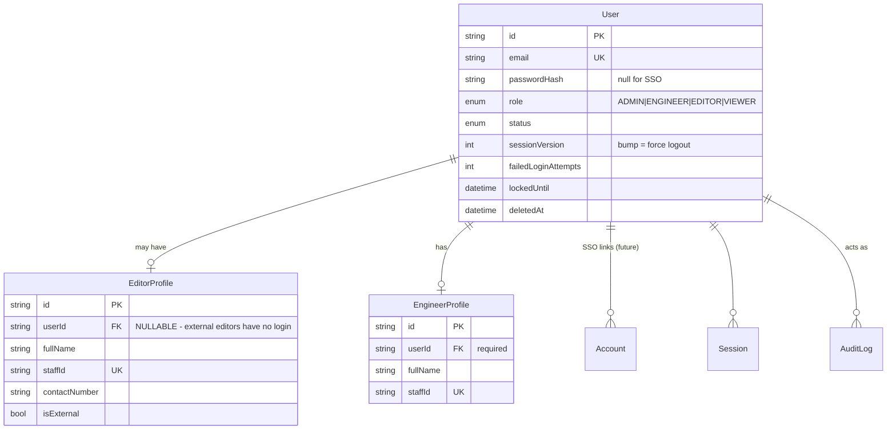
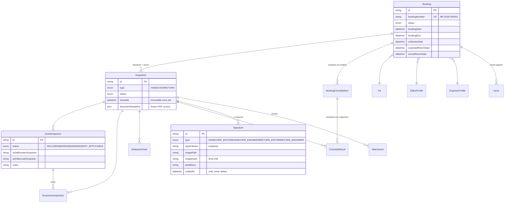

# Edit Kit Management System — Architecture

**Status:** Phase 1 (Architecture & Database Schema) — complete
**Last updated:** 2026-09-03

---

## 1. What this system replaces

A paper "External Editing Kit — Handover and Return" form. The paper form is a
*snapshot* of one kit at one moment: a fixed list of equipment rows, a fixed list
of software, a fixed checklist, and two signatures.

The core architectural requirement is that **the form is data, not code**. An
administrator must be able to create a new kit, a new equipment category, a new
accessory type, a new software requirement, or a new checklist template, and the
handover wizard must pick all of it up with no deployment.

That single requirement drives almost every decision below.

---

## 2. System architecture

### 2.1 Runtime shape

A single Next.js application (App Router, Node.js runtime) talking to one
PostgreSQL database, deployed as a container behind the corporate reverse proxy.
There is no separate API service in the MVP.

```
                    ┌──────────────────────────────────────┐
   Browser /        │  Reverse proxy (TLS termination)     │
   Tablet   ───────▶│  corporate network only              │
                    └──────────────────┬───────────────────┘
                                       │
                    ┌──────────────────▼───────────────────┐
                    │  Next.js 16 (Node runtime)           │
                    │                                      │
                    │  proxy.ts ....... optimistic auth    │
                    │  app/ ........... RSC pages          │
                    │  server/actions/  authz + validation │
                    │  server/services/ business logic     │
                    │  server/db/ ..... Prisma             │
                    └────────┬───────────────────┬─────────┘
                             │                   │
                  ┌──────────▼──────┐   ┌────────▼─────────┐
                  │  PostgreSQL 16  │   │  File storage    │
                  │                 │   │  LOCAL (volume)  │
                  │  + pg_trgm      │   │  → AZURE_BLOB    │
                  │  + btree_gist   │   │    later         │
                  └─────────────────┘   └──────────────────┘
```

### 2.2 Layering (Clean-Architecture-flavoured, not dogmatic)

Four layers, enforced by folder boundaries and an ESLint import rule:

| Layer | Location | Responsibility | May import |
|---|---|---|---|
| **UI** | `src/app`, `src/components`, `src/features/*/components` | Rendering only. No business rules, no Prisma. | features, components, lib |
| **Interface adapters** | `src/server/actions`, `src/app/api` | Authenticate → authorise → Zod-validate → call service → map result. Nothing else. | services, validation, auth |
| **Application / domain** | `src/server/services` | All business rules. Pure functions of `(tx, actor, input)`. Transaction-aware. | db, domain, lib |
| **Infrastructure** | `src/server/db`, `src/server/storage`, `src/server/auth` | Prisma client, file storage, auth provider. | — |

**The rule that matters:** a React component never imports Prisma, and a service
never imports `next/headers`. Services receive an explicit `actor` object, which
makes them unit-testable without a request context and makes it impossible to
accidentally ship an unauthenticated write path.

### 2.3 Read path vs write path

- **Reads** go through a *Data Access Layer* (`src/server/dal`). Every DAL
  function calls `requireSession()` itself, so authorisation happens next to the
  data rather than in a layout. This follows the Next.js guidance that layout
  checks are not a security boundary (layouts do not re-render on navigation and
  do not gate nested segments).
- **Writes** go through Server Actions in `src/server/actions`, which are treated
  as public HTTP endpoints: every one re-checks the session and the permission,
  regardless of what the UI showed.

`proxy.ts` (Next.js 16's replacement for `middleware.ts`) does an *optimistic*
cookie-only check to bounce anonymous users to `/login`. It is a UX
optimisation, never the security boundary.

---

## 3. Data model

### 3.1 Design invariants

1. **Nothing from the paper form is a column.** Equipment lists, accessory
   lists, software lists and checklists are all rows.
2. **A signed inspection is immutable.** Corrections happen by voiding and
   re-inspecting, never by `UPDATE`. Every mutation path checks `lockedAt`.
3. **Inspection lines carry snapshots.** `AssetInspection` stores
   `serialNumberSnapshot`, `admBarcodeSnapshot`, `modelSnapshot`, … as written
   at inspection time. Renaming an asset in 2027 cannot rewrite what an editor
   signed for in 2026.
4. **Handover and Return are two rows, never one.** `Inspection.type`
   distinguishes them, so the side-by-side diff is a plain join.
5. **Reference data is soft-deleted.** Bookings point at kits, assets and
   categories forever; hard deletion would orphan history.

### 3.2 ER model — identity



> **The important nullable in this system.** `EditorProfile.userId` is optional.
> Freelance/external editors appear on bookings and sign handovers but have no
> account. Modelling the editor as "a User with role EDITOR" would have made
> external handovers impossible without creating fake accounts.

### 3.3 ER model — equipment catalogue and kits


`AccessoryType` is an addition to the entity list in the brief. Without it,
"Power Adapter" would be free text on every asset and the admin could not
maintain a consistent vocabulary — which contradicts the "no hard-coded
accessories" requirement.

### 3.4 ER model — bookings, inspections, signatures



### 3.5 Two refinements to the requested entity list

The brief listed `BookingChecklistItem` and `SoftwareCheck`. Building them
exactly as named creates a conflict: the checklist is snapshotted **per
booking**, but it is *answered* twice — once at handover and once at return.
One row cannot hold both answers without the return overwriting the handover,
which requirement §"RETURN WORKFLOW" explicitly forbids.

Resolution:

| Entity | Role |
|---|---|
| `BookingChecklistItem` | The snapshot. One row per checklist line per **booking**. Holds label, description, phase, required, order. Frozen at booking creation. |
| `ChecklistResult` *(added)* | The answer. One row per line per **inspection**. Holds PASS/FAIL/NOT_APPLICABLE + notes. |

`SoftwareCheck` needed no split — it already hangs off `Inspection` — but it
gained `nameSnapshot` / `versionSnapshot` / `vendorSnapshot` for the same
immutability reason.

`AssetHistory` was deliberately **not** created. The asset timeline is a service
that merges `AssetStatusLog`, `AssetInspection` (joined to `Booking`), `Issue`,
and `AuditLog` at read time. A separate denormalised history table would be a
second source of truth that can silently drift from the first.

---

## 4. Guarantees enforced in the database, not in application code

Application-level checks lose races. These four are constraints, so they hold
even under concurrent requests, and even if someone writes to the database by
hand.

### 4.1 No overlapping bookings for the same kit

```sql
ALTER TABLE bookings ADD CONSTRAINT bookings_no_overlap
  EXCLUDE USING gist (
    "kitId" WITH =,
    tstzrange("bookingStart", "bookingEnd", '[]') WITH &&
  ) WHERE (status IN ('RESERVED','READY_FOR_HANDOVER','CHECKED_OUT','OVERDUE','RETURN_INSPECTION')
           AND "deletedAt" IS NULL);
```

Requires the `btree_gist` extension. Two engineers reserving MBP-02 for
overlapping weeks now fails at commit rather than producing a double-booked kit
that nobody notices until collection day.

### 4.2 One live inspection of each type per booking

A partial unique index on `("bookingId", type) WHERE "voidedAt" IS NULL`. An
admin can void a return inspection and redo it; they cannot end up with two
live ones.

### 4.3 One live signature of each type per inspection

Same pattern on `("inspectionId", type) WHERE "voidedAt" IS NULL`.

### 4.4 An asset cannot sit in two kits at once

Partial unique index on `("assetId") WHERE "removedAt" IS NULL` in `kit_assets`.

### 4.5 Fast barcode / free-text search

`pg_trgm` + GIN indexes on the name and code columns that global search hits,
plus plain B-tree indexes on `admBarcode` across `assets`, `kits` and
`accessories`. Barcode lookup is a single indexed equality — ready for a
hardware scanner posting into a search box.

The GIN indexes are declared in `schema.prisma`
(`@@index([name(ops: raw("gin_trgm_ops"))], type: Gin, map: …)`) *and* created
in the migration under the same names. Prisma ignores partial indexes,
exclusion constraints and triggers when checking for drift, but it does see
ordinary indexes — left undeclared, it would generate a migration to drop them.

### 4.6 Verified, not assumed

All of §4 is exercised by `scripts/db/verify-constraints.sql` — 18 tests that
insert violating rows inside a transaction, assert the specific SQLSTATE, and
roll back. It passed 18/18 against PostgreSQL 16.15 on 2026-09-03.

---

## 5. Key architecture decisions

### AD-1 — Numbering via a locked counter row, not a Postgres sequence

`BK-2026-000001` must have no gaps (it is quoted in emails and disputes).
Postgres sequences deliberately leak numbers on rollback. Instead
`NumberSequence` holds `(scope, period, current)` and is incremented with
`UPDATE … RETURNING` **inside the same transaction** as the row it numbers. If
the booking insert fails, the number is released.

Cost: writes to the same scope serialise. At a few hundred bookings a year this
is irrelevant.

### AD-2 — JWT sessions with a `sessionVersion` kill switch

Auth.js v5 forces the JWT strategy when using a Credentials provider, so
database sessions are not available. To keep server-side revocation (required
by "session timeout design" and "no client-side-only security"), `User` carries
`sessionVersion`. The `jwt` callback compares the token's copy against the
database; a mismatch invalidates the token immediately. Bump it on password
change, role change, suspension, or "sign out everywhere".

Short `maxAge` (8 h) + `updateAge` (15 min) gives an idle timeout.

### AD-3 — All auth behind a facade

Everything auth-related is confined to `src/server/auth/*`, and the rest of the
app only ever imports `requireSession()`, `requirePermission()` and the `Actor`
type. Adding Entra ID later means adding a provider inside that folder. The
`Account` / `Session` tables already exist for it.

This also contains the risk that `next-auth@5` is still a beta release (see §7).

### AD-4 — Storage provider is a column, not a config

Every `Attachment` and `Signature` row stores `storageProvider` (`LOCAL` /
`AZURE_BLOB`) alongside its path. Migrating to Azure Blob does not require
rewriting old rows or a big-bang cutover — old files keep resolving through the
local driver while new ones go to Blob.

### AD-5 — Reporting reads from a query layer, not from pages

Each report is a function in `src/server/reports/` returning
`{ columns: ColumnDef[], rows: Record<string, unknown>[] }`. The HTML table, the
future CSV writer and the future Excel writer are three renderers over that one
shape. Adding "export to Excel" becomes one renderer, not ten report rewrites.

### AD-6 — PDF generated from `documentSnapshot`, not from live joins

When an inspection completes, the fully-resolved document is serialised into
`Inspection.documentSnapshot`. The PDF renderer reads only that. A handover PDF
regenerated in three years is byte-identical to the one signed, even if the kit
has since been dismantled.

### AD-7 — Server Actions are treated as public endpoints

Every action runs `requirePermission(actor, PERMISSION)` before touching data.
The UI hiding a button is cosmetic. This is wrapped in a single `action()`
helper so it cannot be forgotten by omission — the helper *requires* a
permission argument.

### AD-8 — Handover and return run in one transaction

Completing a handover writes: inspection status, `lockedAt`, both signatures,
booking status, kit status, N asset statuses, N `AssetStatusLog` rows, and an
audit entry. Any partial application leaves equipment in a wrong state. All of
it runs inside `prisma.$transaction` with `Serializable` isolation.

### AD-9 — Every timestamp is `timestamptz`, not Prisma's default

Prisma maps `DateTime` to PostgreSQL `TIMESTAMP(3)` **without time zone** unless
told otherwise. That type stores a naive wall-clock value and forgets which zone
it was in — a booking created from a laptop set to London time and read by a
server in UTC would drift by an hour, silently. All 79 `DateTime` columns carry
`@db.Timestamptz(3)`, which stores an unambiguous instant. This is also what
makes the `tstzrange` overlap constraint (§4.1) well-defined.

### AD-10 — Immutability is enforced by triggers, not only by code

`lockedAt` checks in the service layer are the first line. Behind them,
`BEFORE UPDATE` triggers on `inspections` and `signatures` reject any change to
a signed record's content, and `audit_logs` rejects `UPDATE` and `DELETE`
outright. A future code path — or a hand-run `psql` session — cannot quietly
edit what an editor signed for. This is what "immutable/audited signed records"
in the security requirements actually means at the storage layer.

---

## 6. Folder structure

```
edit-kit-management/
├─ docker/
│  ├─ Dockerfile                    # multi-stage, standalone output, non-root
│  └─ postgres-init/                # extensions on first boot
├─ docs/
│  ├─ ARCHITECTURE.md               # this file
│  └─ ROADMAP.md
├─ prisma/
│  ├─ schema.prisma
│  ├─ migrations/
│  └─ seed/
│     ├─ index.ts                   # orchestrator
│     ├─ 01-users.ts
│     ├─ 02-catalogue.ts            # categories, accessory types, software
│     ├─ 03-assets.ts
│     ├─ 04-checklists.ts
│     └─ 05-kits.ts                 # depends on 03 and 04
├─ src/
│  ├─ app/
│  │  ├─ (auth)/login/page.tsx
│  │  ├─ (app)/                     # authenticated shell: sidebar + header
│  │  │  ├─ layout.tsx
│  │  │  ├─ dashboard/
│  │  │  ├─ bookings/
│  │  │  │  ├─ page.tsx  new/  [id]/  [id]/handover/  [id]/return/
│  │  │  ├─ kits/                   page.tsx  new/  [id]/  [id]/edit/
│  │  │  ├─ assets/                 page.tsx  new/  [id]/  [id]/edit/
│  │  │  ├─ editors/                page.tsx  [id]/
│  │  │  ├─ issues/                 page.tsx  [id]/
│  │  │  ├─ reports/
│  │  │  └─ admin/
│  │  │     ├─ users/ categories/ software/ checklists/
│  │  │     └─ audit-logs/ settings/
│  │  └─ api/
│  │     ├─ auth/[...nextauth]/route.ts
│  │     ├─ files/[id]/route.ts     # authorised file serving
│  │     └─ search/route.ts         # global + barcode lookup
│  │
│  ├─ components/
│  │  ├─ ui/                        # shadcn primitives, unmodified
│  │  ├─ layout/                    # AppSidebar, AppHeader, Breadcrumbs
│  │  └─ common/                    # StatusBadge, DataTable, EmptyState,
│  │                                # ConfirmDialog, PageHeader, Stepper
│  ├─ features/                     # one folder per bounded context
│  │  ├─ bookings/  kits/  assets/  editors/  issues/
│  │  ├─ inspections/               # the wizard lives here
│  │  ├─ signatures/                # SignaturePad
│  │  └─ dashboard/  reports/  admin/
│  │
│  ├─ server/                       # never reachable from the client bundle
│  │  ├─ db/prisma.ts               # singleton
│  │  ├─ auth/                      # config, session, permissions, actor
│  │  ├─ dal/                       # authorised reads
│  │  ├─ actions/                   # server actions (authz + zod + service)
│  │  ├─ services/                  # business logic, transaction-aware
│  │  │  ├─ booking.service.ts
│  │  │  ├─ handover.service.ts
│  │  │  ├─ return.service.ts
│  │  │  ├─ issue.service.ts
│  │  │  ├─ audit.service.ts
│  │  │  └─ numbering.service.ts
│  │  ├─ reports/                   # report definitions + renderers
│  │  ├─ pdf/                       # document renderer
│  │  └─ storage/                   # LocalDriver, (AzureBlobDriver later)
│  │
│  ├─ lib/
│  │  ├─ env.ts                     # zod-validated environment
│  │  ├─ validation/                # zod schemas shared client + server
│  │  ├─ constants/                 # status labels, colours, nav definition
│  │  └─ utils/
│  └─ types/
├─ .env.example
├─ docker-compose.yml
├─ prisma.config.ts
└─ DEVELOPMENT.md
```

**Why `features/` and `server/` are separate.** `features/` is UI grouped by
domain; `server/` is logic grouped by domain. Keeping them apart makes the
client/server boundary visible in the file tree — if a component needs something
from `server/`, that is a code smell unless it is a Server Component.

---

## 7. Risks and gaps found in the requirements

Listed worst-first. Items marked **[decision needed]** change what gets built.

### R-1 — How does an external editor sign? **[decision needed]**

The brief gives EDITOR a login and a "Sign handover" permission, but also
describes *external* editors. These conflict. The schema supports both
(`EditorProfile.userId` is nullable), but the wizard has to pick one flow:

- **(a) Co-signing on the engineer's tablet** — editor signs in person on the
  engineer's device during handover. Works for everyone, matches the paper
  process, no account needed. **Assumed default.**
- **(b) Remote counter-signing** — editor logs in separately and signs. Needs
  accounts for freelancers and a "pending signature" booking state.

Building (a) first and adding (b) later is cheap. Building (b) first is not.

### R-2 — Signature legal weight

A canvas PNG is not a qualified electronic signature. What we provide is
*evidence*: SHA-256 of the image, signer identity snapshot, timestamp, IP, user
agent, immutable rows, and full audit trail. If these handovers are ever meant
to support a financial claim against an editor for lost equipment, get that
confirmed by legal before go-live. Mitigation available later: hash-chain the
audit log, or add an RFC 3161 timestamp.

### R-3 — Overdue detection needs a scheduler that the brief does not mention

`OVERDUE` is a stored status but nothing sets it. Options: a container cron
hitting an authenticated route, a `pg_cron` job, or computing overdue at read
time and only persisting it during a nightly sweep. **Assumed:** nightly sweep +
read-time derivation for the dashboard, so the dashboard is never stale.

### R-4 — "Do not allow the handover to be completed until required checks are completed" is ambiguous **[decision needed]**

Two readings: (a) every required line must have *an answer*; (b) every required
line must be `INCLUDED`. **Assumed (a)**, plus: a `MISSING`/`DAMAGED` line
requires a note, and offers to raise an Issue. Reading (b) would block handover
whenever a single cable is missing, which is likely not what the department
wants.

### R-5 — Timezone handling

`ADM` suggests Asia/Dubai. "Booking Start Date" on paper is a *date*; in the
database it is an instant. Storing UTC and rendering in a configured
`APP_TIMEZONE` is correct, but a booking created at 00:30 Dubai time will render
as the previous day if anything reads it in UTC. All date rendering must go
through one formatter. **Assumed** `Asia/Dubai`, stored as an `AppSetting`.

### R-6 — Concurrent edits to one inspection

Two engineers with the same booking open on two tablets will silently overwrite
each other. Needs optimistic concurrency (compare `updatedAt` on save, reject
with a conflict dialog). Scheduled for Phase 8 — flagging it now because it is
easy to forget until it corrupts a real handover.

### R-7 — No Maintenance entity, but maintenance is in scope

`AssetStatus.MAINTENANCE` exists and the asset history is supposed to show
"Maintenance", but no maintenance entity was requested. `AssetStatusLog` records
*that* an asset went into maintenance, not what was done, by whom, or the cost.
If maintenance tracking is actually needed, a `MaintenanceRecord` entity should
be added before Phase 4 rather than retrofitted.

### R-8 — Signature and photo retention

Signature images are personal data. No retention period is specified. Local disk
storage in a container also loses files on redeploy unless a volume is mounted —
the compose file mounts one, but the production deployment must too. Azure Blob
should land before any real volume of handovers accumulates.

### R-9 — `next-auth@5` is still beta

`5.0.0-beta.32` is what Auth.js ships for the App Router, and it declares
support for Next 16. It is nonetheless a beta in a production system. Contained
by AD-3 (auth facade) — swapping to Better Auth would touch one folder.

### R-10 — Prisma's `latest` npm tag is currently an RC (8.0.0-rc.12) — *mitigated*

Pinned to **7.10.0**, the stable release matching `@prisma/client@7.10.0`. Do
not run `npm update prisma` without checking the tag. Prisma 7 also requires a
driver adapter (`@prisma/adapter-pg`) — the client no longer accepts a URL.

### R-11 — Local Node.js was v23 (non-LTS, end-of-life) — *resolved*

Prisma 7 refused to install on Node 23 outright (it supports 20.19+, 22.12+,
24.0+). Node **24.19.0 LTS** is now installed; `package.json` declares
`engines.node >= 22.12` and the Dockerfile uses `node:24-alpine`, so local and
container runtimes match.

### R-12 — Smaller open questions

- Does `BK-YYYY-NNNNNN` reset each January? **Assumed yes.**
- Can the returning engineer differ from the handover engineer? **Assumed yes.**
- Can a kit's contents change while it is checked out? **Assumed no** — kit
  edits are blocked while `status = CHECKED_OUT`.
- Who may void a signed inspection? **Assumed ADMIN only**, always audited.
- Uploaded photos are not virus-scanned. Acceptable on an internal network with
  strict MIME/extension/size validation and non-executable serving; call it out
  if the app is ever exposed more widely.

---

## 8. Future integrations — how each one lands

None are implemented. Each has a defined seam so it does not require rework:

| Integration | Seam already in place |
|---|---|
| Entra ID SSO | `Account` table + auth facade (AD-3); add provider, map role claim |
| Teams / Email notifications | Services emit domain events; add a dispatcher subscriber |
| Barcode scanner | `admBarcode` indexed on assets, kits, accessories; `/api/search` exact-match fast path |
| QR codes | Kit/asset codes already unique and stable |
| Azure Blob | `storageProvider` column (AD-4) + driver interface |
| Excel export | Report query layer (AD-5) — add a renderer |
| Power BI | Read-only DB role over the normalised schema |
| Approval workflows | `BookingStatus.DRAFT` already exists as the pre-approval state |

---

## 9. Security posture

| Control | Implementation |
|---|---|
| Authentication | Auth.js v5, credentials + Argon-grade bcrypt cost 12, account lockout after N failures |
| Session revocation | `User.sessionVersion` compared on every JWT decode (AD-2) |
| Authorization | Permission matrix in `server/auth/permissions.ts`; enforced in DAL + every action |
| Data scoping | EDITOR sees only own bookings — enforced in the DAL query, not the UI |
| Input validation | Zod at every trust boundary; the same schema drives React Hook Form |
| CSRF | Auth.js built-in token for auth routes; Server Actions are origin-checked by Next.js |
| SQL injection | Prisma parameterised queries only; the two raw statements are DDL in migrations |
| File uploads | Extension + MIME sniff + size cap + random stored filename + served through an authorised route, never statically |
| Transport | `secure` cookies, HSTS, CSP set in `next.config.ts`; TLS terminated at the proxy |
| Immutability | `lockedAt` checks + void-don't-delete on signatures and inspections |
| Auditability | `AuditLog` with before/after JSON on every state change and every admin override |
| Least disclosure | DAL returns DTOs; `passwordHash` never leaves the server layer |

---

## 10. Testing strategy (Phase 13, designed now)

- **Unit** — services with an in-memory actor and a transaction mock. The
  highest-value targets are `numbering`, `handover.complete`, `return.complete`
  and the permission matrix.
- **Integration** — Testcontainers Postgres, real migrations, real constraints.
  This is where the exclusion constraint and the partial unique indexes get
  proven.
- **E2E** — Playwright over the full handover → return happy path, plus the
  "engineer tries to edit a locked inspection" path.

The layering exists largely to make the first bullet possible: business rules
that live inside React components cannot be tested this way.
